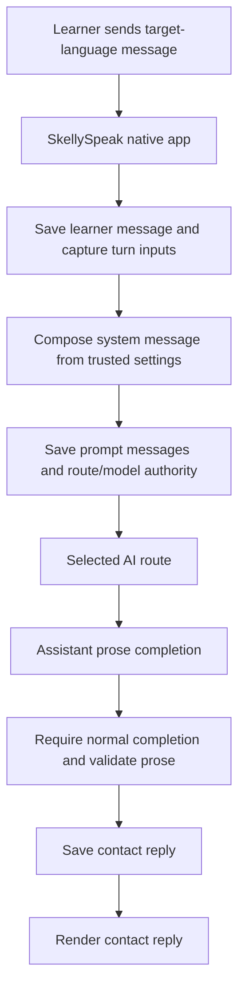
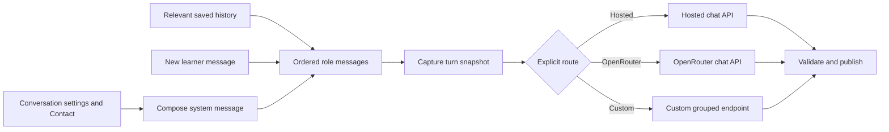
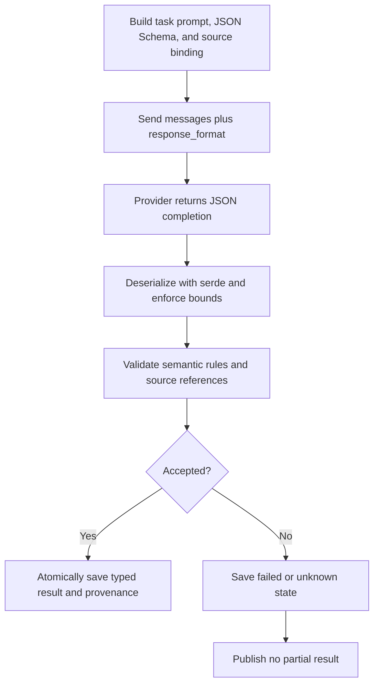
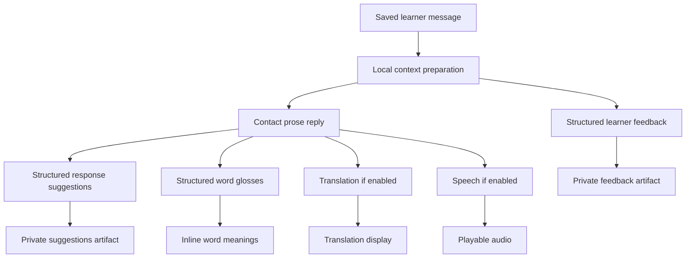

# AI request architecture

This is the practical guide to how SkellySpeak uses AI. It complements the implementation contract in [architecture.md](./architecture.md) and the route/model policy in [AI-STRATEGY.md](./AI-STRATEGY.md). Those documents remain authoritative when this overview conflicts with them.

## The short version

Conversation is a chat-style request. The app assembles an ordered list of messages with `system`, `user`, and `assistant` roles. The `system` message is composed for each accepted turn from trusted application settings: target language and variety, difficulty, language-specific writing guidance, and selected Contact details. It is followed by relevant saved conversation history and the new learner `user` message.

The provider does not retain a permanent copy of this system instruction on behalf of the app. SkellySpeak sends the bounded context it needs on each request, then stores the exact prepared prompt, selected route/model authority, and source IDs in the local turn record. A settings or Contact edit later cannot silently change an accepted in-flight request or retry.

<!-- Intended as a Mermaid sequence diagram. The current documentation renderer does not render sequence diagrams reliably, so this temporary flowchart should be converted back when sequence-diagram rendering is fixed. -->


Conceptually, a contact request looks like this:

```json
[
  {"role":"system","content":"You are the learner's conversation contact..."},
  {"role":"user","content":"Hola"},
  {"role":"assistant","content":"¡Hola! ¿Cómo estás?"},
  {"role":"user","content":"Estoy bien."}
]
```

The system instruction treats Contact data and conversation text as untrusted data, never instructions. It keeps background facts latent until relevant and never gives the Contact access to private coaching.

## Routes and dispatch

Before the request, Rust resolves one explicit route—Hosted, OpenRouter, or Custom—and captures its endpoint, selected model, credential reference, and revision. It never silently switches route, credential, or model after acceptance. Ordinary prose requests currently specify a 2,048-token output limit, temperature 0.7, and disabled reasoning; OpenRouter requests disable provider fallback.



## Prose and structured output

Normal conversation expects prose. The app checks that completion ended normally and that the text satisfies local safety/format rules before publishing it.

Some jobs need machine-readable data instead: word glosses and private coaching. For these, Rust builds a task prompt plus a named strict JSON Schema. The request asks the provider to produce schema-shaped JSON, then local Rust code deserializes it with `serde`, applies size and shape limits, verifies task-specific semantic rules, and confirms that claimed source references belong to the immutable text being analysed.

This is close to the Pydantic pattern: a schema guides the model and an application-side type parser validates the response. The difference is that Rust keeps source binding, publication authority, database transaction, and scheduler validation alongside the data types. Provider output is external input until it passes those checks.

<!-- Intended as a Mermaid sequence diagram. The current documentation renderer does not render sequence diagrams reliably, so this temporary flowchart should be converted back when sequence-diagram rendering is fixed. -->


For example, word glossing gives the model an exact catalog of grapheme IDs. The model returns selected IDs, not arbitrary character offsets. Rust resolves them to the original source text and rejects unknown, reversed, overlapping, or otherwise invalid spans instead of silently repairing them.

## One conversation, several operations

The native scheduler represents a turn as dependent durable operations, rather than treating every capability as part of one giant model call. Independent operations can publish when ready.



Learner feedback can use the learner message and prior context immediately. Suggestions wait for the actual Contact text, because they depend on what the Contact actually said. Glosses, translation, and speech also depend on the accepted Contact reply. Private coach artifacts never become Contact prompt input.

The scheduler records operation states, attempts, provider/model metadata, and usage when reported. It shares bounded AI capacity with conversation, transcription, speech, and helper tasks. Cancellation revokes local publication, while acknowledging that a provider may already have done billable work; interrupted outcomes are shown as unknown and are never automatically retried.

## What belongs where

| Input | Role in the request |
| --- | --- |
| Contact identity, background, tendencies, Vibe | System-prompt data that shapes tone; never trusted as instructions |
| Target language, variety, difficulty | Trusted system instruction for this conversation turn |
| Saved conversation history | Ordered user/assistant chat messages |
| New learner text | Final user message |
| Translation, gloss, and coaching source text | Separate task-specific prompts and result contracts |
| Route, model, credential reference | Captured dispatch metadata, not prompt content |

## Keep the trust boundary in view

It helps to think of three layers:

1. Conversation: compose chat messages and obtain Contact prose.
2. Tasks: perform focused work such as translation, word glossing, or coaching.
3. Trust: capture inputs before dispatch, validate results locally, bind structured claims to source text, and publish only accepted results.

JSON Schema can improve the shape of output. It cannot prove that a model's teaching judgment is correct. Coaching evaluations are model estimates, not calibrated proficiency measurements. Quality evaluation is therefore separate from safe request construction and validation.
