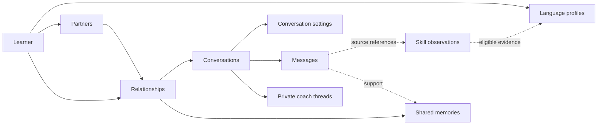

# Data model proposal

Status: approved architecture direction. The local learner/partner/conversation
foundation is implemented; analysis and execution records remain planned. See
[architecture.md](./architecture.md) for concrete storage authority. [DESIGN.md](./DESIGN.md) supplies
the agreed product requirements. Field names describe logical contracts rather
than a final serialization format.

## Scope and authority

Rust owns durable domain records, validates mutations and computes projections.
React presents scoped snapshots and owns transient interaction state. Hosted
identity and usage accounting provide AI access; they do not own the local learner,
contacts, conversations or learning progress. Begin with one local learner, without
profile switching or synchronization machinery.

Separate three classes of data:

| Class | Examples | Authority |
| --- | --- | --- |
| Source and explicit choices | Messages, partner configuration, conversation settings, exclusions | Validated user actions and accepted conversation output |
| Analysis | Annotations, skill judgments, Vibe observations, proposed memories | Validated results with source references and provenance |
| Projections | XP, participation/domain measures, distributions, report tables | Deterministic calculations over eligible source and analysis records |

A model does not directly write XP, flower geometry, user preferences or database
mutations. Its structured output is a candidate result for the owning service to
validate. Cached projections are disposable; their source records are not.

## Identities and references

- Use stable opaque IDs for records. Names, titles, paths and language labels are
  never identity keys. Two partners named Juan remain distinct contacts.
- Define canonical `language_id` values in an explicit registry. A variety belongs
  to a language through that registry; do not infer identity by splitting strings.
- Mutable records carry a monotonic `revision`. A command states the revision it
  expects; conflicting edits fail explicitly. Timestamps describe time, not ordering
  guarantees or identity.
- An immutable saved message is identified by `message_id`; its span uses half-open
  Unicode scalar offsets over the exact saved text. Do not invent a revision counter
  for immutable content. Any future mutable-source contract must identify revisions.
- Every child reference must resolve to the same owning learner and valid domain
  scope. Redundant scope fields, if stored for indexing, are checked against their
  authoritative parents rather than independently editable.
- Source revisions identify the content being analyzed. They do not require a
  permanent history of overwritten text or an event-sourced storage architecture.

### Accepted annotation boundary decisions

These are implementation requirements, not a claim of wired annotation support.
Rust validates endpoints against default extended grapheme boundaries, using the
reviewed `unicode-segmentation` 1.13.3 / Unicode 17 policy, and supplies UTF-16
coordinates for frontend slicing. Reject unsafe endpoints; never normalize or snap
the source. Provider coordinate representation remains subject to evaluation.

Individual word targets remain available independently of phrase explanations.
Structural coverage and useful gloss availability are separate fields: zero glosses
must not be presented as available word help. Valid partial help is terminal and
readable; it does not trigger retries. A failed explicit retry preserves accepted
help and records the failed attempt separately. Reading saved results never creates
inference work. Phrase presentation remains with the UI design conversation.

## Core records

| Record | Key and references | Authoritative fields and constraints |
| --- | --- | --- |
| `Learner` | `learner_id` | Display identity; local identity independent of hosted sign-in |
| `LearnerPreferences` | One per learner | Text size, contrast, accessibility choices and default explanation language |
| `OnboardingState` | One per learner | Tutorial status and last step; replay does not reset application data |
| `LanguageProfile` | Unique `(learner_id, language_id)` | Explicit practice focus and assessment preferences; no conversation difficulty and no model-written XP |
| `Partner` | `partner_id`, `learner_id`, `language_id` | Name, latent background, conversational tendencies, avatar recipe, authored Vibe and configuration revision |
| `Relationship` | `relationship_id`; unique `(learner_id, partner_id)` | Association owning conversations and shared memories; archive status; no invented numerical intimacy score |
| `Conversation` | `conversation_id`, `relationship_id`, fixed `language_id` | Creation/activity timestamps, archive status, descriptive title with provenance |
| `ConversationSettings` | One per conversation | Difficulty, explanation language, variety, composing-help amount, coach proactivity, translation/romanization/pronunciation visibility; explicit revision |
| `Message` | `message_id`, `conversation_id` | Speaker `learner` or `partner`, ordered position, exact accepted text, content revision, timestamps and originating turn |
| `CoachThread` | One per conversation | Private coaching context; independently addressed from partner messages |
| `CoachMessage` | `coach_message_id`, `coach_thread_id` | Learner/coach speaker, content and references to the discussed conversation material |
| `Memory` | `memory_id`, `relationship_id` | Claim, supporting conversation sources, origin, user-corrected status and revision |

Solid arrows describe association/ownership; dotted arrows describe sourced
information. They are not an execution schedule or a grant of prompt access.

One partner belongs to the local learner; persona sharing and a separate reusable
template catalog are not required. Random creation produces an ordinary editable
`Partner`, including a concrete static avatar recipe and authored Vibe. Editing
that partner retains its identity.

Keep partner language fixed in the initial contract. A conversation captures its
target language at creation and cannot change it. A future partner-language editing
feature would need a prospective-only creation rule; it must never reclassify or
translate a saved conversation. No such editing mechanism is required here.

Keep `Relationship` explicit even with one local learner: partner description and
shared experience are different concepts with different prompt permissions.

## Settings and conversation creation

Create the conversation and its complete settings together. Offer a copy of the
partner's most recently used conversation settings, then let the learner adjust it.
Once created, settings never remain linked to their source conversation.

Proposed deterministic selection: choose the relationship's conversation with the
latest recorded open/use sequence, breaking ties by stable ID. An analysis finishing
in the background does not make a conversation the most recently used one. Do not
store another mutable settings bundle on the relationship solely for inheritance.
When no conversation exists, use explicit product defaults. Exact default values
and UI labels are calibration decisions, not additional ownership questions.

Explanation language is captured in conversation settings so analysis can honor the
conversation's chosen help language. Provider selection and credentials are device
configuration, not conversation practice preferences. Credential values remain
outside domain records and analysis payloads.

## Source, assistance and language analysis

| Record | References | Purpose |
| --- | --- | --- |
| `Turn` | Conversation, initiating message/action, captured settings and partner revisions | Groups one learner-visible exchange and its work; graph operations attach here |
| `InputProvenance` | Learner message revision | Text or speech-transcript input; known composing aids and their source references |
| `PassageAnalysis` | Exact message/source revision, language context, analysis contract | Reusable translation, token spans, glosses, pronunciation and romanization |
| `ExpressionHelp` | Source spans in a learner message and produced target-language wording | Captures assistance requested through explanation-language fragments |
| `SkillObservation` | Learner message spans, skill/domain ID, analysis identity | Judgment, rationale, known assistance and uncertainty; no award value |
| `VibeObservation` | Source message/span or explicit collection snapshot; speaker scope | Ranked emoji IDs, similarity scores, encoding/matching provenance and source coverage; no generative-call requirement |
| `PartnerReaction` | Exchange/message references | Comprehension status and emotional interpretation, separate from Vibe and grading |
| `AssessmentExclusion` | Learner and selected source/evidence IDs | Explicit omission from skill-credit and proficiency calculations |
| `ProficiencyAssessment` | Language profile and eligible observation references | Scoped CEFR estimate, uncertainty, rationale, coverage and rubric identity |

Generated annotations and observations record the operation/result identity,
analysis contract version, relevant model/resource provenance and completion state.
Changing views reads these records; it does not request new analysis merely to
populate a report.

Skill/domain IDs resolve against a versioned catalog of definitions and assessment
criteria. The seven practice domains organize evidence; they are not automatically
seven CEFR subscores. An assessment can report insufficient evidence, and its scope
must identify the activities and modalities actually observed.

Known assistance describes observable app behavior. A suggested phrase inserted
into a draft retains its origin even if edited. The system does not claim to detect
external assistance or equate an unmarked message with proven unaided production.

In “Quiero … buy bread,” the English span requests Spanish expression help. Keep
the exact learner text, anchor the help to that span and identify the generated
Spanish wording. Do not credit the supplied wording as a learner demonstration or
assign the conversation to English. Only supported target-language spans contribute
target-language skill judgments. A speech transcript alone does not establish
pronunciation or listening ability.

Private coaching can refer to the exchange and its analysis. Partner-context
assembly cannot read `CoachMessage` records or private assessment discussions.
Accepting a coach settings recommendation creates a normal explicit settings edit;
the recommendation itself cannot change settings.

## Geometric Vibe extraction candidate

Evaluate a shared text-embedding space and emoji reference vectors instead of a
generative LLM call for each Vibe observation. Text embedding followed by cosine
similarity is an established semantic-similarity method; this does not establish
the quality of any particular emoji mapping. See the
[Sentence Transformers similarity documentation](https://www.sbert.net/docs/sentence_transformer/usage/semantic_textual_similarity.html).

Proposed flow:

1. Define an emoji vocabulary with stable IDs and textual descriptors. Start with
   names and keywords, optionally adding reviewed associative descriptions.
   [Unicode CLDR annotations](https://cldr.unicode.org/translation/characters/short-names-and-keywords)
   provide emoji names and keywords. Compare descriptor embeddings with raw-glyph
   embeddings in evaluation rather than assuming a text encoder understands glyphs.
2. Encode and normalize the reference descriptors once for each fixed encoder and
   vocabulary configuration. Distribute this reusable table as a versioned resource;
   do not rebuild it per learner or per observation.
3. Encode the source text in the same compatible embedding space. Rank reference
   vectors by cosine similarity; the initial candidate is the top three distinct
   emoji IDs. Similarity is a geometric score, not a probability or proof of meaning.
4. Persist source references, selected IDs, scores and matching provenance. Retain
   reusable source embeddings under the same privacy and deletion rules as their
   source text. No explanatory LLM narration is needed to populate the result.

Nearest-neighbor ranking does not require k-means. Clustering can separately support
recurring-theme analysis, grouping utterances or a cluster-based view. If introduced,
its input set, seed and fit version are explicit; cluster IDs are not stable emoji
identities or permanent semantic labels.

Logical records:

| Record | Required identity and scope |
| --- | --- |
| `TextEmbedding` | Exact source revision or collection snapshot; encoder/resource version, encoding role, preprocessing/chunking policy, dimension and normalization |
| `EmojiReferenceTable` | Emoji registry and descriptor versions; compatible encoder configuration; emoji-to-vector entries |
| `VibeObservation` | Source/embedding references, speaker and aggregation scope, table and matcher versions, ranked IDs and scores |

Message-level and conversation-level observations are distinct. A conversation
embedding identifies its included message revisions, order, speaker filter and
aggregation policy. Define chunking for long text; do not silently truncate it or
assume an average of message vectors equals encoding the complete conversation.
Updating or deleting an included message invalidates dependent aggregate embeddings
and Vibe results. Reports of emoji counts must state which observation scope they
count and must not combine message and conversation observations as duplicate events.

The encoder still performs computation. A local encoder can avoid a network call;
a hosted embedding endpoint still sends text and can incur cost. Neither is selected
yet. Candidate multilingual encoders must be evaluated across the supported languages
and native-language assistance fragments; vectors from incompatible spaces cannot
be compared. The reference table is built once per configuration, not once forever.

Evaluate literal subjects, abstract associations, short/ambiguous messages, negation,
long conversations and diversity among the three selected emojis. Thresholds,
abstention and near-duplicate handling are matching-policy decisions. Geometric
similarity alone does not establish literal occurrence, emotional state or partner
comprehension; such claims require separate evidence. Authored persona Vibe remains
a learner choice and is never overwritten by observed nearest neighbors.

## Shared memory and source removal

Proposed initial memory policy:

- Extract relationship memories only from eligible partner/learner conversation
  messages. Keep exact supporting references. Exclude private coach records.
- Use active, supported memories as relevant context rather than injecting the
  entire relationship into every request. Relevance selection belongs to execution
  design; permission to read the memory is fixed here.
- A learner correction owns the corrected wording and must not be overwritten by
  extraction. Correcting a sourced memory retains its source links.
- Removing a memory deletes its active claim and adds a visible, learner-managed
  extraction exclusion for its supporting source passages. Those passages cannot
  automatically recreate the removed memory through reanalysis. This suppression
  is available to extraction logic, never to partner prompts.
- New statements in other passages can independently express a fact. Matching
  equivalent claims across unrelated sources needs a later suppression policy;
  do not promise perfect semantic forgetting from a source-exclusion mechanism.
- Deleting a source conversation removes its memory support links. Remove memories
  without remaining support; retain those independently supported elsewhere. A
  user-authored relationship note without conversation sources survives deletion
  of an unrelated conversation.

This gives deletion a concrete initial behavior without introducing complex
familiarity stages or an unrestricted autobiographical memory store.

## Domain metrics and interchangeable views

The domain stores messages, choices, participation, observations and their ownership.
It contains no flower, petal, stalk or garden-health fields. Derive view-independent
metrics with explicit rule versions, units and source coverage:

| Projection | Inputs | Scope |
| --- | --- | --- |
| Language progress | Eligible skill observations, source provenance and exclusions | Learner + target language |
| Conversation metrics | Participation records and seven-domain practice observations | Conversation |
| Relationship metrics | Its conversations' compatible metrics, distributions and inclusion filters | Relationship |
| Partner report | Conversation measures and skill observations | Partner/relationship |
| Global usage report | Measured usage and activity records | Local learner, with filters |

Store participation measurements as sourced records, including active intervals
with a stated measurement method; do not equate elapsed wall-clock time or model
latency with learner practice time. Exact idle thresholds can be calibrated later.

An assessment exclusion suppresses skill-credit and proficiency contributions.
Proposed metrics rule: retain participation and observed practice, since the source
conversation remains; a correction declaring an observation invalid removes that
observation from practice measures too. Report filters make this distinction visible.

A renderer maps these metrics to a view. Under the approved coaching plan,
evidence-caused XP drives the flower and domain stars; participation remains a
separate measured quantity, and proficiency remains a separate projection. A table, timeline, network or another
visualization can consume the same metric snapshot without regenerating evidence,
changing domain records or interpreting flower geometry.

`VisualizationPreferences` is presentation configuration keyed by learner, view ID
and subject scope. It can own a renderer version, static random seed, layout and
palette. Its values cannot affect language assessment, participation or XP. This
configuration can be persisted without becoming part of the conversation's meaning.
Avatar recipes likewise describe partner appearance, not learning evidence.

For an average flower, first aggregate aligned, view-independent metrics under
explicit weighting and inclusion rules, then render the aggregate. Show sample
size and coverage. Do not average pictures, categorical CEFR labels or renderer
coordinates. Switching representations leaves all underlying measures unchanged.
The statistical report remains mechanical and numerical.

The domain ownership diagram and the execution graph are both derived views of
explicit structure. They describe different structures: entity relationships versus
work dependencies. Neither should maintain an independent copy of its underlying
facts merely to support a visualization.

`UsageRecord` stores operation/attempt IDs, provider/model, timestamps, input/output
token counts when supplied, reported costs when available and actual latency.
`ActivityRecord` stores measured app/conversation participation events. Missing
usage values remain unknown, not zero. Tokens, words, characters and time have
distinct units. Separate learner text from partner/coach text in linguistic counts.

One logical analysis result contributes once to evidence; every actual provider
attempt can contribute to usage accounting. Cache reads are observable resolutions
with no invented provider call or token charge. Detailed attempt/state contracts
belong in the graph design.

## Revisions, validity and projections

Capture the settings, identity and input context actually used by an operation.
Configuration changes affect subsequent work according to the execution contract;
they do not rewrite source messages. Keep only necessary request provenance, not
unbounded copies of conversations and credentials in diagnostic records.

A result can be published only while its referenced source revisions remain valid.
Editing/removing a message invalidates dependent analysis and any later messages
whose generation context requires it. Propose explicit edit-and-regenerate behavior
for such conversation branches; do not silently present dependent replies as if
they answered different text.

Projection caches record the input change sequence and rules they represent. An
analysis failure is a status, not an empty successful observation. A source edit,
exclusion or deletion marks affected reports for recomputation. Settled reports
must explain their coverage; unfinished work never manufactures zero performance.

## Deletion and archiving contract

| Action | Required result |
| --- | --- |
| Archive conversation | Hide from default garden; retain sources, resumability and evidence; allow explicit archived filters |
| Archive relationship/contact | Hide from default contacts; retain the relationship and its conversations |
| Delete conversation | Remove messages, settings, private coach thread, source-owned analysis, activity and local usage rows, flower and unneeded memory support |
| Delete partner | Remove its relationship, conversations, memories, avatar/Vibe configuration and all dependent local records |
| Exclude assessment evidence | Retain source conversation; remove eligible contributions to skill credit and proficiency |
| Reset local application data | Remove the local domain and cache contents; credential/account reset scope is specified separately |

Remove or invalidate proficiency snapshots containing deleted evidence so they do
not preserve deleted quotations or unsupported scores. Shared cache entries derived
from deleted private sources must be evicted or stripped of that association;
public lexical resources are not user conversation records.

Invalidate in-flight publication authority before deleting sources. Completing work
cannot recreate a deleted parent. Cancellation, deletion and projection invalidation
need one coherent commit boundary; precise scheduling is deferred to graph/storage
design. Deletion includes content-bearing traces and media, not only visible text.

Proposed reporting policy: local statistics describe retained records. Deleting a
conversation removes its contribution to local usage charts as well as learning
reports. Hosted usage accounting still records incurred usage for access/metering;
it cannot be reset by deleting local conversations and is not a hidden local lifetime
score. Label the local report's retained-data scope clearly.

## Worked ownership example

The IDs below are illustrative labels, not an ID format. Settings are example
choices, not product defaults.

| Record | Owner/reference | Relevant values |
| --- | --- | --- |
| Learner L | Device-local learner | Accessibility preferences |
| Spanish profile ES | `(L, Spanish)` | Spanish evidence and practice focus |
| Juan J | L; Spanish | Static avatar and authored Vibe |
| Marta M | L; Spanish | Independent identity and avatar |
| Relationship RJ | `(L, J)` | Juan's memories and garden |
| Relationship RM | `(L, M)` | Marta's memories and garden |
| Conversation C1 | RJ; Spanish | “Weekend plans”; simple difficulty; translation visible |
| Conversation C2 | RJ; Spanish | “Kitchen stories”; challenging difficulty; translation hidden |
| Conversation C3 | RM; Spanish | “Train journey”; intermediate difficulty; pronunciation visible |

Opening C1 restores C1's settings. Opening C2 restores C2's settings; it does not
change C1. Both can use RJ's relevant memories. Neither can read RM's memories or
the other's private coach thread through partner context. ES aggregates eligible
Spanish observations from C1, C2 and C3 with source attribution intact.

If C2 is Juan's most recently used conversation, creating C4 offers a copy of C2's
settings. Editing C4's difficulty does not modify C2 or create a language preference.
Changing Juan's name or avatar changes the contact, not its IDs or source messages.

Deleting C1 removes its flower and contributions, plus RJ memories supported only
by C1. C2, C3 and their independent sources remain. Archiving C2 retains its evidence;
the default garden hides it. A report can include it through an explicit filter.

## Review points and next boundary

This proposal supplies defaults for three consequential details without treating
them as already approved product decisions:

1. Copy settings from the most recently used conversation instead of maintaining
   an independently editable relationship-default settings bundle.
2. Remove memories when all their conversation support is deleted; suppress
   re-extraction from explicitly excluded source passages.
3. Keep participation/practice distinct from assessment exclusions, and make local
   usage charts report retained data while hosted metering records incurred usage.

These can be revised directly during review. Database technology, table layouts,
indices, state-library APIs, graph scheduler mechanics, scoring constants and visual
layouts remain outside this proposal. [The execution contract](./EXECUTION.md)
and [AI strategy](./AI-STRATEGY.md) develop the next proposals using these ownership
and source-reference rules. Review them together before storage/state design.
