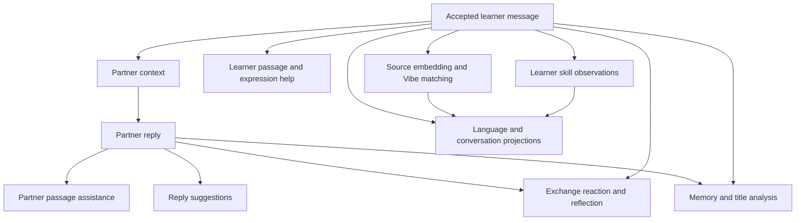

# Execution contract proposal

Status: approved direction. Hosted desktop authentication and partner/coach replies
through Hosted, API-key and Custom URL routes are implemented;
[architecture.md](./architecture.md) describes its concrete contracts and
[README.md](./README.md) records verification limits. Broader operation families,
assistance and evaluation-dependent behavior below remain planned. Transcription is
implemented outside the durable chat scheduler, but now shares its native network
capacity. Shared target holds guard submitted chat, fresh submissions and audio.
Transcription attempts now have durable metadata-only receipts; interrupted work is
marked unknown without replay. Graph-based audio Step remains future work.

## One contract for work and inspection

Rust owns the operation graph, scheduling, validation and publication. The graph
declaration drives scheduling; inspection renders that declaration and its actual
events. There must not be a separately maintained diagram of assumed execution.

An operation declares its kind and contract version, owner, exact input references,
dependencies, output slots, activation condition, required capabilities, resolution
policy and cancellation scope. Each instance has a stable ID. A turn groups work;
it is neither one provider request nor one all-or-nothing transaction.

Outputs have individual contracts. Translation can publish independently of a
skill observation. Combine work in one provider request only when evaluation
justifies the coupling, and still validate and identify each output separately.
Dynamic expansion, such as per-passage analysis, creates recorded child operations
with explicit dependencies rather than invisible requests inside another operation.

Generation operations resolve independently through the AI strategy's versioned
routing table: Standard, Fast or an explicit model override. A turn is not bound
to one model. Record requested role, matched routing rule and concrete model on
each operation/attempt, and show those targets in graph inspection. Dependency
edges describe required results, not a requirement to share a model or request.

## An ordinary exchange

### Request grouping and batching

Current implementation sends one completion request per partner/coach reply.
There is no queue-draining batcher or hosted bulk-inference endpoint. Ten eligible
completion requests use at most four native network slots, with each completion
freeing its slot independently. This is a sliding window, not synchronized pairs.
The hosted chat handler forwards one completion upstream per accepted request;
direct/custom chat bypasses that handler and uses the same native capacity.

Before expanding analysis, evaluate semantic grouping at graph planning, before
network admission: for example, several independent passage annotations from the
same authorized source snapshot could share one structured completion. Merely
being adjacent in the queue is not a reason to combine operations. Grouping requires
the same route, credential scope, model, source permissions, settings revision and
compatible deadlines/output contracts. Never merge partner and private coach context
or combine unrelated conversations to fill a batch.

Each item retains its operation/source identity and independently validated output.
A grouped call has one physical attempt and reported usage record, linked to its
items; do not duplicate token totals across items or invent per-item actual usage.
Bound item count, input/output tokens and total work even when one call serves many
items. Invalid or missing items must not trigger automatic whole-group regeneration.
Required-input invalidation cancels an undispatched group; dispatched output still
requires publication authority for each item.

Keep interactive replies and transcription independent of background grouping.
Do not delay them to fill a batch. Compare grouped and separate calls using time to
first useful result, per-item completion time, queue wait, tokens and failure scope.
A combined completion can delay every item until validation of the response; fewer
HTTP requests alone do not establish a faster experience or preserve partial results.

Grouped transport to our hosted or self-hosted server is the planned gateway
direction. The server fans out independent provider calls and streams each identified
result as it completes, without waiting for the group. Direct-key execution fans out
in the native app. Each child still needs admission, reservation and accounting;
one transport envelope never counts as one inference operation for resource limits.
Only ready operations are submitted; graph dependencies remain app-owned.
The versioned envelope, per-item recovery/duplicate protection, stream framing and
self-hosted authentication must be specified and tested before switching transports.
Provider batch-job APIs, if later considered, require a separate capability and
latency evaluation; no such support is assumed for current routes.

Grouping remains a design/evaluation task. Current shared admission does not implement it.

### Capacity tuning and diagnostics

The native inference default is four concurrent requests, with one additional
transcription allowed to wait in memory. Four is provisional headroom, not a measured
optimal value or provider entitlement. The audio waiting bound protects volatile
recordings; it is not a batch size. Numbers such as eight batch items and four server
workers in discussion remain examples, not implemented server settings.

Native stderr emits fixed `WARN ai_admission` events for eligible chat work blocked
by capacity, a full audio waiting queue and successful audio acquisition after at
least 100 ms of waiting. Each event is limited to one emission per 60 seconds per
app process. Idle or paused chat polls do not produce saturation warnings. Fields
contain only event names, policy limits and audio wait milliseconds, never content,
identities, credentials or URLs. No file sink or telemetry upload is introduced.

Reaching capacity is expected under bursts; warning counts are rate-limited signals,
not request counts or a latency distribution. Measure queue wait and first useful
result under representative workloads before further tuning. Warnings neither
increase capacity automatically nor bypass refusal holds. Provider 429s can require
less concurrency, while long waits without refusals can justify more. Future grouped
transport requires separate transport and per-item execution limits.

Accepting Send atomically records the learner message, known assistance provenance
and turn identity. A repeated submission with the same action ID returns the same
acceptance; intentionally sending the same text again is a different action.

This is a candidate operation family, not a mandate to run every node for every
message. Each enabled node names its actual inputs. Learner-only judgments need
not wait for a reply; judgments about an exchange must declare the reply dependency.
Partner-message Vibe can run separately once that message exists. Private coach
requests have their own graph and context boundary.

Proposed activation policy: prepare visible assistance and configured proactive
help; request hidden detailed help on demand. Collect core evidence and message
Vibe in background when configured capabilities are available. Memory/title work
can batch an explicit source snapshot; language assessments run on explicit request
or a documented evidence-change threshold. Merely opening statistics reads records.
Exact automatic-work budgets and assessment thresholds require calibration.

## Lifecycle and readiness

Operation states are `waiting_dependencies`, `ready`, `held`, `running`,
`succeeded`, `failed`, `cancelled`, `invalidated`, `skipped` and `blocked`.
`blocked` explains an unavailable capability or failed required dependency;
`skipped` explains an activation condition that is false. Neither means success.
Retry creates a new attempt under the same logical operation; an input change
creates a new operation. Attempts retain their own terminal outcome.

| Surface | Readiness condition |
| --- | --- |
| Conversation | Accepted partner message, or an explicit reply error/cancellation |
| Assistance item | That item's validated result; other items can remain pending |
| Assessment | Valid observations and a projection identifying evidence coverage |
| Graph | Current states, attempts, resolution sources and dependencies |

A turn summary reconciles terminal states without hiding individual failures or
blocking the conversation on assessment completion. Initial proposal: one pending
partner reply per conversation; drafting remains available. Another conversation
can proceed concurrently. Late analyses remain anchored to their source messages.

Each published result carries owner IDs, operation ID, input revisions and a
monotonic scoped change sequence. React applies only events belonging to its data
scope. On reconnection or an event gap it obtains an authoritative snapshot and
resumes after that snapshot's sequence. Transport and storage mechanics come next.

## Pause, step and concurrency

Proposed gate scope is a turn, with an app-wide pause overriding every turn.
The gate controls ready computational operations, including cache resolution and
local inference; recording user actions, cancellation and durable publication do
not require a permit. This makes Step meaningful even without a provider request.

- Pause prevents new operation starts. Running operations may finish and publish.
- Step admits one eligible operation in the selected turn and remains paused.
  If none is eligible, report why; do not bank a permit for unrelated future work.
- An operation permit admits one attempt. A retry requires another permit while
  paused; Step cannot silently trigger multiple charged requests.
- Resume releases the selected gate. App-wide pause must be explicitly resumed
  before a turn can run. Cancellation is separate from pausing.

Use bounded app/provider concurrency and a separate bound for local inference.
Prioritize replies and requested help over background work, with fair scheduling
so background work does not starve. Gate eligibility and capacity are checked at
dispatch, without consuming a worker while waiting. Exact limits are configurable
implementation policy; cancellation releases local capacity when work actually ends.

## Streaming and publication

Provider bytes are untrusted candidate output. Partner and coach prose must pass
a deterministic emoji policy before any portion is displayed. Proposed initial
contract: buffer the complete prose result, validate it, then publish the accepted
message. Transport streaming can still provide progress and usage information.
This deliberately defers progressive text display until a grapheme-safe validator
and acceptable partial-output semantics are designed and tested.

Structured results require schema, source-span, scope and semantic-invariant
validation. Invalid output fails the attempt; it never becomes empty successful
analysis. Do not silently strip emojis or repair malformed structures. Any bounded
model repair is another visible provider attempt. User-authored text is preserved.

Validate source authority again at commit, then atomically publish the result,
mark its operation successful and invalidate affected projections. A uniqueness
constraint on logical output identity prevents duplicate messages or evidence.
Projection refresh can follow asynchronously with its coverage/version visible.

## Changes and interruptions

| Event | Proposed behavior |
| --- | --- |
| Navigate to another conversation | Work continues in its owning scope; no results leak into the selected conversation |
| Change difficulty or partner description | Submitted turn keeps its captured context; subsequent turns use the new revision; offer explicit cancellation if immediate replacement is desired |
| Change assistance visibility | Apply display choice immediately; new help requests use current settings and matching cache identity |
| Remove/correct a memory | Revoke unpublished operations using that memory; cancel and require fresh context before retry |
| Change provider/model settings | Dispatched work keeps recorded route/model; undispatched work bound to the superseded execution profile is invalidated and explicitly re-planned |
| Cancel a turn | Revoke publication and stop its unfinished work; accepted messages/results remain; provider termination and billing are not assumed |
| Delete source/conversation/partner | Revoke publication authority with the deletion; remove dependent records and prevent late callbacks recreating them |
| App process stops | On restart reconcile accepted outputs; mark unresolved attempts interrupted or outcome unknown; never assume remote work stopped or automatically replay it |

Proposed edit rule: editing a sent message is an explicit edit-and-regenerate
action that removes the dependent conversation suffix and its derived records,
then creates a fresh turn from the edited source. Show that scope before applying.
No hidden branch history is required. Draft editing has no such consequences.
Memory deletion and evidence removal follow the same source rules as conversation
deletion. Already accepted replies remain source text unless explicitly affected
by the edit/delete action; changing a setting does not rewrite them.

Captured settings are permissible historical request provenance, not a bypass for
revocation: source deletion, memory removal, credential revocation and cancellation
always override a captured turn's permission to publish.

## Retry, reuse and accounting

Resolve using a declared strategy: exact valid cache hit, configured local resource
or configured provider. Cache lookup followed by its planned resolver is ordinary
resolution, not failure recovery. Cache keys include all semantically relevant
input revisions, language context, operation contract and resource/model settings.
Private source associations preserve deletion and permission boundaries.

Every actual network attempt has its own ID, provider request ID when available,
route/model, timing, status and reported usage. Unknown usage stays unknown.
An interrupted request may have incurred a charge. Current adapters make no automatic
HTTP retries. Any future automatic retries must be bounded
and restricted to classified retryable failures; authentication, missing capability
and invalid configuration require correction. An ambiguous request outcome requires
reconciliation where supported or explicit retry with possible additional cost.

Retrying an annotation does not regenerate a reply. Reanalysis replaces the
logical observation's contribution rather than adding duplicate skill credit.
Local computation and cache hits report their own provenance and no invented
provider tokens. After deletion, late usage cannot recreate deleted local rows;
hosted incurred metering remains governed by its separate accounting contract.

### Shared admission contract — next implementation slice

All paid capabilities must obtain a native app-wide permit before network dispatch,
regardless of route, model or window. Use the provisional shared ceiling of four; do not
create an additional pool for each adapter. Local-only graph work does not
spend a network permit. Recording and provider submission are separate lifecycles.
Transcription needs an attempt identity, cancellation/publication rules and unknown
outcome accounting without persisting audio merely to support retries.

Concurrency, queue size and total attempts are separate bounds. Before dynamic
analysis expansion, each graph declares a finite child-operation and network-attempt
budget. Repairs and explicit retries consume attempts too. Budget exhaustion holds
work for an explicit decision, never starts a fresh invisible budget. Queue saturation
returns a clear result without silently discarding accepted messages.

Normalize provider refusals into typed reason, scope, request ID and retry timing.
Scope holds to the affected service/account/credential/capability as evidence allows;
do not infer that a chat-only limit covers an unrelated transcription provider.
Hosted shared-spending refusals can cover both chat and audio. Unknown-scope 429s
hold the affected target conservatively and require explicit recovery. Unrelated
eligible work may continue within the same app-wide capacity.

Known transient holds honor validated Retry-After timing before explicit resumption;
daily exhaustion requires its reset or an allowance correction; spending pauses
require reconciliation. Neither Step nor Resume bypasses admission. Already-running
requests may finish after a hold; do not promise instantaneous upstream cancellation.
Persist durable holds and require explicit recovery after restart where eligibility
is unknown. Never automatically replay ambiguous paid work.

Connection checks and status reads have a separate small native capacity bound and
coalesce equivalent pending checks by configuration revision. They do not consume
inference permits or bypass authentication. No automatic status-polling loop is added.

Shared four-request network capacity and one waiting transcription are implemented.
Matching submitted chat/coach turns also persist a visible hold on HTTP 429; known
retry timing gates explicit recovery. No automatic queue replay follows expiry.
New submissions and audio now consult durable shared target holds. Explicit recovery is
a user-directed attempt, not proof that an upstream spending pause has cleared.
The remaining contracts here are planned, not enforced by the current scheduler.
Acceptance and hosted follow-up are in the build plan's resilience checkpoint.

## Acceptance scenarios for implementation

- Slow assessment leaves the reply and finished assistance usable.
- Failed translation can be retried without another reply or duplicated evidence.
- Paused work makes no new dispatch; Step produces one visible attempt or explains
  why no operation is eligible. Pausing during a request permits its completion.
- Switching between two conversations never misattributes a result.
- A source edit, memory removal or deletion defeats a racing publication at commit.
- Repeated Send delivery produces one message; intentional repeated text remains valid.
- Reconnection restores a coherent snapshot without missing or double-applying results.
- Emoji-containing generated prose and invalid source spans never reach accepted output.
- Unsupported AI capabilities produce a scoped blocked state while independent
  supported work remains usable; no secret provider substitution occurs.
- Interrupted requests preserve unknown outcomes and do not auto-repeat paid work.

## Review before implementation

The consequential proposed defaults are complete-prose validation before display,
one outstanding partner reply per conversation, one attempt per Step, captured
settings for submitted turns, and explicit edit-and-regenerate with suffix removal.
Review these alongside the AI strategy before specifying persistence and IPC.

## Accepted-work budgets

Native chat and coach share a ceiling of 64 outstanding network operations, including
paused and dependency-waiting operations as well as running requests. Local context
operations do not consume this budget. Send and explicit Retry check capacity inside
statement-owning command transactions, before inserting messages or reactivating work.
A full queue returns a visible admission error with no partial acceptance. Completion
or cancellation releases outstanding capacity; pausing and restarting do not.

Each turn permits at most 16 retained network attempts, counting failed and unknown
outcomes. Explicit Retry uses the durable attempt records; restarting or assigning a
new command ID does not reset the turn's budget. Starting a new exchange is a new
explicit action, not a way to replay a turn automatically. These limits are local
resource policy, not server abuse protection or provider quota guarantees. The
network pool remains four slots; transcription retains its separate one-waiter cap.
Saturation emits only a fixed event and numeric limits, at most once per minute.

## Hosted wire identity and decoding

Hosted text-chat requests use version-1 `/v1/operations` envelopes. Network attempt
IDs contain Unix submission seconds and a random 32-hex suffix and are committed
in SQLite before HTTP submission. Wire operation IDs use the existing operation
UUID without separators. There is no automatic endpoint fallback or retry.

The scheduler groups ready hosted operations under one captured destination and
credential authority. Each item's callback commits its result and releases its native
permit immediately; the HTTP stream remains open for unresolved siblings. The NDJSON decoder is incremental,
bounded per line and per stream, and rejects unknown/duplicate identities and
invalid completion counts. A duplicate server receipt cannot reproduce its result,
so it returns an unknown outcome. Interrupted groups retain already committed outcomes and mark only unresolved
operations unknown. Direct-key execution remains independent; Custom URL protocol
integration is still incomplete.

## Assistance admission acceptance criteria

Before expanding the graph for passage assistance, declare a finite work set for
each triggering user action, including repair budgets. A component mount is never
such a trigger. Test reopen/remount, preference changes and hydration with zero
inference dispatch. Test duplicate explicit command delivery against durable work
identity. Capture source revision and deterministic offsets; invalidate dependent
publication on edits or deletion. Independent operations may complete concurrently
and hydrate separately. Record operation/source identity and safe timing/count
metadata so UI-originated fan-out can be diagnosed without exposing credentials.
