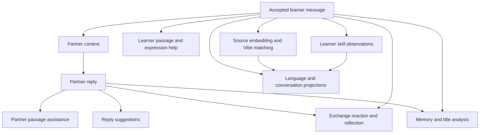

# Execution contract proposal

Status: architecture proposal for review; no runtime is implemented. This document
and [AI-STRATEGY.md](./AI-STRATEGY.md) jointly describe how work fulfills
[DESIGN.md](./DESIGN.md) using the records in [DATA-MODEL.md](./DATA-MODEL.md).
The proposed defaults below remain reviewable. Storage technology is not selected.

## One contract for work and inspection

Rust owns the operation graph, scheduling, validation and publication. The graph
declaration drives scheduling; inspection renders that declaration and its actual
events. There must not be a separately maintained diagram of assumed execution.

An operation declares its kind and contract version, owner, exact input references,
dependencies, output slots, activation condition, required capabilities, resolution
policy and cancellation scope. Each instance has a stable ID. A turn groups work;
it is neither one provider request nor one all-or-nothing transaction.

Outputs have individual contracts. Translation can publish independently of a
skill observation. Combine work in one provider request only when evaluation
justifies the coupling, and still validate and identify each output separately.
Dynamic expansion, such as per-passage analysis, creates recorded child operations
with explicit dependencies rather than invisible requests inside another operation.

Generation operations resolve independently through the AI strategy's versioned
routing table: Standard, Fast or an explicit model override. A turn is not bound
to one model. Record requested role, matched routing rule and concrete model on
each operation/attempt, and show those targets in graph inspection. Dependency
edges describe required results, not a requirement to share a model or request.

## An ordinary exchange

Accepting Send atomically records the learner message, known assistance provenance
and turn identity. A repeated submission with the same action ID returns the same
acceptance; intentionally sending the same text again is a different action.

This is a candidate operation family, not a mandate to run every node for every
message. Each enabled node names its actual inputs. Learner-only judgments need
not wait for a reply; judgments about an exchange must declare the reply dependency.
Partner-message Vibe can run separately once that message exists. Private coach
requests have their own graph and context boundary.

Proposed activation policy: prepare visible assistance and configured proactive
help; request hidden detailed help on demand. Collect core evidence and message
Vibe in background when configured capabilities are available. Memory/title work
can batch an explicit source snapshot; language assessments run on explicit request
or a documented evidence-change threshold. Merely opening statistics reads records.
Exact automatic-work budgets and assessment thresholds require calibration.

## Lifecycle and readiness

Operation states are `waiting_dependencies`, `ready`, `held`, `running`,
`succeeded`, `failed`, `cancelled`, `invalidated`, `skipped` and `blocked`.
`blocked` explains an unavailable capability or failed required dependency;
`skipped` explains an activation condition that is false. Neither means success.
Retry creates a new attempt under the same logical operation; an input change
creates a new operation. Attempts retain their own terminal outcome.

| Surface | Readiness condition |
| --- | --- |
| Conversation | Accepted partner message, or an explicit reply error/cancellation |
| Assistance item | That item's validated result; other items can remain pending |
| Assessment | Valid observations and a projection identifying evidence coverage |
| Graph | Current states, attempts, resolution sources and dependencies |

A turn summary reconciles terminal states without hiding individual failures or
blocking the conversation on assessment completion. Initial proposal: one pending
partner reply per conversation; drafting remains available. Another conversation
can proceed concurrently. Late analyses remain anchored to their source messages.

Each published result carries owner IDs, operation ID, input revisions and a
monotonic scoped change sequence. React applies only events belonging to its data
scope. On reconnection or an event gap it obtains an authoritative snapshot and
resumes after that snapshot's sequence. Transport and storage mechanics come next.

## Pause, step and concurrency

Proposed gate scope is a turn, with an app-wide pause overriding every turn.
The gate controls ready computational operations, including cache resolution and
local inference; recording user actions, cancellation and durable publication do
not require a permit. This makes Step meaningful even without a provider request.

- Pause prevents new operation starts. Running operations may finish and publish.
- Step admits one eligible operation in the selected turn and remains paused.
  If none is eligible, report why; do not bank a permit for unrelated future work.
- An operation permit admits one attempt. A retry requires another permit while
  paused; Step cannot silently trigger multiple charged requests.
- Resume releases the selected gate. App-wide pause must be explicitly resumed
  before a turn can run. Cancellation is separate from pausing.

Use bounded app/provider concurrency and a separate bound for local inference.
Prioritize replies and requested help over background work, with fair scheduling
so background work does not starve. Gate eligibility and capacity are checked at
dispatch, without consuming a worker while waiting. Exact limits are configurable
implementation policy; cancellation releases local capacity when work actually ends.

## Streaming and publication

Provider bytes are untrusted candidate output. Partner and coach prose must pass
a deterministic emoji policy before any portion is displayed. Proposed initial
contract: buffer the complete prose result, validate it, then publish the accepted
message. Transport streaming can still provide progress and usage information.
This deliberately defers progressive text display until a grapheme-safe validator
and acceptable partial-output semantics are designed and tested.

Structured results require schema, source-span, scope and semantic-invariant
validation. Invalid output fails the attempt; it never becomes empty successful
analysis. Do not silently strip emojis or repair malformed structures. Any bounded
model repair is another visible provider attempt. User-authored text is preserved.

Validate source authority again at commit, then atomically publish the result,
mark its operation successful and invalidate affected projections. A uniqueness
constraint on logical output identity prevents duplicate messages or evidence.
Projection refresh can follow asynchronously with its coverage/version visible.

## Changes and interruptions

| Event | Proposed behavior |
| --- | --- |
| Navigate to another conversation | Work continues in its owning scope; no results leak into the selected conversation |
| Change difficulty or partner description | Submitted turn keeps its captured context; subsequent turns use the new revision; offer explicit cancellation if immediate replacement is desired |
| Change assistance visibility | Apply display choice immediately; new help requests use current settings and matching cache identity |
| Remove/correct a memory | Revoke unpublished operations using that memory; cancel and require fresh context before retry |
| Change provider/model settings | Dispatched work keeps recorded route/model; undispatched work bound to the superseded execution profile is invalidated and explicitly re-planned |
| Cancel a turn | Revoke publication and stop its unfinished work; accepted messages/results remain; provider termination and billing are not assumed |
| Delete source/conversation/partner | Revoke publication authority with the deletion; remove dependent records and prevent late callbacks recreating them |
| App process stops | On restart reconcile accepted outputs; mark unresolved attempts interrupted or outcome unknown; never assume remote work stopped or automatically replay it |

Proposed edit rule: editing a sent message is an explicit edit-and-regenerate
action that removes the dependent conversation suffix and its derived records,
then creates a fresh turn from the edited source. Show that scope before applying.
No hidden branch history is required. Draft editing has no such consequences.
Memory deletion and evidence removal follow the same source rules as conversation
deletion. Already accepted replies remain source text unless explicitly affected
by the edit/delete action; changing a setting does not rewrite them.

Captured settings are permissible historical request provenance, not a bypass for
revocation: source deletion, memory removal, credential revocation and cancellation
always override a captured turn's permission to publish.

## Retry, reuse and accounting

Resolve using a declared strategy: exact valid cache hit, configured local resource
or configured provider. Cache lookup followed by its planned resolver is ordinary
resolution, not failure recovery. Cache keys include all semantically relevant
input revisions, language context, operation contract and resource/model settings.
Private source associations preserve deletion and permission boundaries.

Every actual network attempt has its own ID, provider request ID when available,
route/model, timing, status and reported usage. Unknown usage stays unknown.
An interrupted request may have incurred a charge. Automatic retries are bounded
and restricted to classified retryable failures; authentication, missing capability
and invalid configuration require correction. An ambiguous request outcome requires
reconciliation where supported or explicit retry with possible additional cost.

Retrying an annotation does not regenerate a reply. Reanalysis replaces the
logical observation's contribution rather than adding duplicate skill credit.
Local computation and cache hits report their own provenance and no invented
provider tokens. After deletion, late usage cannot recreate deleted local rows;
hosted incurred metering remains governed by its separate accounting contract.

## Acceptance scenarios for implementation

- Slow assessment leaves the reply and finished assistance usable.
- Failed translation can be retried without another reply or duplicated evidence.
- Paused work makes no new dispatch; Step produces one visible attempt or explains
  why no operation is eligible. Pausing during a request permits its completion.
- Switching between two conversations never misattributes a result.
- A source edit, memory removal or deletion defeats a racing publication at commit.
- Repeated Send delivery produces one message; intentional repeated text remains valid.
- Reconnection restores a coherent snapshot without missing or double-applying results.
- Emoji-containing generated prose and invalid source spans never reach accepted output.
- Unsupported AI capabilities produce a scoped blocked state while independent
  supported work remains usable; no secret provider substitution occurs.
- Interrupted requests preserve unknown outcomes and do not auto-repeat paid work.

## Review before implementation

The consequential proposed defaults are complete-prose validation before display,
one outstanding partner reply per conversation, one attempt per Step, captured
settings for submitted turns, and explicit edit-and-regenerate with suffix removal.
Review these alongside the AI strategy before specifying persistence and IPC.
