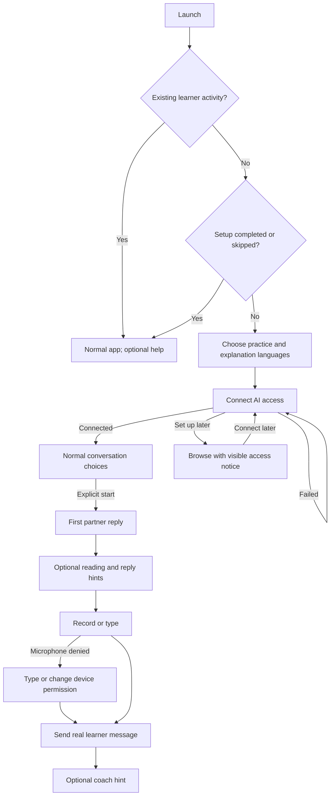

# Onboarding flow proposal

Status: **initial implementation complete in source; native walkthrough pending**.
The original proposal below remains the design rationale. The implementation
checkpoint at the end records actual behavior and limitations separately.

Preview: run the existing UI dev server and open
`http://127.0.0.1:1420/tools/onboarding-preview.html`.
Source: `ui/tools/onboarding-preview.tsx`. Uses production CSS, `VarietyField`,
`ConversationChoices`, `DifficultySelect` and `ComposerInput`. New CSS is only
review-page composition. The preview rejects native IPC and keeps sample state
in memory. It never signs in, requests microphone access, calls AI or saves data.

This develops the first-run section of
[the language/onboarding audit](language-assets-and-onboarding-audit-2026-09-19.md).
The [production design system](../design-system/README.md) remains authoritative.

## Intended experience

Two setup screens, followed by the normal conversation surface with optional
contextual guidance. The useful endpoint is a first real exchange, not completion
of a feature tour. Setup must also have an honest exit without AI access.

## 1. Choose your languages

Primary inputs: **I want to practice**, declared **Variety**, and **Explain things
in**. Interface language is separate, under an expandable secondary control.
Use the complete existing language catalog and translated interface locales;
do not imply that every practice language has translated app chrome.

Continue saves the selected language shortcut and explanation preferences.
It must not create a conversation, select a partner, start generation, or ask for
microphone permission. Additional languages remain available through Add language.
No font-download step: on-demand fonts are separate deferred work.

Implementation seam to preserve: the current `LearningPicker` writes through
`setLanguage`, whose application behavior may select/create a conversation.
Reuse catalog/label/variety primitives and the explicit shortcut-saving path for
setup; do not mount that wired picker and accidentally inherit its side effects.
Extract shared selection presentation if needed instead of duplicating catalog
rules. The prototype uses only a Spanish fixture with Spain/Mexico varieties;
full catalog browsing and interface-language selection are not simulated yet.

Default proposal: infer interface locale from supported device locale, offer that
as explanation language where supported, and ask for the practice language.
Do not infer practice language from geography. Preview defaults are fixtures,
not a proposed automatic Spanish selection.

## 2. Connect AI access

Reuse existing **Hosted sign-in**, **API keys**, and **Custom URL** routes and their
current controls, credential storage and validation. No new account model.
Show connection failures with a retry path; retain language choices on failure.
**Set up later** enters the app with an access notice and a clear return action.
Unavailable generation controls explain the missing prerequisite.

Production must distinguish text-generation access from recording/transcription
and playback capability. A successful text connection must not produce a blanket
“everything ready” state. Reuse existing capability/health information. Never
silently generate a paid test conversation to mark setup complete. Any explicit
connection check must follow the existing check’s actual cost and semantics.

The prototype intentionally substitutes a route selector and simulated connection
for live credentials/account controls. Its failure toggle makes retry and defer
paths reviewable without using accounts. These are flow wireframes, not a redesign
of the AI access settings.

## 3. Start the first conversation

Leave the setup wizard and show the existing conversation start surface. Use the
language’s default partner; creating a persona is not required. Keep current
partner selection/management available through normal application navigation.
Use the existing difficulty values; present the choice as adjustable comfort,
not a placement test or learner assessment. Default topic: partner chooses.

**Let [partner] start** is an explicit generation action. A learner-led opening
should retain the application’s existing behavior rather than invent another
onboarding-only conversation contract. No automatic audio playback merely because
setup finished; honor existing playback preferences and platform constraints.

Review choice: expose all current topic/grammar controls immediately (prototype),
or keep difficulty visible and collapse topic/grammar under **Conversation options**
(recommended for first contact). Decide through the walkthrough before changing
production. The latter should use the same controls, not a new simplified schema.

## Optional contextual guidance

| Moment | Guidance | Exit |
| --- | --- | --- |
| First reply and reading resources ready | Point to actual word help; mention playback only when available | Dismiss |
| Composer available | Record or type; point to existing reply help | Dismiss |
| Explicit Record | OS permission prompt if required; explain denial and retain typing | Type instead or retry permission |
| First real sent learner turn | Explain the coach at its actual control; distinguish pending feedback from ready feedback | Dismiss |
| Help requested later | Replay relevant hints on the current surface | Dismiss |

One hint at a time. Avoid modal spotlights, blocked controls, automatic focus
theft during typing, and requirements to activate every feature. Hint dismissal
must remain dismissed through later events. Completion is not a reward/evidence
event. Do not fabricate learner progress to demonstrate the coach.

Prototype limits: messages are plain fixture bubbles; reading help, playback,
reply-help and coach panels are not interactive. Record inserts a fixed transcript
when stopped, and Send only displays local sample text. Conversation choices do
not change the fixed example reply. These simulations are labeled in the review.
Before approving placement of hints, review them in the actual conversation shell
with the real controls they describe.

## State ownership and interruption

- Language choices belong to learner preferences; AI connection belongs to the
  existing access system; conversation choices belong to conversation setup.
- Setup status and optional hint status are separate. The existing onboarding
  enum alone cannot express which hint was dismissed or which setup step resumes.
  Define the minimum state only after the UX decisions below are settled.
- Save confirmed choices, resume an interrupted setup, and offer a visible way to
  finish later. Do not store credentials in onboarding progress.
- Existing learners must not be forced through setup because a historical
  onboarding flag is `notStarted`. Use current workspace activity/preferences to
  distinguish first contact, while allowing voluntary help replay. No migration
  or legacy-import layer is proposed.
- Changing languages later does not restart general setup. Any future script
  resources belong to language management, not tutorial progress.

## Decisions to review when home

1. Does two-step setup feel short enough, and is “Set up later” understandable?
2. Should first-conversation topic/grammar choices be expanded or collapsed?
3. Do the inline hints help, or take too much space on a phone? Their final form
   should be shorter and anchored beside actual controls, not long review cards.
4. Should an existing learner see a single optional “Show me around” invitation,
   or only a Help entry? Recommend a dismissible invitation once, never a forced
   wizard. Choose its home alongside the existing shell affordances.

## Walkthrough and verification

Try: fresh setup → connect → start → type/send; then restart → set up later →
return to access. Toggle **Connection fails**, try connecting, clear it, retry.
Toggle **Microphone denied**, press Record, then type. Dismiss help before sending
and confirm it stays dismissed; replay it with Show help again. Compare wide,
narrow and dark layouts. Back navigation should preserve confirmed choices.

Verified this design pass: `npm run previews:check` passed. Browser interactions
confirmed deferred setup disables start, failed connection disables Continue and
shows its explanation, successful retry reaches the conversation, denied recording
leaves typing available, and a local sent message displays the coach hint. Narrow
conversation layout was visually inspected. These are prototype checks, not native
permissions, authentication, persistence, localization or application onboarding tests.

Next implementation pass, after design review: shared language selection seam;
setup composition and durable resume; truthful access/voice states; contextual
hint state and real anchors; fresh/existing/skipped/interrupted coverage; keyboard,
screen reader, narrow-screen, RTL and native permission review. Keep each change
reviewable rather than coupling onboarding to deferred font or Android packaging.

## Implementation checkpoint — September 19

Implemented, uncommitted:

- Full-catalog language/variety selection, explanation language, expandable
  interface-language choice; production controls and styling.
- OS preferred languages via the native `preferred_languages` command and
  [sys-locale](https://docs.rs/sys-locale/0.3.2/sys_locale/). Matching honors preference
  order and regional language tags; Traditional Chinese is not silently matched
  to the bundled Simplified translation. Unmatched devices start in English.
  Device defaults apply only to an untouched, explicitly new learner.
- Durable `onboardingRequired` distinguishes new workspaces from historical
  `not_started` flags. `onboardingLanguage` remembers the confirmed practice
  choice; the existing status identifies language/access steps. These fields
  are learner preferences, independent of language YAML and learner evidence.
- AI access mounts the existing SettingsAccess component, with its real routes,
  validation and errors. Dirty credentials block navigation until saved/discarded.
  Continue requires configured access; Set up later remains available.
- Leaving setup selects the local conversation and applies explanation preferences.
  Completion is saved last, so a failed selection/save leaves setup resumable.
  The pre-existing native startup still prepares its empty default conversation;
  language selection within setup does not create another conversation or call AI.
- Optional inline composer guidance follows real conversation state. A separate
  `onboardingHelp` preference persists dismissal. Settings → Reading & display
  offers Show conversation help and Review setup. Existing users open normally.
- Composer recording and sending are unavailable when AI access is not configured.
  Actual recording, permission handling, playback and coaching use existing flows.
- New strings are supplied in all seven current interface locales.

Intentional first-pass limits: existing conversation options stay expanded; no
  placement test, new partner workflow, font download or packaging changes.
  Hints explain the existing controls without a modal tour. There is one durable
  show/dismiss flag, rather than separate completion tracking for each hint.
  Playback is not given its own tutorial step yet. On-device permission and
  cross-platform locale behavior still need a hands-on check.

Verification: 816 UI tests passed; 429 native tests passed, 1 ignored. Native tests
  required localhost permission for their mock HTTP servers. Build, contract
  consistency, style checks, preview type-check, Rust formatting and clippy passed;
  iOS tooling type-check and its two tests passed. The existing large JS bundle
  warning remains. Tests cover locale ordering, new/existing/resumed setup,
  save failure, deferral, localization of the first screen, persistence, and hint
  dismissal. This does not constitute live authentication/audio verification.

The signed desktop development app was rebuilt and launched. Its existing
workspace has schema 14, while the current app uses schema 24; it displayed the
expected refusal/reset screen. No workspace data was changed. The user authorized reset. On the subsequent signed launch, the workspace was
already fresh and the actual first-run language screen rendered. The user advanced
to AI access. No second reset was needed; live authentication and voice remain
unverified. No commit, push, version
bump or release was performed. Unrelated AGENTS.md edits and old src-tauri artifacts
were preserved.
