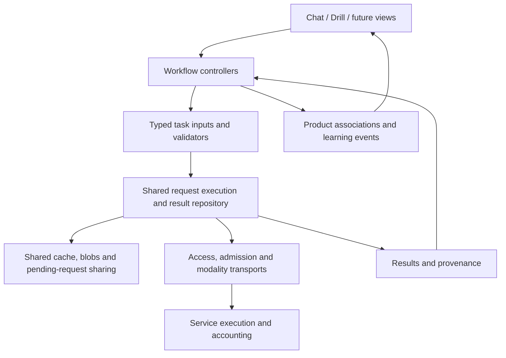

# Shared inference ownership audit

Status: source audit and authorized staged refactor, 2026-09-24. The ownership
principle and staged direction below are agreed. The original findings describe
the baseline before implementation; progress is recorded separately below.
Shared result/blob retention, speech integration, view-independent accepted
gloss lookup, generated reading-text execution, shared transcription and proposal
execution receipts are implemented. Final automated verification and user desktop
smoke testing passed on 2026-09-25, including the phrase-switch correction.
See the pre-commit checkpoint at the end for the current stopping point and
verification limits. Earlier
checkpoints below are historical snapshots, not the current completion status.

## Current correction: local caching, unchanged service contract

Decision: the user confirmed that shared inference ownership and caching are
local application work. The mandatory synthesis-profile protocol extension was
unnecessary coupling and is removed. No deployment, hosted test or remote workflow
run is required for this correction. Earlier deployment-oriented gates below are
historical and superseded by this section.

Implemented:

- Fresh speech sends exactly `model`, `text` and `language` directly to the
  existing speech endpoint. No profile-discovery request precedes it. Audio
  decoding still validates the response version, format and complete PCM data;
  available usage, request IDs and failure diagnostics remain retained.
- Shared pending work, retained audio, eviction and receipts remain in the native
  app. Local keys contain exact text/language and model/endpoint/route/account/
  workspace scope. They exclude UI/workflow identity and unused voice hints.
- Reuse survives restart and requires no network or credential read. Different
  wire inputs/access scope select different results. Unrelated settings revisions
  and pause do not invalidate existing audio. Hidden remote voice/processing
  changes are not detected; cache capacity zero clears retained results while
  preserving receipts. Restoring capacity enables new retention.
- Removed profile transport, profile outcome fields, discovery storage and local
  server protocol additions, including their package entries. Startup removes the
  retired discovery table only; existing result associations/audio/receipts remain.
  Changed key semantics do not reinterpret old keys. Old associated audio can still
  be played and is subject to normal eviction. Historical safe diagnostic fields
  remain allowlisted so existing receipts are still readable.
- Local server speech and protocol handlers now match the source at the last
  successful deployed commit `04fca005`; this was checked with a file diff, not by
  accessing or changing the deployed service. Local permission and packaging
  portability fixes remain intact.

Verification after correction:

- Native library suite: **589 passed, 6 ignored**. Loopback HTTP tests require a
  direct speech POST with exactly three fields, return no profile field, and cover
  selected-word/Drill/shared consumers, restart replay without a listening server,
  cancellation, one-time accounting and retained diagnostics.
- Local server suite with workspace-local decoder: **549 passed, 7 skipped**.
  Speech requests exercise the original wire contract, audio validation, spending
  accounting and provider-failure redaction. Isolated package startup passes. The
  seven database-emulator tests remain unrun; one dependency deprecation warning
  remains. Obsolete profile-feature tests were removed with that feature, not skipped.
- Strict native Clippy passed. Cleanup regression confirms retired discovery
  storage can be removed without losing associated audio or receipts.

Remaining local checkpoint: audible app playback, Stop/navigation/microphone
interaction and any recurrence of the historical reading cancellation need
running-app verification. Automated fixtures do not certify device playback.
Generated reading text is completed in the later checkpoint below; transcription
and proposal-lifecycle integration remain agreed subsequent work. None of these findings authorizes deployment or a commit.

## Historical completion audit: speech-first stopping point

Status: local automated checkpoint reached; operational gates remain open. The user
requested a complete work audit and tangible stopping points. This does not mark
the whole shared-inference refactor complete. Finish the speech integration before
expanding modality coverage; retain the rest of the agreed scope explicitly below.

### Findings and disposition

| Item | Current evidence | Disposition and closure condition |
| --- | --- | --- |
| Generic text transport ownership | Reading and transports use `ai/transport/text_request.rs`; the original dependency on conversation `Dispatch` is removed from these paths. | Implemented. The existing `ai/transport/boundary_tests.rs` recursively checks runtime transport sources for product dependencies and passes in the native suite. The earlier audit incorrectly listed this check as missing. |
| Shared speech storage and execution | All speech consumers use shared results; tests cover independent subscribers, restart reuse, zero capacity, eviction, corruption and cancellation. | Implemented and native tests passing. Runtime playback gate remains open. |
| Service package | `synthesis_profiles.py` was absent from Docker COPY and both source allowlists. This would prevent the new runtime from importing. | Fixed during this audit in all three places. Existing package/import and upload-list tests now exercise the module. |
| Protocol regression | The exact protocol-response test still expected the response before synthesis profiles were introduced. | Fixed to validate the profile and the remaining exact response. No compatibility bypass added. |
| Portable package inventory | The module inventory compared Windows backslash paths with Docker slash paths. | Fixed using POSIX relative paths, so the test detects actual missing modules on either platform. |
| Hosted speech compatibility | Two recent speech failures received HTTP 200 but rejected `audio.synthesis_profile`, with `synthesis_submitted=false`. | Open: verify and deploy the matching server revision, then confirm fresh synthesis. These logs alone do not establish the currently deployed revision. Deployment requires explicit authorization. |
| Actual audio playback | Existing tests use local HTTP fixtures and simulated browser media. | Open: verify chat, Drill reference and selected-word playback, repeated replay, restart replay, Stop, navigation and microphone exclusion in the running app. A fixture pass is not an audible-playback result. |
| Reading cancellation | The separate recent `run_reading` error has a text model, a dispatch timestamp and an empty response. | Added retained cancellation/authority reasons and text dispatch status, with receipt tests. Speech dispatch remains owned by its shared execution. The historical trigger remains unknown; reproduce in the running app. Do not infer that a submitted text request was free or completed. |
| Usage and receipt attribution | Shared execution is counted globally once; consumer associations retain receipts after eviction/cancellation. | Verified across two partners, repeated reading consumers, language scopes, eviction and restart. Partner totals overlap when they consume the same execution and must not be summed as a global total. An undispatched profile failure is excluded. |
| Accepted gloss lookup | Native accepted-source query and actual app composition are covered independently of chat mounting. | Implemented and tested. Preserve captured scopes, exact anchors, alternatives and explicit retry behavior. |
| Generated text results | `ReadingHelp.tsx` still owns the 64-entry generated-result cache and pending requests. | Outstanding agreed work: typed request identity, native shared execution/results, partial-result recovery and explicit fresh execution; remove the UI cache only after replacement flows pass. |
| Transcription | Recording execution still assesses Drill reliability and publishes through owner-bound receipts. | Outstanding agreed work: shared typed result and input-blob identity; workflow-owned assessment/publication; preserve atomic attempt ownership and original recordings. |
| Proposal generation | Generation registry and receipts remain separate from shared result retention. | Outstanding agreed work: explicit fresh-candidate policy and shared lifecycle, with acceptance and learning credit retained by product owners. |
| Server verification | Full local suite now passes with the decoder available. | Fixed Windows private files using protected current-user access controls and handle checks; POSIX retains restrictive modes. Tests cover permissions, link refusal, credential reuse, failed replacement and temporary-file cleanup. Linux runtime/container verification remains external. |
| UI verification | Full suite passes from `ui/`; initial root-directory run had path errors and one Stop-button test failure. Five subsequent complete Drill test-file runs passed. | Invocation corrected. Stop failure not reproduced in 175 additional test executions; cause remains unknown. This bounded investigation does not establish live playback correctness. |

### Verification performed in this audit

- `cargo test --manifest-path native/Cargo.toml --lib --quiet`: 592 passed,
  6 ignored. Ignored cases are explicit artifact/benchmark replays and a paid live
  request suite; they are not passing runtime checks.
- Full UI suite, run from `ui/` with
  `node ../node_modules/vitest/vitest.mjs run --reporter=dot`: 180 files,
  1,226 tests passed. Initial `--root ui` invocation from the repository root
  exposed working-directory assumptions in admin tests; it is not the successful
  suite invocation. Canvas-not-implemented and duplicate-key notices remain;
  neither provides real audio/canvas verification.
- TypeScript, strict native Clippy, generated contracts, diagnostic policy and diff whitespace checks:
  passed. Formatting, Clippy, contracts and diagnostic checks were repeated after
  the cancellation/accounting changes and passed.
- Full server suite: **552 passed, 7 skipped**, using workspace-local FFmpeg 7.1
  on the test process PATH and fresh `.local/` temporary/cache directories.
  Isolated packaged-startup subprocesses required execution outside the sandbox.
  The seven skipped cases require the local database emulator; none was available
  in this Windows environment. This supersedes the initial 525-pass/24-failure
  result and the intermediate decoder-enabled run. No test was disabled to obtain
  this result. One dependency deprecation warning remains.
- Decoder-backed audio and isolated startup of the Docker-COPY source package
  pass. This is not an actual Linux container test. Windows permission assertions
  inspect the real access-control list; link tests exercise junctions/hardlinks
  without requiring privileged symlink creation. POSIX behavior was not executed
  in this Windows run.
- Five consecutive runs from `ui/` of the complete `DrillPage.test.tsx`:
  35 tests each, 175 passed. No UI source change was made to mask the earlier
  intermittent Stop failure.
- Focused package inventory, source upload allowlist and protocol checks:
  28 passed. Actual upload-manifest CLI semantics remain unverified locally because
  the cloud CLI is unavailable. No upload was performed.
- The earlier focused 100-pass run deselected three decoder cases; all three are
  included in the successful full run above. No container tool was found and the
  Linux subsystem reports that it is not installed, so there is no verified local
  Linux runtime available for the remaining service gates.

### Finite completion gates

1. **Speech source ready:** package and contract checks pass; receipt/accounting
   and cancellation regressions cover shared consumers; playback-test instability
   has a reproduced cause or a bounded, explicit unresolved finding. Complete the
   decoder-backed service tests in a suitable environment. This local automated
   gate is reached, with the bounded Stop-test finding recorded above. It does
   not certify Linux packaging, live speech or the historical cancellation cause.
2. **Speech operational:** authorize the prepared deployment, verify the exact
   revision and protocol, then complete the running-app playback matrix above.
   Record fresh executions separately from replays and inspect failure receipts.
   This gate is open; a code checkpoint is not operational completion.
3. **Shared inference complete:** finish generated text, transcription and
   proposal lifecycle integration; remove superseded paths; verify retention,
   accounting, accepted product records and future-consumer behavior across all
   modalities. This gate is open and is not hidden behind the speech checkpoint.

No code was committed, pushed or deployed during this audit. Existing uncommitted
work was preserved. No application data or cloud counters were reset. The initial
package/test fixes were followed by private-file portability fixes, explicit
reading authority diagnostics and shared-speech statistics coverage. The Windows
dependency is platform-scoped and locked. The decoder is a workspace-local
verification tool, not a new application dependency or system PATH modification.

## Historical post-checkpoint operational inspection

Observed after the user pushed checkpoint `ad0ec3349d47c5ae8d475290f13b5786ab1e6e14`:

- Local checkout was clean and the remote `caches` branch resolved to that exact
  commit. No workflow runs existed for its SHA. Branch push alone does not run
  the current CI or deployment workflows on `caches`.
- The latest successful deployment workflow was
  [run 35920041980](https://github.com/freemocap/skellyspeak/actions/runs/35920041980),
  for `04fca005f9f3ad65d4a8f1bca534f7ff5f383e52`. That source's protocol handler
  does not publish `synthesis_profile`. This supports the observed client/server
  mismatch; it is not direct verification of current Cloud Run traffic or of
  deployments made outside this workflow.
- The latest main-branch CI failure, at `97eda06f`, was annotated as a 15-minute
  timeout in the Rust library test step. It is not a failing result for the new
  checkpoint, and the annotation does not identify a specific failed assertion.
- No local runtime log files were newer than the checkpoint commit at
  `2026-09-24T23:02:48Z`. There is no fresh playback evidence to evaluate.
- The existing **Deploy server** workflow can be manually run on `caches` to
  execute Linux server tests, database-emulator transactions, upload-boundary
  validation and container startup. Its deploy job explicitly requires
  `refs/heads/main`, so this branch run does not deploy. Verify the run's resolved
  SHA is the checkpoint above before using its result as release evidence.
- Public workflow metadata was accessible. No authenticated repository CLI or
  browser was available to dispatch the run; the browser inventory was empty and
  opening the in-app browser reported that it was unavailable. The cloud CLI is
  also unavailable. No workflow was dispatched, no access changed and no
  deployment was attempted.

Superseded next action (do not execute): run the existing workflow on `caches`, inspect all test/container
results, then obtain explicit deployment authorization and verify the exact live
revision plus the running-app playback matrix. The local checkpoint remains
complete; operational verification remains open.

## Agreed principle

Text-to-text, audio-to-text and text-to-audio requests, responses, associated
blobs and provenance belong to shared machinery. Translation, glossing,
explanation and generation supply typed task contracts to that machinery.
Chat, Drill and future surfaces consume and associate results; their identities
must not determine request equivalence, cache storage or result availability.

Workflow controllers still decide when work is authorized, assemble its actual
inputs and apply validated results to product records. They own conversation
ordering, Drill visits, acceptance of proposals and learning credit. Views own
display and interaction. Neither a component's mount lifetime nor a workflow's
record ID should become the lifetime or identity of a reusable inference result.

Shared machinery does not mean an untyped result object or a single large
controller. Modality adapters and task validators remain cohesive modules.

## Cleanup and verification

The incomplete cache implementation from this discussion was removed, including
its settings control, generated contracts, schema edits and keep-chat-mounted
workaround. Its approach was too narrow: it still relied on workflow-specific
execution, did not address transcription, and proposed discarding the existing
reference cache before agreeing on the architecture.

The working tree was clean after cleanup, before adding this audit. No commit,
deployment or application launch was performed during cleanup/audit. No local
application database was inspected or reset. This establishes source restoration,
not the state of any independently running development process or its data.

Baseline verification after restoration:

- `cargo test --manifest-path native/Cargo.toml --lib`: 572 passed, 6 ignored.
- Focused UI tests: 21 files, 167 tests passed (reading components, conversation
  reading, Drill, reading speech playback, native command registration).
  Executed through the installed test runner with `--root ui`; the npm argument
  wrapper failed before tests, and the direct runner required sandbox escalation
  for configuration resolution. The passing run emitted simulated-browser
  canvas-not-implemented notices; it does not verify real audio or canvas output.
- `cargo run --manifest-path native/Cargo.toml --bin export-contracts -- --check`:
  passed.
- `node node_modules/typescript/bin/tsc --noEmit -p ui/tsconfig.json`: passed.

The audit covers active UI, native execution/storage and service inference
boundaries, with adjacent generation, diagnostics and usage consumers. It is a
source-level responsibility audit, not a line-by-line review of every module.
No live inference, device playback or server runtime tests were performed.

## Current paths

Paths below are repository-relative; findings describe restored source.

| Operation/consumer | Execution and validation | Result ownership/reuse today |
| --- | --- | --- |
| Conversation translation and gloss | Conversation scheduler; shared translation/gloss contracts | Results in turn context, projected into message snapshots; operation/attempt identity tied to turns |
| Explicit translation, gloss and explanations, including Drill | Reading registry and command executor reuse the task contracts | Durable redacted reading receipts; returned results cached in a component-local 64-entry map |
| Conversation speech | Conversation speech operation and scheduler; shared audio adapter | Four-entry, 16 MiB memory cache keyed by attempts; lost on restart; insertion-order eviction |
| Drill reference speech | Reading executor plus Drill reference storage | Persistent 16 MiB LRU; lookup requires Drill item ID and generation key |
| Token speech | Reading executor and shared playback | No native reusable audio cache for requests without a reference item |
| Transcription for chat and Drill | Shared capture, recording executor and audio adapter | Owner-bound transcription receipts; Drill stores attempts/audio; conversation inspection is volatile |
| Persona and Drill phrase generation | Shared generation registry and receipts, distinct task prompts/validators | Proposal/acceptance ownership differs; no general reusable result repository |
| Service execution | Generic text/grouped and audio endpoints, common admission/accounting | Text attempt duplicate protection; no general cross-operation result cache found in audited service paths |

An IPC request or loading indicator is not proof of another paid request. Drill
reference replay calls native validation/cache lookup; a hit avoids dispatch.
The reported concern is confirmed for token speech, while full Drill reference
speech already caches within its much narrower ownership boundary.

## Findings and evidence

### 1. Speech storage is divided by consumer

`native/src/speech/cache.rs` holds four memory entries and never updates recency
on reads. `native/src/conversations/execution/speech.rs` regenerates on an explicit
request when completed media is no longer resident.
`native/src/drill/reference.rs` has a separate durable LRU, indexed first by
`drill_item_id`. Identical phrases in different items cannot share that entry.
Its key also includes the full language context, configuration hash and resolved
target, which can invalidate speech for changes unrelated to actual synthesis.
`native/src/application/commands/reading.rs` consults this Drill-specific cache.
`ui/src/platform/audio/reading-speech.ts` calls the reading service for ordinary
read-aloud; token requests supply no reference item and therefore miss that cache.

Required direction: one speech result/blob repository and reuse policy for all
consumers, with workflow associations outside the cache.

### 2. Saved gloss availability depends on a mounted view

`ui/src/app/shell/SurfaceHost.tsx` replaces the conversation with Drill.
`ui/src/features/conversation/reading/ConversationReadingProvider.tsx` registers
only the loaded snapshot's saved annotations.
`ui/src/components/reading/SavedReadingProvider.tsx` unregisters on unmount.
Consequently the shared reading index loses those conversation annotations when
switching to Drill, even though the source records remain durable.

Required direction: load/query saved results independently of page lifetime.
Keeping the conversation mounted is not the architectural fix.

### 3. The shared reading component also owns data and execution policy

`ui/src/components/reading/ReadingHelp.tsx` owns a 64-entry map and pending request
sharing. Entries are removed in insertion order, not LRU, and disappear with the
provider instance. The key includes aid, language scope and text, but no execution
contract/model identity. `reading-requests.ts` correctly manages separate consumer
cancellation, but only inside that UI instance; native registries and other
windows do not share it. Native reading rejects simultaneous reference requests
for the same item instead of providing general equivalent-request sharing.

`ui/src/domain/reading/saved-gloss-index.ts` already provides useful, shared exact
surface-form indexing with language/variety boundaries and alternative meanings.
Preserve that policy as a projection of saved results. A word meaning borrowed
from another context is not an identical whole-passage inference result; retain
source provenance and alternatives rather than making this a fuzzy cache key.

### 4. Shared contracts still depend on conversation-owned execution types

`native/src/language/reading/mod.rs` builds
`crate::conversations::execution::Dispatch` even for independent reading tasks.
The generic provider request functions and grouped transport accept that same
conversation-owned type (`native/src/ai/transport/provider/request.rs` and
`native/src/ai/transport/grouped.rs`). Generic generation also reads configuration
and credential helpers from conversation execution.

Translation lives in `native/src/conversations/translation.rs`; reading already
reuses its prompt/schema/validator. Gloss and speech input construction similarly
have shared callers but conversation ownership. Move responsibilities deliberately,
not just filenames: generic transports should accept generic execution inputs,
and workflow dispatch should wrap those inputs with workflow associations.

### 5. Transcription shares transport but includes Drill publication and assessment

`native/src/speech/recording/owner.rs` resolves recognizer inputs from either a
conversation or Drill item. Resolving context belongs at the workflow boundary;
the resulting audio/language/context request can be consumer-independent.
`native/src/speech/recording/voice.rs::transcribe` branches on the owner to compute
Drill reliability. `transcription.rs::publish_transcription` stages Drill attempts
and prunes Drill recordings. Its receipt schema requires a conversation or item.

Required direction: publish a typed transcription result (text, timings,
confidence/diagnostics and input blob reference) through shared machinery. The
Drill controller assesses and associates it; the conversation controller inserts
it into the composer/send flow. Preserve atomic publication and one-time attempt
ownership when moving these calls. Same audio with different recognizer context
is a different request; newly recorded audio is not equivalent merely because it
produces the same transcript.

### 6. Result, execution and usage records have several incompatible owners

`native/src/storage/schemas/schema.sql` defines turn-owned `operations/attempts`,
owner-bound `transcription_attempts`, JSON `reading_attempts` and item-owned
`drill_references`. `generation_schema.sql` adds generation-specific attempts.
`native/src/language/reading/receipts.rs` and
`native/src/ai/generation/generation_receipts.rs` implement separate lifecycle
transitions and recovery. `native/src/statistics/mod.rs` combines these stores
using different counting rules; reading cache hits are excluded via absence of a
dispatch timestamp.

This is evidence of fragmented ownership, not proof that existing totals are
incorrect. A shared model must distinguish requests, actual dispatch attempts,
validated results, cache uses and product events. A reused result adds no new
provider charge and must not duplicate learning credit or erase prior metadata.

### 7. Service duplicate protection is not reusable caching

`server/app/inference/grouped.py` claims an attempt using the operation/request
digest and returns duplicate state for an existing claim. It does not return a
saved result for equivalent content under another operation.
`server/app/inference/audio_service.py` invokes the shared audio adapters after
admission; those paths do not provide the grouped attempt protocol.

Keep local result reuse, sharing concurrent equivalent work, and transport
idempotency as distinct responsibilities of the shared system. Audit cancellation
and ambiguous network outcomes across all three. Do not introduce server-side
content persistence as an incidental consequence of local caching.

### 8. Effective synthesis identity is not fully exposed locally

`native/src/ai/transport/service_audio.rs` sends model, text and language, not its
internal voice field. `server/app/inference/audio_service.py` selects the actual
voice from server configuration. A key hashing the local voice field cannot
detect an effective server voice change at the same address/model.

The design needs an explicit effective configuration identity or equivalent
capability contract for reuse validation. Do not invent an invalidation scheme
from client fields that never reach synthesis. Exact wire design remains open.

## Shared machinery already worth preserving

Access resolution, admission, holds, retry classification and provider transports
already have shared owners under `native/src/ai/`. Translation/gloss contracts
are reused by reading; persona and Drill generation share a registry and receipt
machinery. Speech playback and interruption are shared under
`ui/src/platform/audio/`. Diagnostics retain structured, redacted information.
The service's inference endpoints do not need chat/Drill UI state.

Conversation dependency scheduling, captured context, revision rejection,
transaction boundaries, proposal acceptance and learning credit remain workflow
responsibilities. Different task prompts and output schemas are legitimate;
duplicating their execution or result lifetime by surface is not.

## Proposed ownership model

Conceptually distinguish immutable input/result data, provider execution attempts,
consumer subscriptions and workflow associations. These are responsibilities,
not approved database tables. Core execution must not switch on chat/Drill owners.
Task identity is more precise than modality: two text-to-text requests are not
equivalent just because their visible source text matches.

Request identity includes actual inputs, supplied context, task/prompt/output
contract versions, relevant language/variety, effective model/configuration and
generation parameters. Audio uses its input representation and decoding contract.
Exclude page IDs, message IDs, practice-item IDs and playback volume/speed. Keep
authorization scoped to the local workspace; never put credential secrets into
cache identities or diagnostics. Avoid broad configuration hashes that invalidate
unrelated results. Preserve exact source text; no lossy matching normalization.

The shared layer should support reuse, explicit fresh execution, and read-only
lookup. An intentional request for another generated candidate must remain
possible through an explicit operation policy, not a special case for its screen.
One consumer leaving must not cancel work still needed by another. Revoking a
workflow's right to publish is distinct from invalidating a reusable result.

Eviction governs regenerable payloads; it must not silently delete accepted
translations, annotations, transcripts, learner evidence or original receipts.
Blob references and retention obligations require review before choosing storage.
Settings expose shared capacity and usage, not one cache per feature. Default
capacity, byte accounting, result retention and refresh policy remain undecided.

## Proposed implementation sequence for review

1. Agree on the request/result/attempt/association boundaries and representative
   reuse examples. Resolve effective service identity, fresh-generation behavior,
   and retained-result versus evictable-blob ownership before schema choices.
2. Establish generic execution/task interfaces using existing adapters and
   validators. Remove the transport dependency on conversation dispatch without
   changing workflow behavior. Add dependency checks for this boundary.
3. Implement the shared result/blob and pending-request machinery. Route every
   speech consumer through it first, including chat, references and tokens;
   establish accounting and cancellation behavior before adding cache UI.
4. Route translation, gloss and explanation consumers through the same machinery.
   Move saved-result lookup out of view registration; preserve exact annotation
   anchors, partial results, alternatives and explicit repair behavior.
5. Route transcription and generation through that lifecycle. Move Drill scoring,
   proposal acceptance and product persistence into their workflow controllers.
   Consolidate receipt/usage projections as consumers move; remove superseded
   paths only after the replacement flows are verified.
6. Review shared capacity/retention settings, diagnostic views and the future-
   consumer test. Document any targeted development-data cleanup required by
   the agreed schema; do not add historical format-conversion machinery.

Each stage needs a concrete reviewed scope before editing. This sequence is not
authorization for a broad rewrite or for changing task behavior.

## Acceptance checks for the eventual refactor

- Equivalent requests from different surfaces and windows share one execution
  and retained result; restart reuse needs no provider call.
- Closing one consumer preserves the others; revoked consumers cannot publish
  stale results. Pending/failed/partial data cannot masquerade as complete hits.
- Model, task contract, relevant language/context or effective voice changes
  distinguish requests; playback and navigation changes do not.
- Cache reads do not need provider credentials or paid-work admission. New
  dispatch still obeys authorization, pause, holds, limits and retry policy.
- Capacity reduction and true LRU eviction operate across consumers. Active
  playback, accepted records, diagnostics and billing provenance remain coherent.
- A cache use never counts as another provider execution, learner attempt or
  reward. Unknown cost stays unknown; allowance is never reported as actual cost.
- Gloss reuse works with chat unmounted and preserves source anchors across
  representative scripts/encodings without language-specific exceptions.
- A minimal non-chat/non-Drill consumer can use each modality without adding an
  owner variant, cache implementation or transport branch.

## Historical next review after the initial audit

The staged direction is authorized and the execution-input slice below is
implemented. The next checkpoint concerns shared result/blob ownership, effective
service identity and retention before implementing persistence. Existing cache
bugs remain present; this checkpoint does not claim they are fixed.

## Implementation checkpoint: shared execution inputs

Implemented first slice:

- Provider/grouped transports accept `ai/transport/text_request.rs::TextRequest`
  instead of conversation dispatch. This input has no message, practice item,
  gloss source, speech publication owner or workflow schema fields.
- Conversation dispatch explicitly projects its provider inputs. Reading and
  proposal generation construct generic inputs directly; reading returns its
  source and output schema separately for validation.
- Translation and gloss contracts moved to `language/` with direct caller
  updates and no old-path aliases. Conversation operation-kind recognition stays
  with workflow consumers.
- Speech-input construction moved to `ai/audio.rs`; common connection settings
  and credential selection helpers moved to `ai/connections/configuration.rs`.
  Request identity construction moved to `ai/identity.rs`.
- A transport dependency test rejects runtime imports of product workflows.
  Existing transport fixtures now construct requests without any product owner.

This slice changes ownership and dependency direction, not result lifetime,
cache behavior, schemas, IPC, task prompts or workflow publication semantics.
Conversation still owns its dispatch/publication state, and the existing reading,
generation and recording lifecycles remain to be consolidated. No storage or
cache-capacity choice is implied by this checkpoint.

Verification for this slice:

- Native library suite: 573 passed, 6 ignored, no failures. Includes the new
  transport boundary test, independent transport requests, and existing
  conversation/reading contract parity and local HTTP execution tests.
- `cargo check --manifest-path native/Cargo.toml --all-targets`: passed.
- Generated TypeScript contract check: passed; IPC declarations are unchanged.
- Compared moved task implementation and fixtures with the original files:
  unchanged except the gloss ownership comment and removal of translation's
  workflow-kind classifier.
- `git diff --check`: passed.

No application launch, paid request, database reset, commit or deployment was
performed. UI and server source are unchanged in this slice. Device behavior
has not been manually verified.

## Design checkpoint: shared results and speech integration

Historical status at this checkpoint: scope approved, including the configurable 256 MiB default. The service
identity step is implemented below; the repository and consumer integration
remain pending. The following design description is not a claim of implementation.
The user committed the execution-input slice and reports that the app runs;
this is a smoke check, not verification of cache behavior. The working tree was
clean at the start of this review.

### Ownership and behavior proposed for review

The shared native layer owns requests, completed results, execution provenance,
payload retention and pending subscriptions. A workflow owns its association
with a result and its right to publish. No shared request key, pending entry or
eviction policy contains a chat message, Drill item or other presentation owner.

- A request identifies exact effective inputs, task/output contract and service
  configuration. Preserve source Unicode and whitespace; do not apply reading
  matching normalization. Credentials, timestamps, playback speed, UI owner and
  unrelated settings are not semantic inputs. Service/account isolation remains
  explicit; removing credential bytes from keys must not merge unrelated access
  scopes.
- A result is immutable, validated output linked to its originating execution.
  Several results may exist for one request when a caller explicitly requests
  fresh generation. Reuse versus fresh execution is an explicit shared policy,
  not a test for which feature called it.
- An execution retains redacted diagnostics and billing provenance whether or
  not its output remains cached. A reuse association points to that execution;
  it is not another paid execution or another learning event.
- Payloads belong to the shared repository. Accepted text, learner recordings
  and other durable product records retain their existing ownership in this
  slice. A reference to evictable synthesized audio does not promise permanent
  audio availability. Any future durable payload reference needs explicit
  retention protection before eviction is allowed to affect it.
- One workspace-wide byte budget covers evictable request/result payloads and
  unique blobs. Successful lookup updates recency; eviction removes the least
  recently used unprotected entries. Shared blobs are counted once and removed
  only after their last retaining reference. Active playback holds its bytes
  independently of disk eviction. Report payload usage separately from physical
  database size and retained product data.

### Effective speech identity

Confirmed source behavior: `ai/transport/service_audio.rs` sends model, text and
language; it does not send `SpeechInput.voice`. The server's
`inference/audio_service.py` selects the configured voice. The current Drill key
hashes the unused local voice and broad configuration, which cannot reliably
identify the actual synthesis configuration.

Proposed contract: the service advertises an opaque synthesis profile identifier
covering its effective model, voice, synthesis preparation and output contract.
The client supplies the expected profile on new synthesis requests; the service
rejects a mismatch before paid dispatch and echoes the actual profile on success.
Changing a profile must not cause an automatic paid retry. Native validation
requires the expected profile before publishing a reusable completed result.
Do not expose credentials or raw configuration through this identifier.

Retained audio replay is local and needs neither credentials nor service
availability. An equivalent lookup may use the last verified service profile;
that is reuse under a known profile, not proof of the server's current settings.
A request explicitly requiring current settings refreshes the profile first.
Connection verification and subsequent online requests update the known profile.
After a profile change is learned, new equivalent lookups use the new identity;
existing result references still identify their original audio. If no verified
profile exists, do not guess identity from local voice configuration.

### Pending work and publication

Equivalent reusable requests join one native pending execution, including across
windows. Each caller holds an independent subscription. Leaving revokes that
caller's publication rights; work required by remaining callers continues.
When the last subscriber leaves, cancel work that has not dispatched. Dispatched
work still requires truthful receipt settlement; cancelling a local wait cannot
claim that remote work was cancelled or unbilled. Valid completed output may be
retained without publication to a departed workflow. Failed, interrupted and
partially validated outputs never become complete cache hits.

### Finite implementation scope after review

1. Add and test effective synthesis profiles in the service and native adapter.
   Preserve existing error metadata and the no-automatic-retry rule. This is a
   source change only; service deployment remains separately authorized.
2. Implement the generic native repository and pending subscriptions. Prefer
   transactional storage in the workspace database so result, blob and execution
   provenance publication can commit together. Review the exact schema and any
   necessary development-data cleanup before applying it; do not silently reset
   or add historical conversion machinery.
3. Route chat speech, phrase references and token speech through that same path.
   Retain workflow validation at association/publication boundaries. Remove the
   replaced memory cache and Drill-owned reference cache only after regression
   checks pass. Reuse reads precede paid admission and credential loading.
4. Expose one shared cache capacity setting. Approved starting default: 256 MiB.
   Capacity zero
   disables retained reuse but still allows sharing currently pending work.
   Lowering capacity evicts reusable payloads without deleting product records.

Verification must cover reuse across all three speech callers and after restart,
same text in different Drill items, exact-input/profile differences, read-touch
LRU and capacity reduction, shared-blob accounting, offline replay, independent
subscriber cancellation, stale publication rejection, failed validation, and
one paid receipt for joined work. Preserve existing refusal, accounting and
diagnostic tests. Tests use local fixtures and must not issue paid requests.

Translation/gloss lookup, transcription lifecycle, generation lifecycle and
application-wide follow-up findings remain the subsequent audit slices. This
proposal does not claim those paths or speech caching are already repaired.

## Implementation checkpoint: effective synthesis identity

Implemented the first step of the approved speech integration scope:

- The service advertises a synthesis profile derived from its model, configured
  voice, input-preparation revision and output contract. Credentials and allowance
  rates are excluded. Profile revisions must change when those executable
  preparation/output contracts change.
- Speech requests supply the expected profile. The server rejects a mismatch
  before reserving spending or calling the provider, and echoes it on success.
- The shared native adapter obtains the profile before synthesis and rejects a
  missing or mismatched response identity. A verified identity is carried in
  `SpeechOutcome` and retained diagnostics/reading receipts. Both existing speech
  callers use this adapter without feature-specific profile logic.
- Profile-fetch failures distinguish an unsubmitted synthesis request from an
  ambiguous paid synthesis outcome. Missing/mismatched identity or invalid audio
  retains available provider request IDs and usage metadata. A profile mismatch
  does not trigger an automatic retry.
- The shared diagnostic policy and its generated copies include the validated
  profile field. No input text, voice identifier or credentials were added to
  retained metadata.

This is not the shared cache implementation. No result/blob tables, pending
subscriptions, capacity control or cache replacement have been added. The adapter
currently probes before each actual synthesis; retained Drill replay still uses
its existing local path. Persisting the last verified profile for generic local
lookup belongs to the repository step. Gloss and transcription behavior is
unchanged.

Verification:

- Native library suite: 576 passed, 6 ignored; no failures. Includes profile
  validation, incompatible protocol rejection, receipt preservation and existing
  reading/restart-replay regression tests.
- Native all-target compilation and generated IPC contract check: passed.
- Service audio and adapter tests: 72 passed, 3 transcription tests excluded on
  the focused rerun. The initial complete audio-service run found those three
  failures because `ffmpeg` is not installed in this environment.
- Broader server diagnostics run: 129 passed, one unrelated local-admin failure
  because Windows Python has no `os.fchmod`; the same three transcription tests
  were excluded. These are verification gaps, not passing checks.
- Diagnostic artifacts regenerated from their source policy; diff whitespace
  check passed.

New synthesis with this native build requires the matching service code. An
older service without the profile fails before a paid synthesis request. No
service deployment, application launch, paid request, data reset or commit was
performed. Storage, shared reuse, cancellation and capacity remain outstanding.

## Implementation checkpoint: shared speech results and retention

This checkpoint supersedes the storage-pending statements above. Source now has:

- A modality-independent result/blob repository and pending subscriptions in
  `native/src/ai/results/`. Execution receipts and opaque consumer associations
  are retained separately from evictable payloads. No chat or Drill identifier
  participates in speech request equivalence, sharing or eviction.
- Shared speech composition in `application/speech_results.rs` used by the
  conversation scheduler and explicit reading (including Drill and token speech).
  Exact text, language, service/account scope and verified synthesis profile
  determine reuse. Unused local voice and unrelated configuration revisions do not.
- One configurable 256 MiB default capacity, read-touch LRU, shared-blob accounting,
  restart reuse and explicit corruption/schema errors. Zero capacity disables
  retained payloads without disabling simultaneous-request sharing. Usage counts
  payload bytes, not SQLite file size; receipts are outside that budget.
- Independent consumer cancellation. A departing last consumer prevents synthesis
  if discovery has not finished. Already-dispatched execution settles separately
  even when every consumer leaves. Publication still checks source ownership.
- One execution counted for joined work. Replay creates no new paid execution.
  Reading activity and unavailable conversation speech can inspect the shared
  receipt after cancellation or eviction. Requested/actual model, provider request
  ID, unknown cost, decoder metadata and retry information remain inspectable.
- Native Settings commands and a compact capacity/usage control. Conversation's
  old memory cache is now a consuming delivery mailbox, and the Drill reference
  owner only validates publication eligibility.

Startup adds the shared repository schema and drops only the retired
`drill_references` cache table. Original recordings, Drill attempts, conversations
and existing receipts are not reset. Incompatible existing inference schema
objects produce an error before this cleanup; no compatibility migration or
silent recovery of unknown data was added.

Cached requests use the last verified profile. A new synthesis request probes the
service, and custom connection verification also updates the profile. Learning a
new profile changes subsequent equivalent lookups; existing result associations
retain their original audio. There is no periodic hosted profile refresh or
dedicated refresh button. Replay is not proof of the service's current voice.
New reading requests still need a configured access identity to choose their
account scope, but cache lookup does not read credential secrets. Existing
conversation result associations remain readable after credentials are removed.

### Verification

- Full native library suite: 587 passed, 6 ignored, no failures at this checkpoint.
  Covers repository restart/LRU/byte limits, exact Unicode and profile identity,
  corruption refusal, retry receipts, shared reading/Drill/independent execution,
  paused offline replay, cancellation before dispatch and settlement after one or
  all consumers cancel. Conversation also reuses an independent result while
  paused, reopens its association without credentials and rejects changed source
  text. Invalid independent inputs fail before discovery or execution association.
- Focused settings, Drill storage, IPC registration and merged Drill undo UI
  tests: 36 passed across 6 files. Architecture suite: 26 passed across 8 files.
- TypeScript compilation, generated contracts, diagnostic policy and all 7
  locale catalogs passed. Native all-target compilation and strict Clippy passed.
- HTTP tests use local fixtures; no paid inference or deployment was performed.
  Automated tests do not establish real-device playback or hosted compatibility.

The observed running-app speech failure came from the hosted protocol response
missing the new synthesis profile. Diagnostics recorded `synthesis_submitted:
false`. The matching server source exists, but this work has not deployed it;
new hosted synthesis remains dependent on that deployment. Earlier server test
gaps concerning unavailable ffmpeg and Windows `os.fchmod` remain as recorded
above and are not passing checks.

### Next bounded architecture pass

The original audit's gloss concern remains confirmed: saved annotations are
registered by a mounted conversation provider, and `ReadingHelp.tsx` still owns
the 64-entry text-result cache and request sharing. Speech no longer uses that
cache. Do not retain the conversation view merely to make its data available.

Next scope for review is shared translation/gloss/explanation result ownership:

1. Query accepted annotations independently of mounted views, preserving exact
   language/variety scope, original source anchors and alternative meanings.
2. Project typed text-task inputs and validators into the shared result lifecycle.
   Whole-request equivalence must include actual prompt/context/model/schema;
   reusing a saved word meaning is a separate indexed lookup with provenance.
3. Remove the component-owned cache only after native lookup, concurrent sharing,
   partial gloss recovery and explicit retry behavior have regression coverage.

Recording/transcription and proposal generation are later slices. Keep recording
ownership, accepted product records, intentional fresh candidates and learner
credit outside the result cache. Audit aggregate attribution across several
partners separately from counting one underlying execution. This checkpoint does
not claim those lifecycles are consolidated or authorize incidental task changes.

## Implementation checkpoint: accepted gloss lookup without mounted chat

Implemented the first bounded part of the text-result pass. This supersedes the
mounted-view limitation recorded above for reading help's accepted-word lookup.
It does not claim the component cache for newly generated text results is removed.

- Added a read-only native query over accepted message and suggestion annotations.
  It is independent of selected conversation and snapshot pagination, resolves
  omitted varieties through shared configuration, and filters by the original
  captured source/explanation scope. Current conversation preference changes do
  not relabel old annotations. Archived, replaced and invalidated sources are
  excluded. Source identity/anchor errors fail explicitly.
- Query/source contracts belong to shared reading; the conversation owner
  projects its durable records. There is no new cache table, capacity setting,
  migration or retained copy of accepted content. This query neither requires
  AI access nor creates an inference attempt, provider request or learning event.
- `app/ReadingTools.tsx` composes the query into shared reading services.
  Word help queries it before new inference. The existing pure matcher preserves
  exact source encodings, scope, clitic offsets, passage priority and alternative
  meanings. Native candidate filtering is substring-only; it never decides that
  a substring is an equivalent word. The shared matcher makes that decision.
- Reading display types distinguish an annotation projection from a new
  `WordGlossView`; no invented provider attempt is attached to reused meanings.
  Inspection retains consulted source IDs, available operation/attempt IDs and
  original anchors without copying source content into the lookup receipt.
- Read-only results are not inserted into the component cache. Reopening help
  queries accepted data again. Cancellation during lookup prevents subsequent
  dispatch, and a storage failure is shown rather than silently generating a
  replacement. Partial saved data can explain a known word; an unknown selected
  word can still request inference. Explicit retry bypasses the read-only lookup.

Verification for this checkpoint:

- Full native library suite: 591 passed, 6 ignored. Added cases cover restart,
  paused/no-credential lookup, captured scope after preference changes, multiple
  sources, suggestion provenance, archive/replacement exclusion and invalid data.
- Reading, Drill and architecture UI suite: 214 tests passed across 31 files.
  Integration coverage uses the actual application reading composition and native
  adapter with fixture IPC: chat unmount, a fresh non-chat surface, refreshed
  accepted data, cancelled queries, lookup errors, unknown words and explicit
  partial-result retry. Pure matching covers scripts and canonical encodings.
  Simulated-browser tests emit canvas-not-implemented notices; these do not
  verify real canvas/audio rendering.
- TypeScript, strict native Clippy, generated contracts, diagnostic policy and
  diff whitespace checks passed. The generated types remain the annotation
  contract source; the pure UI index uses a projection of that type.

Remaining text-result work: move newly generated translation, gloss and
explanation request/results into the shared native lifecycle, including task
identity, partial-result recovery and fresh execution. The existing 64-entry
component cache and pending-request map still serve those generated text results.
Transcription and proposal generation remain later stages. No service deployment,
paid request, application-data reset or commit was performed in this checkpoint.

## Implementation checkpoint: generated reading results, 2026-09-25

Status: implementation complete; verification results below distinguish automated
coverage from running-app checks. This supersedes earlier statements that the
64-entry component cache and UI pending map still own generated reading results.
It does not mark the entire shared-inference task complete.

Implemented behavior:

- Translation, word gloss and explanation requests use shared local native
  execution and the existing bounded result/blob store. Identity hashes the exact
  wire prompt/output contract, task, effective model, resolved language context,
  configuration and access/workspace scope. Consumer IDs are excluded. Language
  handling remains shared; source encodings are not normalized for cache identity.
- Each reading card keeps its own receipt/cancellation and source authority.
  Concurrent equivalent requests share an execution with independent transport
  IDs. Closing the initiating card, or every card after submission, does not
  abandon settlement. Access/admission failures also settle an execution receipt
  without being counted as submitted provider usage.
- Retained results survive restart and can be reused while AI is paused, without
  network or secret reads. Access/configuration changes revoke stale consumers.
  Explicit retries start fresh execution, including when an equivalent request is
  still pending. Valid partial gloss spans survive repair; the repair receipt
  links the previous execution. Repairs merge under one store guard.
- Cache-write failures retain the validated provider response and accounting in
  the failure receipt. Successful provider transport is not reported as successful
  reading publication when local storage rejects the result.
- Reuse selects the newest retained execution, not the most recently inspected
  payload. Historical receipt inspection no longer promotes an older answer.
  Eviction removes generated bytes while preserving receipts and usage attribution.
- Local saved-word lookup includes generated glosses in the current model/access/
  configuration and language scope. Accepted conversation records remain separate,
  take precedence for exact passages, and remain available without credentials.
  Generated provenance identifies the source execution; no new learning credit or
  accepted product record is invented by reuse.
- Removed the generated-result Map, request-sharing Map and their obsolete UI
  helper/tests. Native tests now cover those lifecycle guarantees. UI state holds
  only current presentation and cancellation. Mounted accepted annotations still
  display synchronously; other generated results are queried on explicit actions
  and do not automatically populate unrelated mounted cards.
- Inspector lookup preserves the selected word's saved partial result until an
  explicit retry. Whole-passage lookup requires complete saved coverage. Analysis
  quotes that exactly match their owning message reuse its accepted translation.

Verification:

- Full native library suite: **596 passed, 6 ignored**. After the final cache-write
  failure diagnostic refinement, all **40 reading tests** passed, including the
  added failure-injection test. Strict Clippy over library and tests passed on the
  final source. The injected database failure retains provider ID, usage, failed
  execution state and zero reusable payloads rather than losing the paid receipt.
- Local HTTP fixtures cover equivalent concurrent consumers, initiator and final
  consumer cancellation, restart/paused reuse, distinct in-flight retry, partial
  repair, cross-passage generated lookup, eviction and one-time usage accounting.
- Full UI suite: **1,224 passed across 179 files**, including the actual reading
  composition, saved partial-result inspector, exact-message analysis translation,
  scope changes, explicit retries and cancellation. TypeScript, generated contract
  checks, diagnostic policy, formatting and diff whitespace checks passed.
- The UI harness still emits duplicate-key messages in Drill fixtures, simulated
  canvas limitations and expected diagnostic delivery/error output. These are not
  device verification. Review the noisy Drill fixtures with the transcription/
  proposal passes and distinguish their repeated fixture IDs from product data;
  do not treat a passing suite as proof that those diagnostics were audited.
- No paid provider request, hosted configuration change, deployment, application
  data reset or commit was performed. Tests use temporary databases and loopback
  fixtures. Source implementation is not evidence that the running installed app
  has loaded this revision or that device playback/transcription quality improved.

Remaining agreed work, in order:

1. Shared transcription lifecycle, preserving captured recording ownership and
   Chat/Drill publication. The separate transcription-quality investigation remains
   parked at the user's request; it is not resolved by these changes.
2. Shared proposal generation lifecycle, preserving intentional fresh candidates,
   acceptance, durable product ownership and learning-credit rules.
3. Final cross-modality audit and running-app checks: chat, Drill and reading help,
   Stop/navigation/microphone interaction, restart reuse and diagnostic inspection.
   Earlier device-playback and emulator verification limits remain open. Deployment
   is outside this authorization and is not a prerequisite for local verification.

## Implementation checkpoint: shared transcription, 2026-09-25

Status: source implementation and local automated verification complete for this
slice. This supersedes earlier listings of transcription lifecycle integration as
unimplemented. Proposal generation and the final running-app audit remain open.
The separate recognition-quality investigation remains parked at the user's request.

Implemented behavior:

- Added the local transcription executor and exact request identity under shared
  inference ownership. It uses the existing pending registry, bounded result cache,
  execution receipts and consumer associations. Keys include exact WAV bytes,
  captured language/variety/tag, prompt context, requested model, endpoint, account
  and workspace. No language-specific rules, audio transformations, prompt edits,
  recognition setting changes or server protocol changes were introduced.
- Only validated transcript/timing payloads enter the shared cache. Original
  recordings remain with the recording/Drill owner and its retention policy.
  Results survive restart; eviction does not remove product attempts or receipts.
  Hidden remote processing changes are not detected by the local key.
- Chat and Drill preserve separate recording identities, inspections and publication.
  Drill reliability remains a product assessment over its own inspection plus the
  preserved provider evidence; it is not part of reusable recognition. Chat still
  returns the transcript to its composer rather than inserting a conversation turn.
  Duplicate recording IDs cannot publish twice. Captured Drill visits and the
  existing continuous-listening accepted-take queue remain unchanged.
- Provider execution owns admission, credential access, bounded existing retry
  policy and settlement. Losing one or all consumers cannot abandon submitted
  work or its accounting. A removed/archived recording owner cannot receive a late
  transcript. Workspace identity is captured before recording and checked under
  the store guard before receipt creation, refusal handling and publication.
- Recording receipts are marked as shared consumers at reservation, atomically
  with their captured visit. They do not imply paid submission. Statistics count
  the underlying dispatched execution once globally and per matching language/
  partner scope. Drill-only recordings have no partner attribution. Global shared
  receipts/usage survive removal of product owners; scoped attribution follows
  remaining owner associations, as in the existing shared result design.
- Receipts preserve provider diagnostics on success, malformed-response failure and
  local cache-write failure. Malformed provider completion retains its existing
  unknown-outcome classification rather than implying no cost. Receipt views
  attach current shared settlement even after a consumer has stopped.
- Capture/reservation pause and access policies remain in force. Shared cached
  results do not authorize starting a new recording while execution is paused.
- Reviewed the noisy recording UI tests: sparse spectrogram band sets produced
  duplicate rounded frequency ticks. The shared tick projection now returns unique
  labels, with sparse/single-band tests. The former repeated-key `100` warnings
  are absent. Proposal fixture ID warnings belong to the next proposal pass.

Verification:

- Full native library suite: **603 passed, 6 ignored**. New loopback fixtures prove
  independent Chat/Drill publication and one-time accounting; restart reuse;
  duplicate-recording refusal; owner removal; one/all consumers leaving after
  submission; exact audio/context/language/model/workspace separation; provider
  contract failures; cache-write failures; and pre-dispatch pause with no paid count.
- After adding eviction assertions, all **36 recording tests** passed: clearing the
  shared cache preserves both durable Drill attempts and content-free receipts.
  Existing continuous-take tests now use distinct waveforms for distinct-utterance
  dispatch assertions, rather than accidentally asking for identical recognition.
- UI recording/Drill/speech-inspection/media/activity and architecture suite:
  **223 passed across 35 files**. TypeScript, generated contracts, diagnostic policy,
  strict native Clippy, formatting and diff whitespace checks passed.
- Simulated canvas remains unavailable in the UI harness; the tests explicitly
  exercise that failure display and do not certify real rendering or playback.
  AddPhrases fixtures still repeat candidate/request identifiers; review that
  diagnostic during the next generation pass rather than suppressing it globally.

No deployment, hosted configuration change, paid provider request, app-data reset
or commit was performed. Verification used temporary databases and local HTTP
fixtures. No claim is made that the currently running app has loaded these sources,
that a physical microphone was tested, or that recognition accuracy improved.

Next bounded slice: proposal generation ownership, preserving fresh generation,
acceptance and durable learning/product ownership. Then complete the cross-modality
cleanup/audit and running-app checks already listed above. Deployment still requires
explicit authorization and is not a prerequisite for local verification.

## Implementation checkpoint: proposal execution, 2026-09-25

Status: implemented and automatically verified. This supersedes the preceding
checkpoint's statement that proposal execution is the next unimplemented slice.
The complete cross-modality audit and running-app verification remain open.

Implemented:

- Persona and Drill generation now create independent shared execution receipts
  and associate their existing proposal consumer receipts. Dispatch updates both
  receipts in one transaction. Admission, credentials, transport, bounded existing
  retry policy and refusal handling stay local and use the existing service contract.
- Each explicit Generate action remains fresh, with distinct operation/attempt
  identities. Proposals are neither deduplicated by prompt nor retained in the
  reusable result cache. Persona output remains volatile; Drill previews retain
  their existing product-owned candidates and transactional IDs-only acceptance.
- A worker settles submitted execution independently of its command future.
  Explicit cancellation or a dropped command cannot publish candidates or create
  a persona. A consumer guard also handles the race where a worker has delivered
  a result but the command closes before consuming it. Pre-dispatch cancellation
  prevents submission. Workspace, pause, configuration and access authority checks
  remain active; consumer cancellation is separate from execution authority.
- Product receipt state and execution outcome remain distinct. A closed proposal
  can be unknown while its underlying execution is known to have succeeded.
  Activity exposes that source receipt and projects known provider/model/finish/
  usage fields even when the consumer never receives the result.
- Profile totals count each submitted shared execution once globally and per
  language, without attributing proposals to an existing partner. Generation
  activity totals use the same execution evidence. Older unlinked receipts keep
  their existing accounting; this introduces no schema conversion or data reset.
- Provider metadata survives validation and product-publication failures. A
  failed shared terminal write still fails the command and refuses publication;
  known response metadata is retained separately when storage permits, and the
  error carries both the source execution ID and sanitized response facts.
  A pending receipt from such a storage failure remains unresolved until restart
  recovery marks the interrupted execution unknown; it is not reported as success.
- Removed the obsolete proposal-specific retry receipt writer. Fixed the
  multi-length AddPhrases fixture to return separate native identities and the
  requested length/count, and verified Keep all submits each request's own IDs.
  The previous duplicate candidate/length-key diagnostics no longer appear.

Verification:

- Full native library suite: **609 passed, 6 ignored**. Added local HTTP tests
  cover fresh identical requests, one-time usage, persona source wiring and
  restart receipts, dropped commands during inference, dropped delivered results,
  atomic dispatch failure, and shared receipt-write failure. Existing tests still
  cover explicit cancellation, malformed output, candidate publication failure,
  partial/idempotent acceptance and single-use generation IDs.
- UI Drill, partner, activity and architecture suites: **224 passed in 23 files**.
  Proposal IPC suites: **5 passed in 2 files**. TypeScript, strict native Clippy,
  generated contracts and diagnostic-policy checks passed. The simulated canvas
  limitation remains; these tests do not certify device rendering or playback.
- Fixtures use temporary workspaces and loopback HTTP. No paid provider request,
  server code/configuration change, deployment, app-data reset or commit occurred.
  Earlier uncommitted transcription work is preserved in the same checkout.

Remaining agreed work:

1. Final cross-modality source/receipt/publication audit, including leftover
   caches and workflow-specific execution paths, with an explicit findings list.
2. Running local application checks across Chat, Drill, reading help and proposal
   acceptance: cancellation/navigation, replay after restart, eviction, failure
   details and usage attribution. Verify the running build before interpreting logs.
3. Speech recognition-quality regression investigation remains separately parked
   at the user's request. This checkpoint does not claim improved transcription.

Deployment is not needed for these local checks and still requires explicit
authorization. This is a completed proposal checkpoint, not completion of the
entire audit or evidence that the running app has loaded the changed native code.

## Final source audit checkpoint, 2026-09-25

Status: source review and automated verification complete for this refactor.
Interactive runtime verification is incomplete, with the specific blocker below.
This supersedes the preceding checkpoint's open source-audit item.

### Boundary review

| Area | Reviewed ownership and evidence |
| --- | --- |
| Speech | Chat playback, Drill reference playback and reading speech converge on `application/speech_results.rs`. Exact wire text/language and access/workspace scope select reuse. `speech/delivery.rs` is a bounded, consuming playback mailbox, not a competing reusable cache. `shared_speech`, `speech_reuse` and `speech_publication` tests cover sharing, cancellation, restart, pause, owner validity and receipts. |
| Reading | `application/reading_results.rs` owns generated reading execution, pending subscriptions and retained results. Explicit fresh retries bypass old pending work. Saved lookup combines native retained results with accepted product annotations. UI reading providers project/lookup those records; they no longer own generated-result retention. `shared_reading` tests cover fresh retries, partial repair, restart, cancellation and failed cache publication. |
| Transcription | Chat and Drill use `application/transcription_results.rs`, with exact WAV/context/language/access identity. Original recording files, inspection, Drill assessment and publication remain recording/product responsibilities. `transcription_execution_tests` covers cross-consumer reuse, independent adoption, owner removal, failures and one-time usage. |
| Proposals | Persona and Drill share execution receipts, not generated content. Explicit actions stay fresh. Preview candidates, review, acceptance and learning credit stay product-owned. Proposal lifecycle and IPC suites cover cancellation, delivered-result abandonment, validation, publication and usage. |
| Conversation flow | Replies, coaching and turn-owned annotations retain the scheduler's existing grouped dispatch/publication transactions. They use generic `TextRequest` transports and remain intentionally fresh product work. Moving product orchestration or making conversational replies reusable is not part of this refactor. The transport dependency test rejects imports back into product workflows. |
| Retention and statistics | One native result/blob store and byte budget; consumer associations do not grant publication rights. LRU eviction removes reusable payloads, retaining execution metadata and durable product records. Profile totals exclude linked consumer attempts before counting shared executions once per selected scope. Tests distinguish missing usage, actual cost and estimated allowance. |
| Interface state | Remaining reading/loading flags, waveform buffers, grouped acceptance IDs and active playback bytes represent UI work or delivery. They are not reusable inference caches. Cache controls invoke native settings; generated IPC contracts remain unchanged. |

### Findings fixed in this pass

1. Speech previously lost provider response facts when a successful response could
   not be written to the blob cache. It now retains a failed metadata-only receipt
   and returns the storage failure with its source execution ID and response facts.
   If receipt storage also fails, that failure is retained in the returned details;
   the request is never represented as successful. A local HTTP/SQLite-trigger
   regression verifies request ID, unknown actual cost, failed receipt, no reusable
   payload and exactly one submitted execution survive a cache-write failure.
2. Speech failures before dispatch could leave a consumer association without an
   execution receipt. Valid uncached work now creates its shared receipt before
   authority/credential/admission checks and settles those failures as undispatched.
   A paused-request test verifies no network work, no paid count and no source text
   in the retained receipt.
3. Reading and speech now check captured workspace identity under the same store
   guard used for producer cache lookup/receipt creation. An obsolete worker cannot
   create an execution receipt in a replacement workspace before its authority check.

No additional source defect was identified in the reviewed boundaries. This is a
bounded ownership audit, not proof of linguistic quality or physical device behavior.

### Verification

- Native library suite: **611 passed, 6 ignored**; strict library/test Clippy passed.
- Full UI suite: **1,224 passed across 179 files**. Expected simulated-canvas and
  deliberate diagnostic-test output remain; the suite has no failed tests.
- Generated contracts, TypeScript, diagnostic policy, formatting and diff whitespace
  checks passed. No service changes required a server or deployment test.
- All native/frontend log streams from the four application runs in the audit
  window beginning 07:50 local time were inspected, including successful events.
  Each run contained 20 IPC starts and 20 successes, with no unmatched calls,
  warning/error events or malformed log records. These were startup/settings/evidence
  reads, not inference or playback runs; they do not certify the runtime matrix.
- The local development executable was rebuilt at 07:56:25 and its current process
  started at 07:56:30, after the source changes. This confirms a subsequent local
  build/start by the running development watcher. No source hash is recorded in the
  manifest, so this is timestamp/process evidence rather than binary attestation.

### Runtime blocker and finite remaining matrix

The desktop automation package initializes, but application enumeration fails with:
`Computer Use native pipe is unavailable: failed to connect native pipe: The system cannot find the file specified. (os error 2)`.
No app controls were exercised through that unavailable connection. A working
desktop automation connection or a manual check of the running local app is needed
to close these items:

| Local check | Expected result | Status |
| --- | --- | --- |
| Chat, Drill reference and reading playback; Stop and navigation | Correct audio; Stop/navigation prevent late playback; another caller can finish independently | Device/UI verification outstanding; automated ownership tests pass |
| Chat and Drill microphone capture | Transcript stays with its recording owner; Drill publication is independent; abandoned capture cannot publish late | Physical microphone/UI verification outstanding; local fixture tests pass |
| Reopen app and replay previously retained speech/reading result | Replay works from native retention; usage does not increment | Interactive verification outstanding; restart/offline tests pass |
| Set cache capacity to zero and restore it in a disposable test workspace | Reusable payloads clear; accepted items, recordings and receipts remain | Interactive verification outstanding; eviction tests pass |
| Generate, cancel and accept persona/Drill proposals | Each generation is fresh; canceled results cannot be adopted; acceptance adds only selected IDs | Interactive verification outstanding; native/UI/IPC tests pass |
| Inspect a failed request and usage report | Expandable source receipt retains provider facts; one submitted execution counts once | Interactive verification outstanding; failure/accounting tests pass |

Recognition-quality investigation remains parked separately at the user's request.
No remote configuration, deployment, paid request, app-data deletion or commit was
performed. The audit leaves only the explicitly listed runtime checks open; it does
not claim the entire task is done while those checks are unavailable.

## Desktop testing follow-up: reference preview and XP scope, 2026-09-25

User evidence: the desktop app ran successfully during a partial manual test;
the user reported no apparent AI-layer failures. This is positive smoke-test
evidence, not completion of the full runtime matrix above.

Two display issues were confirmed and fixed:

- Drill cleared its reference state on entry/selection and populated it only in
  the playback callback. Cached audio could therefore exist while its spectrogram
  stayed absent. A new cache-only reading IPC lookup now exposes retained speech
  for inspection when selecting a phrase. It uses current speech/access identity
  and validates the reference owner. It never starts generation, plays audio,
  creates a reading attempt or increases paid usage. Misses remain empty until
  explicit playback; late lookups cannot attach to another phrase or override a
  newer play action. Analysis still uses the existing native audio inspector.
- The conversation XP chip displayed the language profile total. It now uses
  existing conversation-filtered credited evidence. At the user's follow-up request,
  the added language-experience labels were removed, retaining the existing XP
  wording pending the broader overhaul. All-language XP remains the existing sum
  in the progress panel. No award,
  persistence, reward animation or progression rules were changed; broader XP work
  remains with the separately assigned work. Equal values can still be legitimate
  when all language XP belongs to a single conversation.

Verification: 13 native reading tests and 90 UI/progress/Drill/architecture tests
passed. Tests cover an empty cache without dispatch, retained lookup after restart
while paused and offline, unchanged receipt counts, drawing before playback,
discarding a late selection result, and displaying 20 conversation XP separately
from 119 language XP. Existing overview tests retain the all-language total while
switching displayed languages. TypeScript, strict Clippy and command registration
checks passed. Contracts were regenerated from the command registration source.
A Stop-button fixture now waits for the button to become enabled before pressing
it, rather than racing the existing Drill visit admission state.

Logs from the user-test run beginning 08:05:53 were reviewed across native and
frontend streams, including successes. They contain 20 accepted text/structured
response validations and 3 accepted speech validations; no provider failure was
recorded in those outcomes. The 158 logged lifecycle IPC starts have matching
success events. Separate diagnostic records also include:

- One `run_reading` conflict at the reading-authority stage: the source/access was
  no longer valid or the request was stopped. Its exact reason is redacted, so it
  cannot be confidently attributed to cancellation versus an access/source change.
- Two related HTML-nesting console warnings. Their element names and component
  stack arguments are redacted, preventing attribution to a specific component
  from these records. They remain a separate UI diagnostic to reproduce; passing
  provider checks must not be described as an entirely error-free log.

These logs do not establish recognition quality, flawless playback or completion
of the full runtime matrix. The two implemented display corrections are ready for
desktop retesting. No service/deployment change or commit was performed.

Follow-up source verification: Auto capture encodes each segmented clip into its
own WAV. Transcription publication retains those bytes for the individual Drill
attempt. `useAttemptAudio` reads that attempt's WAV and passes the same bytes to
inspection and playback, so the comparison spectrogram and Play yours use the
selected take, not the continuous listening session. Segmentation retains short
boundary padding, including up to 200 ms of trailing quiet. Fit mode stretches
each recording to the available width; Same scale uses a common time scale.
The 10 segmentation tests passed. This verifies the source path and segmentation
tests, not an audition of the user's particular recording.

## Spectrogram presentation follow-up, 2026-09-25

Implemented: frequency labels are plain overlay text with a small contrast shadow,
without opaque backgrounds, padding or rounded badge shapes. Drill adds an
optional Align words mode. Valid matching word sequences map the take's word
boundaries to reference times by piecewise linear interpolation; spectrogram
windows, word labels and segment markers use that same map. Original audio,
duration labels, word timestamp tooltips and playback remain unchanged. The
aligned view states that playback keeps original timing.

Historical availability before the timing follow-up below: `inspect_drill_audio` only analysed WAV samples and did
not attach word timestamps for either recording. Therefore the control is
disabled in the current desktop flow. No timestamp generation or service change
was added. Missing, unsupported, clipped, overlapping or incompatible timings
disable alignment without a timing error message. Changing to an untimed take
shows the ordinary Fit view. Matching requires the same sequence, allowing only
canonical Unicode equivalence and surrounding whitespace; it does not infer
correspondence for changed words or provide pronunciation/spelling evidence.

Verification: 70 tests across Drill, alignment, localization and architecture
passed, along with TypeScript and the style checker. Timestamped fixtures verify
word placement, unchanged playback actions and loss of alignment availability.
An additional canvas regression passed, verifying that mapped spectral windows
retain unsampled gaps. The enabled alignment path is fixture-tested, not available in current Drill
inspection responses. Desktop visual review remains outstanding.

## Retained speech timing follow-up, 2026-09-25

Implemented in source; this supersedes the preceding availability limitation.
Recording publication now retains the normalized transcription result, including
word timing, independently of the evictable inference cache. It publishes in the
same transaction as the recording outcome. Inspection verifies the recording's
audio digest and Drill ownership before attaching its retained timing. Timing
survives restart and audio retention pruning; explicit attempt deletion removes
the retained result while preserving the content-free execution receipt.

Synthesis requests the provider's timestamped endpoint. Original and normalized
character alignments travel with the generated audio through the service response,
native result, shared local cache, reading response and Drill inspection. Their
validated arrays are retained rather than replaced by the derived word view.
Reference words are projected only from an unambiguous source-text span. Invalid
optional alignment has an explicit diagnostic status and does not discard valid
audio. Product text and timing stay in product records, outside diagnostic logs.

Alignment matching ignores case, punctuation and whitespace while preserving
diacritics. The UI discloses that matching policy. Missing or incompatible word
sequences keep the control disabled; this is visual alignment, not pronunciation
evidence, and playback retains original timing.

Existing recordings without retained results are not backfilled or retranscribed.
Known obsolete raw-audio synthesis cache entries are invalidated, not converted;
fresh synthesis creates the audio-and-alignment result. This cleanup preserves
recordings and execution receipts and does not reset the workspace.

Verification: 614 native tests passed, with 6 ignored. The server inference suite
passed 293 tests. The affected UI run passed 267 tests with two outdated result
fixtures failing; after correcting those fixtures, all 48 tests in the three
affected Drill/playback suites passed. TypeScript, strict Clippy, formatting and
generated-contract checks passed. Tests cover cache eviction, restart, audio
identity, deletion ownership, Unicode alignment and retained synthesis arrays.
The Windows local launcher now selects the virtual environment's Windows Python
path; its TypeScript check passed.

Still pending: live synthesis/transcription against the changed local server and
desktop inspection. The user is running a server from another location; the
checkout/address and source revision need confirmation. Local port 8765 was not
responding during these checks. The packaged-runtime check needs a rerun with the
local audio decoder on PATH; initial runs encountered temporary-directory access
and missing-decoder setup failures. No cloud deployment or commit was performed.

## Attempt playback cursor follow-up, 2026-09-25

Implemented: the selected take now observes playback time and draws the same
vertical cursor as the reference. In word-aligned view its position follows the
visual time mapping while playback uses the original recording. Switching takes
or leaving Drill aborts the old playback and resets its time; aborted players
cannot update the new take's cursor. Existing right-to-left track mirroring also
mirrors the cursor. The defect was missing UI wiring, not missing audio timing.

Verification: all 50 focused Drill page, comparison and word-alignment tests
passed after correcting a floating-point assertion; TypeScript passed. The page
test drives the playback observer and checks the visible cursor position, and
the comparison test checks its mapped position. Desktop visual review of this
cursor change remains pending.

The local server run starting at 13:57 UTC passed decoder startup and logged six
speech and four transcription requests, all HTTP 200, with no warning/error
events at review time. Its eleven operations requests and six protocol requests
also completed with HTTP 200. These outcomes establish successful requests, not
recognition accuracy or word-alignment quality. The latest reviewed native run
had 70 started and 70 successful IPC calls and no recorded failures. The preceding
native run contained one account conflict and two reading conflicts; those should
not be described as provider failures or silently omitted from the audit.

## Drill report rows, 2026-09-25

Implemented: the detailed selected-take report precedes the phrase summary.
The full summary shows every loaded take as a selectable row, newest first,
instead of one word per row and one take per column. Each take divides its full
word area into equal-width target-word cells; long words truncate visually but
remain available in tooltips and the detailed report. Extras remain in the detail
and do not consume target-word cells. Unreliable recognition keeps a neutral row
with its existing not-scored label rather than displaying colored evidence.
Different target splits retain their own source words in their own row.

The active take has a rectangular outline. Selecting a row updates the detail
and playback selection; a newly published newest take becomes active. The compact
mobile summary retains its existing controls. Summary calculations still consume
stored comparisons; no recognition, grading or server behavior changed.

Verification: 43 Drill page and progress tests passed, along with TypeScript and
the style checker. The page regression checks newest-first row order, equal-width
word columns, selected outline state, detail-before-summary order and row selection.
Desktop visual review remains pending.

Density refinement: each attempt now occupies one horizontal row with shared
number, word-strip and percentage columns. Rows have no vertical gap or padding;
the selected outline draws inside the row without adding spacing. Desktop uses
the small control height, while coarse pointers retain the touch minimum.
TypeScript and style checks passed for this presentation-only refinement.

## User test and log review, 2026-09-25

The user reports that the desktop test worked well. This supersedes the earlier
blanket statements that desktop review is unavailable; it is a successful smoke
test, not a claim that every historical runtime-matrix case was exercised.

At this review, the active local server had 57 completed requests, all HTTP 200:
21 transcription, 9 speech, 12 operations and 15 protocol requests. All 64 logged
provider starts had matching completion, reservation and settlement events. No
warning/error events were recorded. The server's prior decoder startup failure
is resolved in this running session.

Desktop logs were not entirely clean: the previous native run had eight
`inspect_drill_audio` storage failures and the newest restart had two, all reporting
`query_returned_no_rows`. Inspection scopes each attempt to its phrase. Source
review found that history exposed the old phrase's attempts during the render
before its clearing effect ran, allowing inspection with mismatched ownership.
The history hook now hides results for other phrases synchronously, invalidates
abandoned page requests, and avoids launching inspection after an abandoned audio
read. A regression drives that exact phrase-switch/effect sequence. The logs do
not retain phrase/attempt IDs, so individual historical failures cannot be mapped
to a specific selection gesture from logs alone.

Verification: 38 focused history/Drill page tests passed. The suite also exposed
and verified a correction to initial-history selection: automatic selection now
resets only when an already-loaded phrase receives a different newest take, not
when history first arrives. TypeScript passed. These final selection fixes still
need a short desktop phrase-switch check; they do not require repeating the full
successful user test. Consolidated pre-PR checks and the packaged-runtime rerun
remain outstanding. No commit or deployment was performed.

## Pre-commit checkpoint, 2026-09-25

The user confirmed the final phrase-switch check works and authorized one commit.
This closes the local implementation and desktop smoke-test checkpoint. The
earlier pending consolidated checks and packaged-runtime rerun are superseded:

- Complete UI suite: 1,239 tests passed across 181 files.
- Native library: 614 passed, 6 ignored.
- Complete server suite: 562 passed, 7 emulator-dependent tests skipped. This
  includes isolated packaged-runtime startup with the installed audio decoder.
- Strict Clippy, Rust formatting, generated contracts, TypeScript, diagnostic
  policy and style checks passed.

Test-environment notices remain: simulated canvas drawing is unavailable in the
DOM test environment, and the server test client's HTTP dependency reports a
deprecation notice. Neither caused a failed test. These checks do not establish
cross-device behavior, emulator integration or production deployment readiness.

Generated admin assets were refreshed by the local launcher from their current
source, including retained diagnostic fields and shared style tokens. No hand
edits to generated assets or new admin behavior are introduced by this refresh.
Merge planning is separate. No push, merge or cloud deployment is authorized by
this checkpoint; the main-branch server workflow must be considered before a
later merge so it does not inadvertently deploy the server.

## PR CI corrections, 2026-09-25

PR 44 exposed two integration omissions. The mobile jobs stopped at TypeScript:
the tour demo added on main did not supply the new attempt playback position.
The comparison now defaults static previews to zero; live Drill continues to
supply observed playback time. Its regression covers the default cursor position.
The frontend job stopped at the unused-message audit: five retired Drill grid and
audio-cache labels remained in every locale. Those unused entries are removed.

Verification used an isolated combined source tree from the branch and current
main, preserving main's new tour code and translations. The exact production
build command passed, as did the merged localization audit (1,366 messages,
zero unused candidates). Preview type-checking, seven localization-tool tests
and 51 focused Drill/localization tests passed. The branch-only localization
audit also passes. An existing large-bundle advisory remains non-fatal.

The fixes are uncommitted for the user. Remote CI must run on the updated branch
before its mobile compilation or complete PR status can be called green. No
commit, push, merge or deployment was performed for these corrections.
