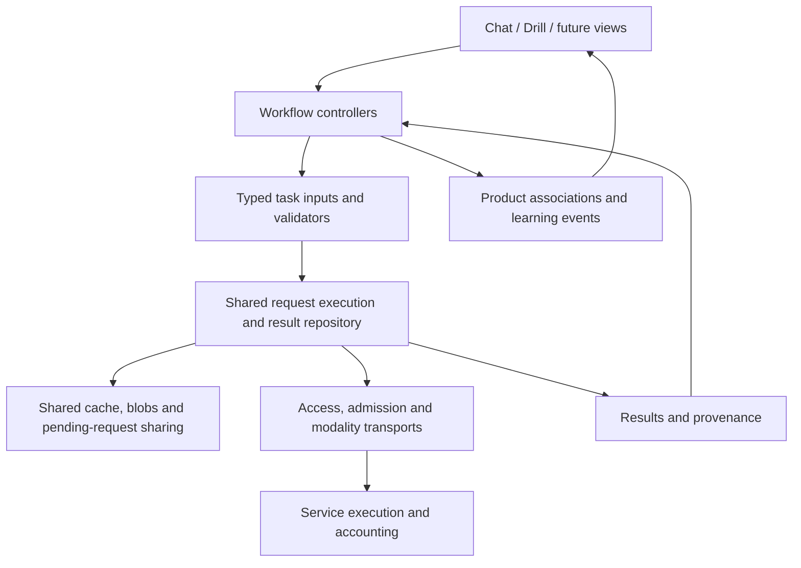

# Shared inference ownership audit

Status: source audit and authorized staged refactor, 2026-09-24. The ownership
principle and staged direction below are agreed. The original findings describe
the baseline before implementation; progress is recorded separately below.
Record shapes, retention policy and storage choices have not been implemented.

## Agreed principle

Text-to-text, audio-to-text and text-to-audio requests, responses, associated
blobs and provenance belong to shared machinery. Translation, glossing,
explanation and generation supply typed task contracts to that machinery.
Chat, Drill and future surfaces consume and associate results; their identities
must not determine request equivalence, cache storage or result availability.

Workflow controllers still decide when work is authorized, assemble its actual
inputs and apply validated results to product records. They own conversation
ordering, Drill visits, acceptance of proposals and learning credit. Views own
display and interaction. Neither a component's mount lifetime nor a workflow's
record ID should become the lifetime or identity of a reusable inference result.

Shared machinery does not mean an untyped result object or a single large
controller. Modality adapters and task validators remain cohesive modules.

## Cleanup and verification

The incomplete cache implementation from this discussion was removed, including
its settings control, generated contracts, schema edits and keep-chat-mounted
workaround. Its approach was too narrow: it still relied on workflow-specific
execution, did not address transcription, and proposed discarding the existing
reference cache before agreeing on the architecture.

The working tree was clean after cleanup, before adding this audit. No commit,
deployment or application launch was performed during cleanup/audit. No local
application database was inspected or reset. This establishes source restoration,
not the state of any independently running development process or its data.

Baseline verification after restoration:

- `cargo test --manifest-path native/Cargo.toml --lib`: 572 passed, 6 ignored.
- Focused UI tests: 21 files, 167 tests passed (reading components, conversation
  reading, Drill, reading speech playback, native command registration).
  Executed through the installed test runner with `--root ui`; the npm argument
  wrapper failed before tests, and the direct runner required sandbox escalation
  for configuration resolution. The passing run emitted simulated-browser
  canvas-not-implemented notices; it does not verify real audio or canvas output.
- `cargo run --manifest-path native/Cargo.toml --bin export-contracts -- --check`:
  passed.
- `node node_modules/typescript/bin/tsc --noEmit -p ui/tsconfig.json`: passed.

The audit covers active UI, native execution/storage and service inference
boundaries, with adjacent generation, diagnostics and usage consumers. It is a
source-level responsibility audit, not a line-by-line review of every module.
No live inference, device playback or server runtime tests were performed.

## Current paths

Paths below are repository-relative; findings describe restored source.

| Operation/consumer | Execution and validation | Result ownership/reuse today |
| --- | --- | --- |
| Conversation translation and gloss | Conversation scheduler; shared translation/gloss contracts | Results in turn context, projected into message snapshots; operation/attempt identity tied to turns |
| Explicit translation, gloss and explanations, including Drill | Reading registry and command executor reuse the task contracts | Durable redacted reading receipts; returned results cached in a component-local 64-entry map |
| Conversation speech | Conversation speech operation and scheduler; shared audio adapter | Four-entry, 16 MiB memory cache keyed by attempts; lost on restart; insertion-order eviction |
| Drill reference speech | Reading executor plus Drill reference storage | Persistent 16 MiB LRU; lookup requires Drill item ID and generation key |
| Token speech | Reading executor and shared playback | No native reusable audio cache for requests without a reference item |
| Transcription for chat and Drill | Shared capture, recording executor and audio adapter | Owner-bound transcription receipts; Drill stores attempts/audio; conversation inspection is volatile |
| Persona and Drill phrase generation | Shared generation registry and receipts, distinct task prompts/validators | Proposal/acceptance ownership differs; no general reusable result repository |
| Service execution | Generic text/grouped and audio endpoints, common admission/accounting | Text attempt duplicate protection; no general cross-operation result cache found in audited service paths |

An IPC request or loading indicator is not proof of another paid request. Drill
reference replay calls native validation/cache lookup; a hit avoids dispatch.
The reported concern is confirmed for token speech, while full Drill reference
speech already caches within its much narrower ownership boundary.

## Findings and evidence

### 1. Speech storage is divided by consumer

`native/src/speech/cache.rs` holds four memory entries and never updates recency
on reads. `native/src/conversations/execution/speech.rs` regenerates on an explicit
request when completed media is no longer resident.
`native/src/drill/reference.rs` has a separate durable LRU, indexed first by
`drill_item_id`. Identical phrases in different items cannot share that entry.
Its key also includes the full language context, configuration hash and resolved
target, which can invalidate speech for changes unrelated to actual synthesis.
`native/src/application/commands/reading.rs` consults this Drill-specific cache.
`ui/src/platform/audio/reading-speech.ts` calls the reading service for ordinary
read-aloud; token requests supply no reference item and therefore miss that cache.

Required direction: one speech result/blob repository and reuse policy for all
consumers, with workflow associations outside the cache.

### 2. Saved gloss availability depends on a mounted view

`ui/src/app/shell/SurfaceHost.tsx` replaces the conversation with Drill.
`ui/src/features/conversation/reading/ConversationReadingProvider.tsx` registers
only the loaded snapshot's saved annotations.
`ui/src/components/reading/SavedReadingProvider.tsx` unregisters on unmount.
Consequently the shared reading index loses those conversation annotations when
switching to Drill, even though the source records remain durable.

Required direction: load/query saved results independently of page lifetime.
Keeping the conversation mounted is not the architectural fix.

### 3. The shared reading component also owns data and execution policy

`ui/src/components/reading/ReadingHelp.tsx` owns a 64-entry map and pending request
sharing. Entries are removed in insertion order, not LRU, and disappear with the
provider instance. The key includes aid, language scope and text, but no execution
contract/model identity. `reading-requests.ts` correctly manages separate consumer
cancellation, but only inside that UI instance; native registries and other
windows do not share it. Native reading rejects simultaneous reference requests
for the same item instead of providing general equivalent-request sharing.

`ui/src/domain/reading/saved-gloss-index.ts` already provides useful, shared exact
surface-form indexing with language/variety boundaries and alternative meanings.
Preserve that policy as a projection of saved results. A word meaning borrowed
from another context is not an identical whole-passage inference result; retain
source provenance and alternatives rather than making this a fuzzy cache key.

### 4. Shared contracts still depend on conversation-owned execution types

`native/src/language/reading/mod.rs` builds
`crate::conversations::execution::Dispatch` even for independent reading tasks.
The generic provider request functions and grouped transport accept that same
conversation-owned type (`native/src/ai/transport/provider/request.rs` and
`native/src/ai/transport/grouped.rs`). Generic generation also reads configuration
and credential helpers from conversation execution.

Translation lives in `native/src/conversations/translation.rs`; reading already
reuses its prompt/schema/validator. Gloss and speech input construction similarly
have shared callers but conversation ownership. Move responsibilities deliberately,
not just filenames: generic transports should accept generic execution inputs,
and workflow dispatch should wrap those inputs with workflow associations.

### 5. Transcription shares transport but includes Drill publication and assessment

`native/src/speech/recording/owner.rs` resolves recognizer inputs from either a
conversation or Drill item. Resolving context belongs at the workflow boundary;
the resulting audio/language/context request can be consumer-independent.
`native/src/speech/recording/voice.rs::transcribe` branches on the owner to compute
Drill reliability. `transcription.rs::publish_transcription` stages Drill attempts
and prunes Drill recordings. Its receipt schema requires a conversation or item.

Required direction: publish a typed transcription result (text, timings,
confidence/diagnostics and input blob reference) through shared machinery. The
Drill controller assesses and associates it; the conversation controller inserts
it into the composer/send flow. Preserve atomic publication and one-time attempt
ownership when moving these calls. Same audio with different recognizer context
is a different request; newly recorded audio is not equivalent merely because it
produces the same transcript.

### 6. Result, execution and usage records have several incompatible owners

`native/src/storage/schemas/schema.sql` defines turn-owned `operations/attempts`,
owner-bound `transcription_attempts`, JSON `reading_attempts` and item-owned
`drill_references`. `generation_schema.sql` adds generation-specific attempts.
`native/src/language/reading/receipts.rs` and
`native/src/ai/generation/generation_receipts.rs` implement separate lifecycle
transitions and recovery. `native/src/statistics/mod.rs` combines these stores
using different counting rules; reading cache hits are excluded via absence of a
dispatch timestamp.

This is evidence of fragmented ownership, not proof that existing totals are
incorrect. A shared model must distinguish requests, actual dispatch attempts,
validated results, cache uses and product events. A reused result adds no new
provider charge and must not duplicate learning credit or erase prior metadata.

### 7. Service duplicate protection is not reusable caching

`server/app/inference/grouped.py` claims an attempt using the operation/request
digest and returns duplicate state for an existing claim. It does not return a
saved result for equivalent content under another operation.
`server/app/inference/audio_service.py` invokes the shared audio adapters after
admission; those paths do not provide the grouped attempt protocol.

Keep local result reuse, sharing concurrent equivalent work, and transport
idempotency as distinct responsibilities of the shared system. Audit cancellation
and ambiguous network outcomes across all three. Do not introduce server-side
content persistence as an incidental consequence of local caching.

### 8. Effective synthesis identity is not fully exposed locally

`native/src/ai/transport/service_audio.rs` sends model, text and language, not its
internal voice field. `server/app/inference/audio_service.py` selects the actual
voice from server configuration. A key hashing the local voice field cannot
detect an effective server voice change at the same address/model.

The design needs an explicit effective configuration identity or equivalent
capability contract for reuse validation. Do not invent an invalidation scheme
from client fields that never reach synthesis. Exact wire design remains open.

## Shared machinery already worth preserving

Access resolution, admission, holds, retry classification and provider transports
already have shared owners under `native/src/ai/`. Translation/gloss contracts
are reused by reading; persona and Drill generation share a registry and receipt
machinery. Speech playback and interruption are shared under
`ui/src/platform/audio/`. Diagnostics retain structured, redacted information.
The service's inference endpoints do not need chat/Drill UI state.

Conversation dependency scheduling, captured context, revision rejection,
transaction boundaries, proposal acceptance and learning credit remain workflow
responsibilities. Different task prompts and output schemas are legitimate;
duplicating their execution or result lifetime by surface is not.

## Proposed ownership model

Conceptually distinguish immutable input/result data, provider execution attempts,
consumer subscriptions and workflow associations. These are responsibilities,
not approved database tables. Core execution must not switch on chat/Drill owners.
Task identity is more precise than modality: two text-to-text requests are not
equivalent just because their visible source text matches.

Request identity includes actual inputs, supplied context, task/prompt/output
contract versions, relevant language/variety, effective model/configuration and
generation parameters. Audio uses its input representation and decoding contract.
Exclude page IDs, message IDs, practice-item IDs and playback volume/speed. Keep
authorization scoped to the local workspace; never put credential secrets into
cache identities or diagnostics. Avoid broad configuration hashes that invalidate
unrelated results. Preserve exact source text; no lossy matching normalization.

The shared layer should support reuse, explicit fresh execution, and read-only
lookup. An intentional request for another generated candidate must remain
possible through an explicit operation policy, not a special case for its screen.
One consumer leaving must not cancel work still needed by another. Revoking a
workflow's right to publish is distinct from invalidating a reusable result.

Eviction governs regenerable payloads; it must not silently delete accepted
translations, annotations, transcripts, learner evidence or original receipts.
Blob references and retention obligations require review before choosing storage.
Settings expose shared capacity and usage, not one cache per feature. Default
capacity, byte accounting, result retention and refresh policy remain undecided.

## Proposed implementation sequence for review

1. Agree on the request/result/attempt/association boundaries and representative
   reuse examples. Resolve effective service identity, fresh-generation behavior,
   and retained-result versus evictable-blob ownership before schema choices.
2. Establish generic execution/task interfaces using existing adapters and
   validators. Remove the transport dependency on conversation dispatch without
   changing workflow behavior. Add dependency checks for this boundary.
3. Implement the shared result/blob and pending-request machinery. Route every
   speech consumer through it first, including chat, references and tokens;
   establish accounting and cancellation behavior before adding cache UI.
4. Route translation, gloss and explanation consumers through the same machinery.
   Move saved-result lookup out of view registration; preserve exact annotation
   anchors, partial results, alternatives and explicit repair behavior.
5. Route transcription and generation through that lifecycle. Move Drill scoring,
   proposal acceptance and product persistence into their workflow controllers.
   Consolidate receipt/usage projections as consumers move; remove superseded
   paths only after the replacement flows are verified.
6. Review shared capacity/retention settings, diagnostic views and the future-
   consumer test. Document any targeted development-data cleanup required by
   the agreed schema; do not add historical format-conversion machinery.

Each stage needs a concrete reviewed scope before editing. This sequence is not
authorization for a broad rewrite or for changing task behavior.

## Acceptance checks for the eventual refactor

- Equivalent requests from different surfaces and windows share one execution
  and retained result; restart reuse needs no provider call.
- Closing one consumer preserves the others; revoked consumers cannot publish
  stale results. Pending/failed/partial data cannot masquerade as complete hits.
- Model, task contract, relevant language/context or effective voice changes
  distinguish requests; playback and navigation changes do not.
- Cache reads do not need provider credentials or paid-work admission. New
  dispatch still obeys authorization, pause, holds, limits and retry policy.
- Capacity reduction and true LRU eviction operate across consumers. Active
  playback, accepted records, diagnostics and billing provenance remain coherent.
- A cache use never counts as another provider execution, learner attempt or
  reward. Unknown cost stays unknown; allowance is never reported as actual cost.
- Gloss reuse works with chat unmounted and preserves source anchors across
  representative scripts/encodings without language-specific exceptions.
- A minimal non-chat/non-Drill consumer can use each modality without adding an
  owner variant, cache implementation or transport branch.

## Next review

The staged direction is authorized and the execution-input slice below is
implemented. The next checkpoint concerns shared result/blob ownership, effective
service identity and retention before implementing persistence. Existing cache
bugs remain present; this checkpoint does not claim they are fixed.

## Implementation checkpoint: shared execution inputs

Implemented first slice:

- Provider/grouped transports accept `ai/transport/text_request.rs::TextRequest`
  instead of conversation dispatch. This input has no message, practice item,
  gloss source, speech publication owner or workflow schema fields.
- Conversation dispatch explicitly projects its provider inputs. Reading and
  proposal generation construct generic inputs directly; reading returns its
  source and output schema separately for validation.
- Translation and gloss contracts moved to `language/` with direct caller
  updates and no old-path aliases. Conversation operation-kind recognition stays
  with workflow consumers.
- Speech-input construction moved to `ai/audio.rs`; common connection settings
  and credential selection helpers moved to `ai/connections/configuration.rs`.
  Request identity construction moved to `ai/identity.rs`.
- A transport dependency test rejects runtime imports of product workflows.
  Existing transport fixtures now construct requests without any product owner.

This slice changes ownership and dependency direction, not result lifetime,
cache behavior, schemas, IPC, task prompts or workflow publication semantics.
Conversation still owns its dispatch/publication state, and the existing reading,
generation and recording lifecycles remain to be consolidated. No storage or
cache-capacity choice is implied by this checkpoint.

Verification for this slice:

- Native library suite: 573 passed, 6 ignored, no failures. Includes the new
  transport boundary test, independent transport requests, and existing
  conversation/reading contract parity and local HTTP execution tests.
- `cargo check --manifest-path native/Cargo.toml --all-targets`: passed.
- Generated TypeScript contract check: passed; IPC declarations are unchanged.
- Compared moved task implementation and fixtures with the original files:
  unchanged except the gloss ownership comment and removal of translation's
  workflow-kind classifier.
- `git diff --check`: passed.

No application launch, paid request, database reset, commit or deployment was
performed. UI and server source are unchanged in this slice. Device behavior
has not been manually verified.
