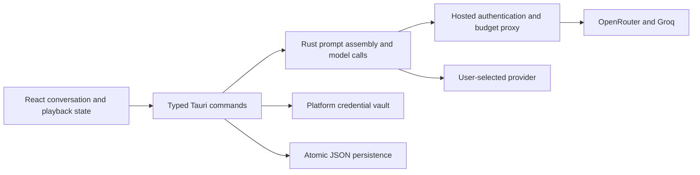

# Architecture

This page describes current behavior. The proposed
[learner, contacts, and language redesign](./architecture-redesign) records the
future architecture, unresolved decisions and migration gates.

SkellySpeak uses a React/TypeScript webview for presentation, a Tauri Rust core
for credentials, persistence and model calls, and an optional FastAPI hosted
service for sign-in and metering.



## Ownership

| Module | Responsibility |
|---|---|
| `src/pages/GuidedPage.tsx` | Streamed UI events and conversation interaction |
| `src/pages/guided/useConversation.ts` | Chat ownership, serialized saves, loading and deletion |
| `src/lib/speech.ts` | One active playback, speed, cancellation and bounded audio cache |
| `src/lib/tauri.ts` | Typed IPC; logs command and argument names without argument values |
| `src-tauri/src/commands/guided/` | Turn execution, independent analysis/coach/observer work |
| `src-tauri/src/prompts/` | Prompt text and explicit instruction precedence |
| `src-tauri/src/ai.rs`, `sse.rs` | Provider requests, validation/retries and byte-safe SSE decoding |
| `src-tauri/src/trace.rs`, `trace_archive.rs`, `instruction.rs` | Captured request inputs, per-attempt records, bounded persistence and reconciliation |
| `src-tauri/src/turn_plan.rs` | Expected operation metadata for the graph and reconciliation |
| `src-tauri/src/lesson.rs`, `commands/lesson.rs` | Learner-owned choices, revision checks and change history |
| `src-tauri/src/observer.rs` | Bounded teaching plan/profile and atomic tutor-memory persistence |
| `src-tauri/src/credentials.rs`, `settings.rs` | Platform vault and public preferences |
| `src-tauri/src/conversation.rs`, `persistence.rs` | Chat files, soft deletion and atomic writes |
| `server/` | Hosted security and spending contracts; see [Hosted API](./hosted-api) |

The graph describes and reconciles execution; it does not execute the turn.
`commands/guided` is the orchestrator. Routing is centralized in Rust settings;
individual UI features do not choose independent provider fallbacks.

## Prompts and background work

The partner's precedence is: target language/level, the learner's current topic,
character voice, then advisory observations. Explicit lesson choices override
conflicting inferred observations and topic suggestions, while the current
conversation and language/level constraints still take precedence. Observer notes are bounded data,
not a second source of overriding instructions. Analysis gets the context it
needs without duplicating the partner's full teaching directives.

The learner-tokenization call can overlap reply generation. Analysis sections
complete independently. The observer runs after the first learner turn and
every fourth learner turn thereafter, and only one observer pass runs at a
time. Its plan and profile calls must both validate before their result applies.

Each turn captures a context epoch and settings. Conversation changes invalidate
late results before they can update another conversation's memory or UI. Coach
questions are single-flight, and completed coach history is persisted before
being published in memory. Late sign-in results cannot overwrite a changed
session or settings context.

## Durable data

```text
<app-config>/ai-traces.json                bounded local model-call archive
<app-config>/trace-exports/                explicit audit exports
<app-config>/settings.json                 public preferences and installation ID
<app-config>/personas.json                 custom characters
<app-config>/conversations/<target>__<native>/
    current.json                          current chat pointer
    memory.json                           inferred teaching plan and profile
    lesson.json                           explicit choices and recent changes
    chats/<chat-id>/session.json           turns, title, timestamps, deletion marker
    chats/<chat-id>/partner.json           saved template, first introduction, origin
    chats/<chat-id>/coach.json             private coach thread
```

Credentials live in the native vault, addressed by the configuration directory.
Startup reads them once into Rust-owned settings. Preference saves compare
against that in-memory state and access the vault only when credentials change;
failed vault writes leave preferences and in-memory settings unchanged.
Inline credentials migrate to the vault during loading. Existing separate
`plan.json` and `profile.json` documents are read when `memory.json` is absent;
subsequent saves write the combined memory document. Source documents remain
intact for recovery.

Files are written to a temporary sibling, synced, then atomically replaced.
Unreadable stored files remain in place and cause errors, so reopening cannot
silently turn corruption into an empty conversation. Deletion marks a chat;
queued saves cannot remove that marker. The frontend flushes before switching
or deleting and ignores late loads from a different conversation.

The vault and preferences are two independent stores. Failed preference writes
roll back the vault write; abrupt process/OS failure between those operations
is not a cross-store transaction. Vault availability and migration require
native-device testing on each supported platform.

## Speech

Cloud playback supports 0.5–1.5× speed while preserving pitch. Speed changes can
apply during playback. OS speech uses the utterance's rate and applies changes
on replay. Speed is persisted in `tts_rate` and exposed in the chat header and
Settings. Identical pending synthesis is shared and replay uses a 24 MiB cache.
Errors are surfaced, and stopping prevents a late synthesis response from
starting playback. Word timestamps and highlighting are deferred.

## Lesson control

`get_lesson` reads learner-owned choices. `save_lesson` validates a complete
`LessonChoices` document against the expected revision and active chat.
`coach_ask` reads recent saved turns in Rust after the UI flushes its conversation;
React no longer assembles a coach prompt. Its structured result is an answer,
an explicit-request application, or a proposal. Applications require a verbatim
quote from the current request; intent classification is model-based. Discussion
and curiosity markers are instructed never to authorize changes. Proposals are
persisted in the coach thread and require the learner's Apply action.

Writes to `lesson.json` are atomic and serialized by the context lock within one
app process. Revision checks reject stale edits and coach results. The observer
never writes this file and rejects observations computed against a changed lesson.
Guided replies, analysis/scaffolds, and observation read the explicit choices.
A lesson update affects the next request, not a reply already in flight.

A successful lesson write emits `lesson-changed` to refresh app windows. The
lesson and coach thread are separate files, not a cross-file transaction: if
history persistence fails after a lesson save, the error identifies the saved
lesson revision and the UI reloads it. Do not run multiple app processes writing
the same configuration directory concurrently.

Lesson editing uses a viewport-constrained modal with debounced, serialized revision-checked saves. Dismissal flushes pending edits. The core resolves the explicit `__none__` persona mode to an empty character sketch and a neutral conversation prompt. Persona rerolls exclude the current saved partner before selecting a new one.

Topic and level changes issue a synthetic steering turn, explicitly identified as a preference change rather than learner speech. The new reply’s analysis supplies suggestions; no parallel scaffold regeneration uses the old history. Existing chat history is preserved.

The private coach remains in the lesson panel; its dock height and collapsed state are stored under `skellyspeak_coach_layout`. The separate composer Coach tray displays `Scaffolds.coach_help` from the existing background suggestion operation. `ScaffoldsOut` requires a brief explanation and annotated partner/reply phrases; validation checks that suggested text matches the insertable replies and that translations and pronunciation are populated. The guided pass also checks the exact partner text. Section events hydrate this data before the complete analysis finishes, and it is persisted with the turn. A null help value means no advice was generated for that saved message; opening the tray does not generate it. The tray stays visible; only its exchange explanation uses a disclosure.

AI activity is loaded through one panel-owned snapshot/event subscription with run-ID deduplication. The graph and call strip share the selected execution scope; node inspection shows response previews and expandable raw run details. Whole-session graph mode is explicitly distinguished from a single interaction. Captured trace context includes saved-chat/message IDs alongside execution-turn IDs. AI render failures are contained within the panel.

Conversation switching synchronizes the history reference before invoking an opening greeting, so a new or reopened empty chat cannot inherit messages from the conversation that was previously displayed. Reply requests contain one system message, up to the most recent 30 conversation messages, and the current learner message or explicit opening trigger.

`conversation_partner.rs` resolves the selected template only when initializing a chat and atomically saves its full snapshot in `partner.json`. The first successful reply establishes identity and is saved before `ReplyDone`; later reply requests read this snapshot without consulting the persona catalog or a frontend selection. One character block in the system message includes the saved sketch and quoted first introduction, even after that introduction falls outside recent history. Model adherence remains probabilistic; the snapshot prevents the app from silently supplying a different character.

Opening a nonempty chat without `partner.json` recovers its earliest saved assistant reply and marks its origin as `recovered_history`. The original template is explicitly unknown; current preferences are not used to guess it. Earlier identity facts take precedence over contradictory later replies, while the transcript stays intact. Empty chats initialize from the supplied template preference. Missing templates or malformed snapshots produce errors. Context locking prevents a late or competing first reply from overwriting identity.

## Instruction auditing

The skill profile includes per-attempt, per-skill XP credits derived in Rust
alongside its totals. For each normalized wording, the earliest unassisted
demonstration owns credit; otherwise the earliest assisted demonstration does.
Ties use turn and attempt identifiers. Excluded, superseded and historical
criteria do not earn current credit. Lesson consumes the app's shared skill
snapshot subscription to show live reviews and attribution without recalculating
rewards in React.

`prompts/difficulty.rs` owns the selected practice policy shared by replies and
suggestions. Coach and observer paths distinguish it from inferred proficiency.
The partner's conversation-style block requires one easy response invitation on
every turn, including greetings and preference changes, within that same difficulty
budget. This is a prompt requirement, not a runtime guarantee of model adherence.
`instruction.rs` records chat/message ownership, captured settings, lesson revision,
partner snapshot and history selection. Named reply/suggestion blocks are rendered
and checked against the actual outbound system message. `ai.rs` captures each
attempt after provider adaptation. Trace storage failures propagate as errors.

The local versioned archive retains at most 300 runs and 8 MiB across restarts.
Reply readiness and successful conversation persistence update the same run;
model completion alone does not prove acceptance or difficulty compliance.
See [Observability](./observability) for coverage and [Privacy](./privacy) for
retention and export scope.

Reply composition includes a `participants` block mapping assistant messages to
the partner and user messages to the learner, with explicit session/steering
events distinguished from learner speech. The character block quotes the saved
introduction as an assistant-role JSON record. This adds no identity inference
call and does not change stored partner files or transcript roles.

`lesson_topic_note` generates a bounded explanation/example/translation for a
visible lesson topic through the existing structured provider. It captures chat,
practice difficulty and lesson revision in a standalone explanation trace, rejects
results after a context change, and does not mutate observer memory or the coach
thread. The frontend retains the request while that topic view is mounted;
changing chat, level or topic creates a fresh view.

## Skill evidence and profile

`skills/catalog.json` is the shared meaning-domain catalog. `catalog-v1.json` and
`catalog-v2.json` validate historical assessments; old rubrics are not remapped.
`skills.rs` owns per-chat `skill-evidence.json`, source matching and validation.
`skills/progress.rs` computes deterministic progress. `learner.rs` owns the explicit
local learner and revision-checked language profiles at
`learners/local/<target>.json`. One local learner aggregates current target-language
evidence across native-language pairings. Each profile contains practice focus and
excluded evidence IDs. Registry target IDs identify profiles; explanation language
and dialect do not change that identity. Invalid schema, language or ownership
fails explicitly. Learner switching is not implemented.

`conversation_practice.rs` owns each conversation’s required difficulty and revision
in `practice.json`. Conversation initialization sets Beginner. Reopening restores
its saved setting. `get_conversation_practice` and `save_conversation_practice`
require the explicitly addressed target/native/chat to be active. Saves check the
revision and increment the execution context epoch. Guided turns, coach requests,
suggestions and topic explanations validate the expected conversation difficulty
before model work. React scopes settings loads and saves to that full conversation
address and waits for them before greeting.

`assess_skills` runs after a successful reply to a real learner message. Its sparse
judgments refer to supplied rubrics; omission means unobserved. Rust rejects
unknown/duplicate IDs and non-source quotes. Validation is structural, not proof
of semantic correctness. Ledger access is context-locked and writes are atomic.
Repeated identical requests reuse their active assessment. Superseded attempts
cannot be revived by late responses. Current source ID/text matching excludes
edited, truncated and soft-deleted sources; interrupted evaluations show failure.

The projection counts distinct successful wording per skill, ignoring case and
whitespace. Recorded assistance earns practice XP, not success marks. Current
catalog evidence alone contributes; exclusion choices are reversible. The rules,
recommendations and lifecycle are specified in the [progression design](./skill-progression-design).

`get_skill_evidence` returns catalog, records and derived profile. `save_language_profile`
checks target ownership and revision. `skills:changed` follows ledger, conversation
save/deletion and profile changes. React uses one app-owned subscription for the
profile entry and tree. Confirmed saves update this shared snapshot; stale revisions
and responses from another settings scope cannot replace it. Native failures remain
visible; only browser demonstration mode uses fixture data.

A captured `skill_practice` block steers subsequent partner and feedback calls;
suggestions, coach chat and observation also receive that focus. Explicit lesson
choices and practice difficulty retain precedence. Saving a focus does not trigger
an extra model call, overwrite lesson choices or change an in-flight request.
Observation retains its ordinary cadence. The learner tree is distinct from the
execution graph. Stories' frontend, IPC, prompts, operation and benchmark case are
retired; shared glossing and speech remain part of Guided conversation.

### Factory reset lifecycle

`factory_reset` validates explicit confirmation and syncs a pending-reset marker,
then closes the process. On next launch, before loading settings, starting file
logging, attaching traces or starting workers, the core clears its credential
vault entry, config contents, app cache/log directories and webview browsing data.
The marker remains until every cleanup step succeeds; errors abort startup and
interrupted resets retry on the next launch. This prevents old asynchronous work
from repopulating the fresh profile.

### Conversation practice board

`SkillPracticeBoard.tsx` renders catalog domains and stable skill cards from the
shared skill snapshot. Branch selection is transient UI state and does not write
profile choices. `SkillDetailDialog` exposes current-catalog review evidence from
the current conversation. `TopicExplanation` calls the existing Rust-owned
`lesson_topic_note` operation on expansion, using the selected skill criterion and
practice difficulty. It does not introduce frontend prompts or reward arithmetic.
Recent review details remain available in a disclosure below the board.

Skill-assessment validation rejects unknown and duplicate IDs separately. Duplicate
feedback identifies the skill and requests one combined judgment, preserving the
sparse-output contract on retries. Invalid reviews are not converted into rewards.

`SkillRewards` observes the shared evidence snapshots. The first snapshot for a
chat/language establishes a silent baseline. `skill-rewards.ts` identifies newly
completed attempts and bounds visual rewards by positive Rust-reported per-skill
XP differences. It does not calculate persistent rewards or write profile state.
Rewards are queued transiently and cleared on ownership changes; retracted credits
are removed from the queue. Visible DOM anchors determine animation destinations.

Skill assessment instructions require explanations in the learner’s native language that identify the quoted construction, its linguistic function, and its relationship to the specific rubric. Topic summaries alone do not support credit. Prompt version `skill-evidence-5` applies to new assessments; saved explanations are not rewritten. Map selection uses a neutral outline independent of domain colors.

Speech uses the saved conversation persona. Built-in characters have distinct cloud voice casts; custom characters receive a stable cast by ID. Explicit age, gender and manner in the saved character guide cloud delivery, without inferring gender from occupation. No-persona chats use the configured voice. OS playback selects a stable installed voice per persona within the target language; OS voices expose no reliable age/gender metadata. Audio caching separates chats.

Chat translation controls reveal already-hydrated analysis without another model request. Tokenization, translation, mechanics and scaffolds emit independent sections; skill review and coach feedback remain detached. Expanded card explanations start independently of conversation busy state and hydrate on completion.


## Shared frontend navigation and detail resources

SkillNavigationProvider owns target-scoped browsing selection and explicit map-entry
requests. Saved practice focus remains a Rust profile choice. A sequence identifies
repeated selections; GuidedPage and SkillsPage share the selection owner. The
conversation remains mounted during map navigation.

SkillOverview and SkillEvidenceRecord render definitions and credit status in both
surfaces. DetailDialog owns native-dialog focus restoration, dismissal and back
registration. Reward inspection resolves selected identities against the current
snapshot rather than storing an evidence object.

TopicNotesProvider scopes a bounded request cache to the guided settings context.
Disclosures mount explanation content on demand. Equivalent card and dialog requests
share observable request state, including errors and explicit retries; replies continue streaming independently. Settings scope changes
replace the resource. Skill evidence hides prior-settings snapshots until the current
read completes. The retired Suggestions toggle and standalone frontend regeneration
path are removed; steering still produces a reply whose analysis hydrates suggestions.

Skill snapshot event bursts coalesce while a read is active and always request a trailing refresh. Successful reads clear earlier refresh errors. In-flight topic notes are retained until completion; inactive completed notes are pruned to the cache limit.

### XP presentation lifecycle

The React reward presentation controller owns opening, hovering, and departing cards. Selections store message/credit identities and resolve evidence against the current snapshot; removed evidence closes the card. On desktop, Web Animations moves the card from its captured phrase position to the conversation header area and then to a currently visible domain anchor. Mobile Fast mode skips the opening/hover phases and follows a 340 ms curved departure from the source area to the mobile meter. Mobile manual inspection stays near the source instead of the header. Arrival IDs drive each meter fill, so no bar fills ahead of its card. A compact indicator represents an offscreen map destination. Route, chat, and target changes clear presentations. This transient state does not write credits, alter scoring, or issue model requests.

The composer has no manual advice-refresh control. Suggestions update through the conversation pipeline; the exchange disclosure only shows existing explanation.

Desktop debug builds use `com.freemocap.skellyspeak.dev` for application storage
and credential-service identity. Release storage is not migrated or read by a
debug build. Ordinary logs contain operational metadata; content-bearing AI
traces retain their separate inspection and deletion contract.

The Rust-owned `Settings.always_pronunciation` preference defaults to false and controls token-level pronunciation in chat and Coach through `TokenSpan`. Sentence-level `AssistedPhrase.pronunciation` remains in saved advice but is not rendered. Mobile Chat/Lesson selection belongs to the app shell so secondary Skill Tree navigation cannot hide the way back to practice.

`Settings.fast_mode` is persisted by Rust and defaults to true. New credit detection sends each reward directly into the shared card presentation stack; animation does not gate model processing or later rewards. Automatic arrivals are staggered by 460–560 ms; in desktop Fast mode each card holds for 500 ms after opening before departing; mobile Fast mode departs directly; manually inspected cards remain until dismissed. Presentation does not change earned credit.

XP arrival detection compares credit amounts by attempt and skill, bounded by net skill XP gains; it does not require the review to become complete in the same snapshot. Point-icon clicks inspect one credit without dismissing other icons. Card sizing uses the visible viewport independently of the message stream’s available height.

Chat token annotations include native-readable approximate pronunciation for the exact source token, alongside its contextual gloss and optional romanization. Both learner and partner token analysis produce this field. Saved tokens predating this field deserialize with no pronunciation; the UI does not infer alignment from sentence-level Coach advice.

Linguistic progress is owned by `(learner_id, target_language)`. Conversation evidence is stored under its target/native pair and aggregated across native-language contexts only for the same target. Saved profile choices live under the target key; the projection rejects mixed-language or mixed-learner records. The frontend hides snapshots from a different selected target and ignores obsolete settings-scope responses. Reward transitions never compare XP across targets. The practice dashboard derives descriptive domain totals and distinct contributing-message counts from the current credit ledger, with source-record provenance; it introduces no global linguistic score or inferred proficiency measure.

The explicit difficulty enum includes `fluent`, with a C2-style practice policy above Advanced. It uses the same reply blocks, teaching context, diagnostics, evaluation, and credit rules as other levels. Difficulty denotes requested expression, not measured ability; complex topics are not excluded at simpler levels. Provider safeguards retain authority.

`get_practice_overview` is a read-only aggregation of independent target-language snapshots for every supported language. The profile computes global retained-activity counts and an explicitly additive global XP total, then exposes language-specific tabs. Zero-experience languages are included; no global total is fed back into any language’s scoring or unlocks.

A completed opening is an assistant history message even though its turn has no learner text. `reply_done` makes it available to subsequent requests before annotation finishes; pending annotation does not exclude the reply from conversation history. The provider payload preserves these message roles and contents.

`reaction` is a detached Chat operation declared in the turn plan. After a learner reply, it reuses the captured partner provider and full reply-request context plus the completed assistant message, then requests a structured `PartnerReaction` self-report in the native language. Its original partner blocks plus the reaction instructions are rendered into one system message and recorded together; the outbound provenance check must match that exact composition. A final application trigger is explicitly distinguished from learner dialogue. It never consumes private coach grades. Reaction success/failure events attach to the originating turn and persist with that conversation; stale events cannot cross chat ownership. The coach independently sees the learner message, prior dialogue, and partner reply and returns `grammar` and `conversation` scores. Historical `comprehensibility` remains historical data rather than being converted to a different construct. Reactions do not award XP or change ability estimates.

`playback-lifecycle.ts` installs window focus, visibility, page-hide/unload, and Tauri focus/close/suspend/resume handlers before rendering. Independent blockers gate `speakSmart`; suspension cancels HTML audio and OS speech, clears UI playback state, and invalidates the request token so late synthesis or voice-identity results cannot play. Resume clears its blocker without replaying audio. Native mobile event delivery still requires device verification.

Rust settings persist `reward_sounds` as `yes`, `no`, or `follow_tts`; the default follows `auto_speak`. `reward-sounds.ts` synthesizes bounded Web Audio motifs without model calls or audio downloads. Automatic XP cues are attached to new-card settlement, manual inspection pops to XP-icon clicks, and partner cues only to newly received confused/understood results. Visible-source glow and audio share scheduling; offscreen or inactive sources stay silent. App lifecycle cancellation stops scheduled oscillators and highlights alongside TTS. Historical inspection never replays earning sounds.

Reward audio activation listens in capture phase to mouse, keyboard, and touch-release events. Enabled, foreground contexts resume from both suspended and WebKit interrupted states on user interaction; inactive or muted contexts stay silent. Resuming does not recreate cancelled notes.

Reading presentation shares `TokenSpan` across chat and `TargetText` surfaces. `ReadingProvider` supplies language preferences and a bounded transient, language-pair-scoped cache of complete annotation requests keyed by source text and context. The Rust `annotate_text` command uses a dedicated mixed-language reading prompt, the configured provider routing and `TokensOut` schema. Its separate `annotate_text` operation appears as Text annotations in diagnostics. For word-delimited target languages, Rust supplies exact whitespace-delimited source entries and rejects changed, split or merged entries; other target languages retain meaningful-word segmentation with exact source coverage. Every entry containing letters or numbers requires a contextual gloss and pronunciation, including quoted words, native-language words and numbers. Validation feedback identifies the offending token and missing fields; punctuation-only entries may omit these aids. These checks reject invalid output rather than substituting annotations. Unsaved reading text prepares annotations on mount; ordinary word taps only toggle prepared meanings. Hold/right-click explicitly invokes deeper `word_insight` analysis. Cached and in-flight annotations are shared across preview, panel reopen and duplicate text within the mounted reading provider; this cache does not survive app restart. Markdown preserves its surrounding source as inspection context. Explicit request failures appear inline. Saved token annotations are reused when supplied. The Rust settings contract persists `text_size` (75–150%, default 100) and `text_spacing` (0–12px, default 2); CSS scales reading text and word spacing independently. Token pronunciation is gated solely by `always_pronunciation`, including after a gloss reveal. Message Translate buttons and `auto_translate` select the same inline rendering; changing the global preference clears local translation overrides.

Reading display preferences are shared through `ReadingPreferencesProvider`. The guided surface supplies its current settings so quick toggles update Coach, lesson examples, token annotations and analysis dialogs immediately. Coach suggestion words remain inspectable; only the trailing insertion icon fills the draft. The top-bar settings panel uses transient disclosure state and starts closed. Translation, pronunciation and romanization displays respect their corresponding preferences.

Chat aligns each token annotation to the original source string before rendering. The source owns punctuation and whitespace: repeated punctuation-only annotations cannot borrow punctuation from a later sentence, and overlapping punctuation attached to words is matched against the remaining source. Missing word matches are errors. Annotation indices remain stable for existing reveal and inspection callbacks.

Audio volume preferences (`master_volume`, `voice_volume`, `effects_volume`) are persisted by Rust as validated percentages from 0 to 100, defaulting to 100 for existing settings. The frontend multiplies master by each channel before playback: speech uses the cloud audio element or OS utterance volume, while reward sounds share an output gain. The existing `reward_sounds` policy independently controls whether effects play.

The settings IPC boundary rejects missing or invalid audio percentages before exposing them to React or saving them. Audio configuration failures are reported through the fault UI; the settings dialog remains closable.
