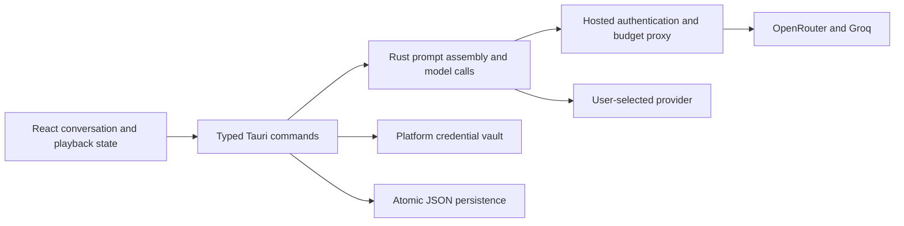

# Architecture

SkellySpeak uses a React/TypeScript webview for presentation, a Tauri Rust core
for credentials, persistence and model calls, and an optional FastAPI hosted
service for sign-in and metering.



## Ownership

| Module | Responsibility |
|---|---|
| `src/pages/GuidedPage.tsx` | Streamed UI events and conversation interaction |
| `src/pages/guided/useConversation.ts` | Chat ownership, serialized saves, loading and deletion |
| `src/lib/speech.ts` | One active playback, speed, cancellation and bounded audio cache |
| `src/lib/tauri.ts` | Typed IPC; logs command and argument names without argument values |
| `src-tauri/src/commands/guided/` | Turn execution, independent analysis/coach/observer work |
| `src-tauri/src/prompts/` | Prompt text and explicit instruction precedence |
| `src-tauri/src/ai.rs`, `sse.rs` | Provider requests, validation/retries and byte-safe SSE decoding |
| `src-tauri/src/trace.rs` | Per-attempt usage and operation reconciliation |
| `src-tauri/src/turn_plan.rs` | Expected operation metadata for the graph and reconciliation |
| `src-tauri/src/observer.rs` | Bounded teaching plan/profile and atomic tutor-memory persistence |
| `src-tauri/src/credentials.rs`, `settings.rs` | Platform vault and public preferences |
| `src-tauri/src/conversation.rs`, `persistence.rs` | Chat files, soft deletion and atomic writes |
| `server/` | Hosted security and spending contracts; see [Hosted API](./hosted-api) |

The graph describes and reconciles execution; it does not execute the turn.
`commands/guided` is the orchestrator. Routing is centralized in Rust settings;
individual UI features do not choose independent provider fallbacks.

## Prompts and background work

The partner's precedence is: target language/level, the learner's current topic,
character voice, then advisory observations. Observer notes are bounded data,
not a second source of overriding instructions. Analysis gets the context it
needs without duplicating the partner's full teaching directives.

The learner-tokenization call can overlap reply generation. Analysis sections
complete independently. The observer runs after the first learner turn and
every fourth learner turn thereafter, and only one observer pass runs at a
time. Its plan and profile calls must both validate before their result applies.

Each turn captures a context epoch and settings. Conversation changes invalidate
late results before they can update another conversation's memory or UI. Coach
questions are single-flight, and completed coach history is persisted before
being published in memory. Late sign-in results cannot overwrite a changed
session or settings context.

## Durable data

```text
<app-config>/settings.json                 public preferences and installation ID
<app-config>/personas.json                 custom characters
<app-config>/conversations/<target>__<native>/
    current.json                          current chat pointer
    memory.json                           teaching plan and profile together
    chats/<chat-id>/session.json           turns, title, timestamps, deletion marker
    chats/<chat-id>/coach.json             private coach thread
```

Credentials live in the native vault, addressed by the configuration directory.
Inline credentials migrate to the vault during loading. Existing separate
`plan.json` and `profile.json` documents are read when `memory.json` is absent;
subsequent saves write the combined memory document. Source documents remain
intact for recovery.

Files are written to a temporary sibling, synced, then atomically replaced.
Unreadable stored files remain in place and cause errors, so reopening cannot
silently turn corruption into an empty conversation. Deletion marks a chat;
queued saves cannot remove that marker. The frontend flushes before switching
or deleting and ignores late loads from a different conversation.

The vault and preferences are two independent stores. Failed preference writes
roll back the vault write; abrupt process/OS failure between those operations
is not a cross-store transaction. Vault availability and migration require
native-device testing on each supported platform.

## Speech

Cloud playback supports 0.5–1.5× speed while preserving pitch. Speed changes can
apply during playback. OS speech uses the utterance's rate and applies changes
on replay. Speed is persisted in `tts_rate` and exposed in the chat header and
Settings. Identical pending synthesis is shared and replay uses a 24 MiB cache.
Errors are surfaced, and stopping prevents a late synthesis response from
starting playback. Word timestamps and highlighting are deferred.
