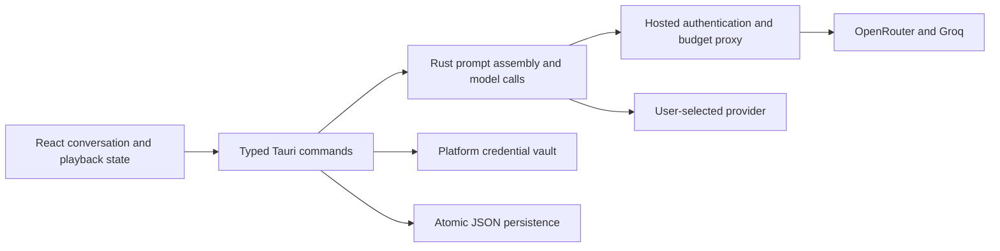

# Architecture

SkellySpeak uses a React/TypeScript webview for presentation, a Tauri Rust core
for credentials, persistence and model calls, and an optional FastAPI hosted
service for sign-in and metering.



## Ownership

| Module | Responsibility |
|---|---|
| `src/pages/GuidedPage.tsx` | Streamed UI events and conversation interaction |
| `src/pages/guided/useConversation.ts` | Chat ownership, serialized saves, loading and deletion |
| `src/lib/speech.ts` | One active playback, speed, cancellation and bounded audio cache |
| `src/lib/tauri.ts` | Typed IPC; logs command and argument names without argument values |
| `src-tauri/src/commands/guided/` | Turn execution, independent analysis/coach/observer work |
| `src-tauri/src/prompts/` | Prompt text and explicit instruction precedence |
| `src-tauri/src/ai.rs`, `sse.rs` | Provider requests, validation/retries and byte-safe SSE decoding |
| `src-tauri/src/trace.rs`, `trace_archive.rs`, `instruction.rs` | Captured request inputs, per-attempt records, bounded persistence and reconciliation |
| `src-tauri/src/turn_plan.rs` | Expected operation metadata for the graph and reconciliation |
| `src-tauri/src/lesson.rs`, `commands/lesson.rs` | Learner-owned choices, revision checks and change history |
| `src-tauri/src/observer.rs` | Bounded teaching plan/profile and atomic tutor-memory persistence |
| `src-tauri/src/credentials.rs`, `settings.rs` | Platform vault and public preferences |
| `src-tauri/src/conversation.rs`, `persistence.rs` | Chat files, soft deletion and atomic writes |
| `server/` | Hosted security and spending contracts; see [Hosted API](./hosted-api) |

The graph describes and reconciles execution; it does not execute the turn.
`commands/guided` is the orchestrator. Routing is centralized in Rust settings;
individual UI features do not choose independent provider fallbacks.

## Prompts and background work

The partner's precedence is: target language/level, the learner's current topic,
character voice, then advisory observations. Explicit lesson choices override
conflicting inferred observations and topic suggestions, while the current
conversation and language/level constraints still take precedence. Observer notes are bounded data,
not a second source of overriding instructions. Analysis gets the context it
needs without duplicating the partner's full teaching directives.

The learner-tokenization call can overlap reply generation. Analysis sections
complete independently. The observer runs after the first learner turn and
every fourth learner turn thereafter, and only one observer pass runs at a
time. Its plan and profile calls must both validate before their result applies.

Each turn captures a context epoch and settings. Conversation changes invalidate
late results before they can update another conversation's memory or UI. Coach
questions are single-flight, and completed coach history is persisted before
being published in memory. Late sign-in results cannot overwrite a changed
session or settings context.

## Durable data

```text
<app-config>/ai-traces.json                bounded local model-call archive
<app-config>/trace-exports/                explicit audit exports
<app-config>/settings.json                 public preferences and installation ID
<app-config>/personas.json                 custom characters
<app-config>/conversations/<target>__<native>/
    current.json                          current chat pointer
    memory.json                           inferred teaching plan and profile
    lesson.json                           explicit choices and recent changes
    chats/<chat-id>/session.json           turns, title, timestamps, deletion marker
    chats/<chat-id>/partner.json           saved template, first introduction, origin
    chats/<chat-id>/coach.json             private coach thread
```

Credentials live in the native vault, addressed by the configuration directory.
Inline credentials migrate to the vault during loading. Existing separate
`plan.json` and `profile.json` documents are read when `memory.json` is absent;
subsequent saves write the combined memory document. Source documents remain
intact for recovery.

Files are written to a temporary sibling, synced, then atomically replaced.
Unreadable stored files remain in place and cause errors, so reopening cannot
silently turn corruption into an empty conversation. Deletion marks a chat;
queued saves cannot remove that marker. The frontend flushes before switching
or deleting and ignores late loads from a different conversation.

The vault and preferences are two independent stores. Failed preference writes
roll back the vault write; abrupt process/OS failure between those operations
is not a cross-store transaction. Vault availability and migration require
native-device testing on each supported platform.

## Speech

Cloud playback supports 0.5–1.5× speed while preserving pitch. Speed changes can
apply during playback. OS speech uses the utterance's rate and applies changes
on replay. Speed is persisted in `tts_rate` and exposed in the chat header and
Settings. Identical pending synthesis is shared and replay uses a 24 MiB cache.
Errors are surfaced, and stopping prevents a late synthesis response from
starting playback. Word timestamps and highlighting are deferred.

## Lesson control

`get_lesson` reads learner-owned choices. `save_lesson` validates a complete
`LessonChoices` document against the expected revision and active chat.
`coach_ask` reads recent saved turns in Rust after the UI flushes its conversation;
React no longer assembles a coach prompt. Its structured result is an answer,
an explicit-request application, or a proposal. Applications require a verbatim
quote from the current request; intent classification is model-based. Discussion
and curiosity markers are instructed never to authorize changes. Proposals are
persisted in the coach thread and require the learner's Apply action.

Writes to `lesson.json` are atomic and serialized by the context lock within one
app process. Revision checks reject stale edits and coach results. The observer
never writes this file and rejects observations computed against a changed lesson.
Guided replies, analysis/scaffolds, and observation read the explicit choices.
A lesson update affects the next request, not a reply already in flight.

A successful lesson write emits `lesson-changed` to refresh app windows. The
lesson and coach thread are separate files, not a cross-file transaction: if
history persistence fails after a lesson save, the error identifies the saved
lesson revision and the UI reloads it. Do not run multiple app processes writing
the same configuration directory concurrently.

Lesson editing uses a viewport-constrained modal with debounced, serialized revision-checked saves. Dismissal flushes pending edits. The core resolves the explicit `__none__` persona mode to an empty character sketch and a neutral conversation prompt. Persona rerolls exclude the current saved partner before selecting a new one.

Topic and level changes issue a synthetic steering turn, explicitly identified as a preference change rather than learner speech. The new reply’s analysis supplies suggestions; no parallel scaffold regeneration uses the old history. Existing chat history is preserved.

The coach dock’s height and collapsed state are presentation preferences stored in device localStorage under `skellyspeak_coach_layout`. They do not affect lesson choices or conversation context.

AI activity is loaded through one panel-owned snapshot/event subscription with run-ID deduplication. The graph and call strip share the selected execution scope; node inspection shows response previews and expandable raw run details. Whole-session graph mode is explicitly distinguished from a single interaction. Captured trace context includes saved-chat/message IDs alongside execution-turn IDs. AI render failures are contained within the panel.

Conversation switching synchronizes the history reference before invoking an opening greeting, so a new or reopened empty chat cannot inherit messages from the conversation that was previously displayed. Reply requests contain one system message, up to the most recent 30 conversation messages, and the current learner message or explicit opening trigger.

`conversation_partner.rs` resolves the selected template only when initializing a chat and atomically saves its full snapshot in `partner.json`. The first successful reply establishes identity and is saved before `ReplyDone`; later reply requests read this snapshot without consulting the persona catalog or a frontend selection. One character block in the system message includes the saved sketch and quoted first introduction, even after that introduction falls outside recent history. Model adherence remains probabilistic; the snapshot prevents the app from silently supplying a different character.

Opening a nonempty chat without `partner.json` recovers its earliest saved assistant reply and marks its origin as `recovered_history`. The original template is explicitly unknown; current preferences are not used to guess it. Earlier identity facts take precedence over contradictory later replies, while the transcript stays intact. Empty chats initialize from the supplied template preference. Missing templates or malformed snapshots produce errors. Context locking prevents a late or competing first reply from overwriting identity.

## Instruction auditing

`prompts/difficulty.rs` owns the selected practice policy shared by replies and
suggestions. Coach and observer paths distinguish it from inferred proficiency.
`instruction.rs` records chat/message ownership, captured settings, lesson revision,
partner snapshot and history selection. Named reply/suggestion blocks are rendered
and checked against the actual outbound system message. `ai.rs` captures each
attempt after provider adaptation. Trace storage failures propagate as errors.

The local versioned archive retains at most 300 runs and 8 MiB across restarts.
Reply readiness and successful conversation persistence update the same run;
model completion alone does not prove acceptance or difficulty compliance.
See [Observability](./observability) for coverage and [Privacy](./privacy) for
retention and export scope.

Reply composition includes a `participants` block mapping assistant messages to
the partner and user messages to the learner, with explicit session/steering
events distinguished from learner speech. The character block quotes the saved
introduction as an assistant-role JSON record. This adds no identity inference
call and does not change stored partner files or transcript roles.

`lesson_topic_note` generates a bounded explanation/example/translation for a
visible lesson topic through the existing structured provider. It captures chat,
practice difficulty and lesson revision in a standalone explanation trace, rejects
results after a context change, and does not mutate observer memory or the coach
thread. The frontend retains the request while that topic view is mounted;
changing chat, level or topic creates a fresh view.

## Skill evidence and profile

`skills/catalog.json` is the shared meaning-domain catalog. `catalog-v1.json` and
`catalog-v2.json` validate historical assessments; old rubrics are not remapped.
`skills.rs` owns per-chat `skill-evidence.json`, source matching and validation.
`skills/progress.rs` owns deterministic progress and revision-checked choices at
`learners/local/<target>.json`. One local learner aggregates current target-language
evidence across native-language pairings. Profile switching is not implemented.

`assess_skills` runs after a successful reply to a real learner message. Its sparse
judgments refer to supplied rubrics; omission means unobserved. Rust rejects
unknown/duplicate IDs and non-source quotes. Validation is structural, not proof
of semantic correctness. Ledger access is context-locked and writes are atomic.
Repeated identical requests reuse their active assessment. Superseded attempts
cannot be revived by late responses. Current source ID/text matching excludes
edited, truncated and soft-deleted sources; interrupted evaluations show failure.

The projection counts distinct successful wording per skill, ignoring case and
whitespace. Recorded assistance earns practice XP, not success marks. Current
catalog evidence alone contributes; exclusion choices are reversible. The rules,
recommendations and lifecycle are specified in the [progression design](./skill-progression-design).

`get_skill_evidence` returns catalog, records and derived profile. `save_skill_profile`
checks target ownership and revision. `skills:changed` follows ledger, conversation
save/deletion and profile changes. React uses one app-owned subscription for the
profile entry and tree. Native failures remain visible; only browser demonstration
mode uses fixture data.

A captured `skill_practice` block steers subsequent partner and feedback calls;
suggestions, coach chat and observation also receive that focus. Explicit lesson
choices and practice difficulty retain precedence. Saving a focus does not trigger
an extra model call, overwrite lesson choices or change an in-flight request.
Observation retains its ordinary cadence. The learner tree is distinct from the
execution graph. Stories' frontend, IPC, prompts, operation and benchmark case are
retired; shared glossing and speech remain part of Guided conversation.

### Factory reset lifecycle

`factory_reset` validates explicit confirmation and syncs a pending-reset marker,
then closes the process. On next launch, before loading settings, starting file
logging, attaching traces or starting workers, the core clears its credential
vault entry, config contents, app cache/log directories and webview browsing data.
The marker remains until every cleanup step succeeds; errors abort startup and
interrupted resets retry on the next launch. This prevents old asynchronous work
from repopulating the fresh profile.
