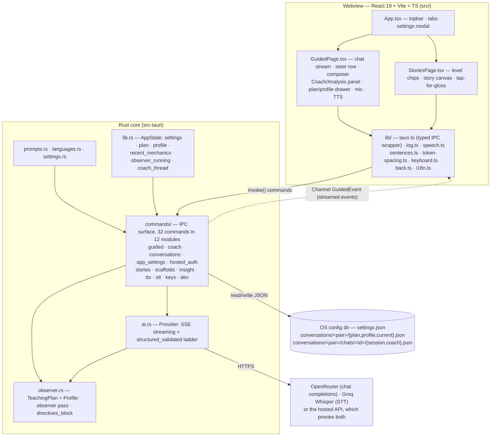
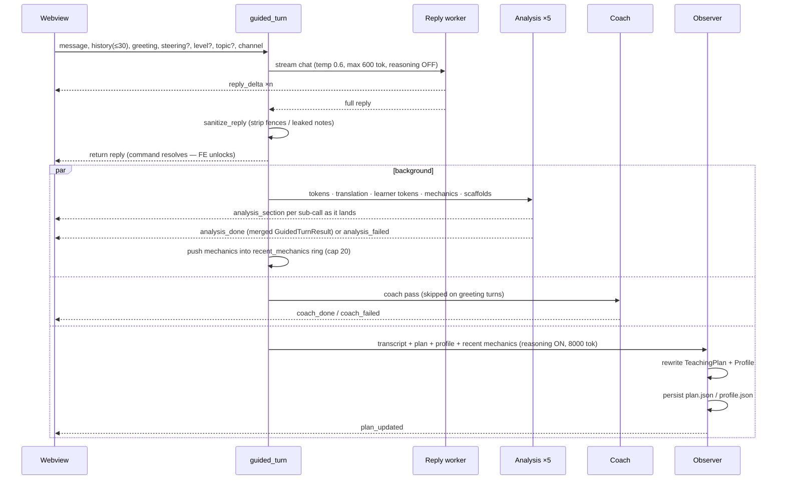

# Architecture

SkellySpeak is a **Tauri v2** app: a React 19 + Vite + TypeScript webview frontend
(`src/`) driving a Rust core (`src-tauri/`). The Rust core owns **everything
sensitive and durable**: API keys, settings, the observer documents, and all
LLM/STT network calls. The frontend is pure UI + state over a small IPC
surface.



## Module map (with sizes)

| File | Role |
|---|---|
| `src-tauri/src/commands/` | The IPC surface, one module per domain |
| &nbsp;&nbsp;`commands/guided/` | One turn, split by pass |
| &nbsp;&nbsp;&nbsp;&nbsp;`guided/types.rs` | Wire types, the `GuidedEvent` contract, `sanitize_reply` |
| &nbsp;&nbsp;&nbsp;&nbsp;`guided/mod.rs` | The command: prompt assembly, streamed reply, then hand off |
| &nbsp;&nbsp;&nbsp;&nbsp;`guided/analysis.rs` | Four calls about the reply, merged with per-section degradation |
| &nbsp;&nbsp;&nbsp;&nbsp;`guided/observer_pass.rs` | Rewrites the plan and profile, never overlapping itself |
| &nbsp;&nbsp;&nbsp;&nbsp;`guided/coach_pass.rs` | Private feedback on the learner's message |
| &nbsp;&nbsp;`commands/coach.rs` | Per-message feedback and the private side-thread |
| &nbsp;&nbsp;`commands/tts.rs` | Speech synthesis and the WAV container |
| &nbsp;&nbsp;`commands/app_settings.rs` | Settings read/write, update-check feed |
| &nbsp;&nbsp;`commands/conversations.rs` | Listing, opening, saving and removing chats |
| &nbsp;&nbsp;`commands/stories.rs` · `scaffolds.rs` · `dev.rs` · `stt.rs` · `keys.rs` · `insight.rs` · `hosted_auth.rs` | One domain apiece |
| `src-tauri/src/ai.rs` | OpenAI-compatible client: streaming, schema-constrained structured output, corrective retries, `$defs` inlining |
| `src-tauri/src/settings.rs` | Settings model, provider resolution, key masking, JSON persistence |
| `src-tauri/src/conversation.rs` | Where conversations live on disk, one directory per pairing |
| `src-tauri/src/prompts.rs` | Prompt builders composed from shared blocks |
| `src-tauri/src/observer.rs` | TeachingPlan/Profile documents, observer pass, `directives_block` |
| `src-tauri/src/hosted.rs` | Sign-in to the hosted service: system browser, loopback and deep link |
| `src-tauri/src/bench.rs` | `#[ignore]`d model-bench harness (live provider calls) |
| `src-tauri/src/languages.rs` | Language registry (en-US, fr-FR, es-ES, ar) + dialects + overlays |
| `src-tauri/src/lib.rs` | Bootstrap, `AppState`, command registration, logging |
| `src/pages/GuidedPage.tsx` | The main surface: composition and layout |
| &nbsp;&nbsp;`pages/guided/useConversation.ts` | Which conversation is on screen, and everything that changes it |
| &nbsp;&nbsp;`pages/guided/useScaffolds.ts` | The suggestion chips and what refreshes them |
| &nbsp;&nbsp;`pages/guided/useWordInspection.ts` | Tap, right-click and press-and-hold on a word |
| `src/lib/turns.ts` | Reading a conversation: history for the backend, newest answered turn, best scaffolds |
| `src/components/SettingsModal.tsx` | Settings UI (two-column tree + search) |
| `src/lib/i18n.ts` | UI chrome strings per native language |
| `src/components/chat/TurnView.tsx` | Memoized turn renderer + `TokenSpan` interrogation gestures |
| `src/components/ChatHistory.tsx` | The chat history drawer |
| `src/hooks/useMicRecorder.ts` | Mic lifecycle: permissions, capture, silence auto-stop, Whisper |
| `src/components/panes/CoachAnalysisPanel.tsx` | The unified right panel (Coach / Analysis tabs) |
| `src/pages/StoriesPage.tsx` | Story reader |
| `src/components/panes/AnalysisContent.tsx` | Pinned-turn breakdown |
| `src/types.ts` | TS mirror of the Rust wire types |
| `src/lib/*` | invoke wrapper, log bridge, speech, sentences, token spacing, keyboard, back-stack, normalize, faults, conversation titles, provider rules |

Roughly ordered by size. Exact line counts are deliberately not recorded here:
they were wrong in eleven rows the last time anyone checked, several by a
factor of three, and any number written down is stale by the next commit.

## IPC surface (complete)

Fifteen commands, registered in `lib.rs::run()`:

| Command | Payload | Notes |
|---|---|---|
| `get_settings` | → `Settings` | Key material is **masked** (`head6••••••••tail6`) — the webview never sees raw keys |
| `save_settings` | `Settings` | Persists to `settings.json`. An unchanged mask means "keep the stored key"; the hosted session token and install id are always taken from disk, never from the webview. A change of **target or native language** saves the outgoing pairing's documents and loads the incoming one's. The dialect is not part of a pairing and switches nothing |
| `reset_settings` | → `Settings` | Restores defaults and clears the stored keys |
| `take_startup_faults` | → `string[]` | Drains problems recorded before the webview existed, so a startup failure reaches the screen rather than a log file |
| `validate_key` | `provider, key` → `KeyStatus` | Live provider check; resolves a masked value against the stored key server-side |
| `get_languages` | → `LanguageInfo[]` | The language registry verbatim from `languages.rs`. Fetched once before first render (`main.tsx`); the webview keeps **no** language table of its own |
| `get_diagnostics` | → `[(name, count)]` | The four `ai.rs` retry counters, for the logs overlay header |
| `guided_turn` | `message, history, greeting, steering?, level?, topic?, on_event: Channel<GuidedEvent>` | Returns the reply string once pass 1 finishes; analysis, coach and observer arrive via the channel |
| `generate_scaffolds` | `ScaffoldRequest` → `ScaffoldsOut` | Standalone scaffold regeneration after a steering change |
| `word_insight` | word + context → `WordInsight` | Lemma / POS / form / role / usage card for one token |
| `speak_text` | text → `TtsAudio` | Cloud TTS via OpenRouter `gpt-audio-mini`; PCM16 stream wrapped in a WAV container |
| `transcribe_audio` | `audioBase64, prompt?` → text | Groq `whisper-large-v3-turbo`; `prompt` carries a target-language-only context hint |
| `generate_story` | `level` → `StoryResponse` | One structured call |
| `get_plan` | → `{plan, profile}` | For the Plan drawer / initial load |
| `get_coach_thread` | → `CoachChatMessage[]` | The persisted private coach thread |
| `coach_ask` | question → reply | Appends to the open chat's `coach.json` (40-message cap) |
| `coach_thread_clear` | — | Wipes the coach thread for the open chat |

### Conversations

Each language pairing keeps its own chats; see [Observability](./observability#persistence)
for the layout. Every call names the pairing (and, where it matters, the chat)
explicitly rather than reading settings, so a language switch cannot race an
in-flight save and file one conversation under another's name.

| Command | Payload | Notes |
|---|---|---|
| `list_conversations` | `target, native` → `ChatSummary[]` | Most recently used first; deleted chats are omitted |
| `load_conversation` | `target, native` → `{id, turns}` | The open chat, starting one if there is none |
| `open_conversation` | `target, native, id` → `{id, turns}` | Switches chats, bringing that chat's coach thread with it |
| `save_conversation` | `target, native, id, turns, title` | The title is derived by the webview, which is the side that knows what a turn looks like |
| `new_conversation` | `target, native` → `id` | A fresh chat. Plan and profile are untouched — they sit above the chats |
| `delete_conversation` | `target, native, id` | Sets `deleted_at` in the document; the turns stay on disk |

### Hosted service

| Command | Payload | Notes |
|---|---|---|
| `hosted_sign_in` | → `Account` | Opens the **system** browser and waits for the redirect; stores the session |
| `hosted_account` | → `Account` | Identity and remaining daily allowance |
| `hosted_sign_out` | — | The only thing that clears the stored session token |

### Observability and shell

| Command | Payload | Notes |
|---|---|---|
| `get_runs` / `clear_runs` | → `Run[]` / — | The recorded run ring, for the Runs view |
| `get_graph` | → `Graph` | The execution graph generated from `turn_plan.rs` |
| `get_reconciliation` | → `Reconciliation` | The declared graph diffed against recorded runs |
| `open_dev_window` | — | Pops the observability panel into its own OS window |
| `latest_github_release` | → `LatestRelease` | Update check feed, used where the updater plugin is unavailable |

### `GuidedEvent` (channel protocol, snake_case tagged)

| Event | When | Effect in UI |
|---|---|---|
| `reply_delta` | Pass 1 token | Appends to pending bubble |
| `reply_done` | Pass 1 complete | Composer unlocks; turn becomes "analyzing…"; auto-pin breakdown |
| `analysis_section` | Any one analysis sub-call completes | Merges that section into the turn immediately (progressive hydration — only the finished section's field is populated). Carries `tokens`, `translation`, `user_tokens`, `user_translation`, `mechanics` or `scaffolds` |
| `coach_done` | Coach pass complete | Renders the coach card (remark, score meters, corrections, language-split chips) in the Coach tab |
| `coach_failed` | Coach pass dead | Visible error in the Coach tab — fail loudly, never a blank pane |
| `analysis_done` | All analysis sub-calls settled | Authoritative final merged state, including per-section degradations |
| `analysis_failed` | Pass 2 dead | Marks turn reply-only; chips fall back to the newest turn that has scaffolds |
| `plan_updated` | Observer pass complete | Updates Plan drawer + focus chips |

## The guided turn pipeline

This is the heart of the app (`commands/guided/mod.rs::guided_turn`):



Key properties:

- **The learner keeps typing while analysis lands.** The command resolves at
  `ReplyDone`; pass 2 and the observer run in `tokio::spawn`ed tasks.
- **Progressive hydration.** Each analysis sub-call runs in its own task and
  emits `analysis_section` the moment it finishes — tokens/translation/
  learner-tokens/mechanics/scaffolds appear in the UI as they arrive, never
  gated behind the slowest call. `analysis_done` remains the authoritative
  final state.
- **The observer never overlaps itself.** An `observer_running` mutex flag
  skips a pass if the previous one is still thinking; the next turn picks it
  up. The plan is never more than one turn stale.
- **Per-section degradation.** The five analysis sub-calls fail independently;
  a failed section simply never emits an `analysis_section` event and costs
  only that section in the final state (empty tokens, no mechanics, etc.).
- **Anti-repetition.** `recent_mechanics` (ring buffer, last 20 card titles)
  plus the observer's `taught_ledger` are rendered into an "ALREADY TAUGHT —
  do NOT re-teach" block injected into the reply, mechanics, and scaffolds
  prompts via `observer::directives_block`.

## The three agent roles

| Role | Model default | Reasoning | Temp | max_tokens | Output |
|---|---|---|---|---|---|
| Reply worker | `google/gemini-2.5-flash` | disabled (per-family dialect: `enabled:false`, or `effort:minimal` on OpenAI) | 0.6 | 600 | plain text, streamed |
| Analysis workers ×5 | same worker model | disabled | 0.1–0.6 | 6000 | schema-constrained JSON |
| Coach | same worker model | disabled | — | 6000 | schema-constrained JSON (`CoachFeedback`) |
| Observer | `z-ai/glm-5.3-flash` | **enabled** (the whole point) | 0.4 | 8000 | schema-constrained JSON |

Model changes are decided by running the bench harness
(`cargo test model_bench -- --ignored --nocapture` in `src-tauri/`) against
the real prompts, then updating the default + the legacy-migration list in
`settings.rs`. Any new default must pass 6/6 with zero corrective retries
before it ships.

Defaults live in `settings.rs` (`default_model`, `default_observer_model`);
the worker model is editable in Settings; the observer model is currently
only editable by hand-editing `settings.json`. **No `frequency_penalty`.** The doc claimed for a long time that every payload
set `frequency_penalty: 0.3`; it set it nowhere, and adding it back returns
`404: No endpoints found that can handle the requested parameters`, because
`require_parameters: true` then filters out every provider serving the model.
Repetition is handled where it actually happens — across turns — by the
NEVER REPEAT YOURSELF rule in the reply prompt.

### Prompt composition

`prompts.rs` builds every prompt from shared blocks so the rules have one
source of truth:

- `persona_block` — role, target language, CEFR, native language.
- `mandatory_rules` — scope lock (language practice only), content policy,
  persona lock. "These override everything else."
- `always_respond_rule` — always reply in the target language.
- `no_emoji_rule` — TTS-forward: no pictographs ever.
- Language `overlay()` — per-variant guidance (e.g. Peninsular Spanish +
  vosotros, European Portuguese clitic placement, simplified characters +
  pinyin-as-support for zh-CN).
- `directives_block` — the observer's advisory plan (focus, recast queue with
  budget, vocab recycle, avoid-list, interests, energy read, taught ledger).

Per-surface builders: `guided_reply_prompt`, `guided_tokens_prompt`,
`guided_translation_prompt`, `guided_mechanics_prompt`,
`guided_scaffolds_prompt`, `story_prompt` (+ `LEVEL_BANDS` for word-count and
grammar bands, `resolve_cefr` mapping beginner/intermediate/advanced → A2/B1/C1).

## Error handling: fail loudly, retry only the transient

Design principle: **nothing degrades silently.** A failure is either
transient (retry with visibility) or a real problem (explode with the actual
error so the cause gets fixed).

- **429 rate limits** — transient, expected with parallel worker bursts:
  back off 3s, retry once, count it.
- **Malformed model output** (prose-wrapped JSON, failed validation) —
  transient nondeterminism: corrective retry with the error fed back to the
  model, counted, and logged at WARN. Schema-constrained decoding is applied
  on **every** attempt.
- **Everything else fails hard, with the provider's actual error message** —
  no prompted-JSON fallback, no reasoning-param retry. If a model rejects
  `json_schema` or `reasoning: false`, the error surfaces to the user and the
  model gets changed. A model that can't serve the call must not be quietly
  served by a degraded path.
- **Per-section analysis failures** are returned to the UI in
  `GuidedTurnResult.errors` and rendered as visible error boxes in the
  breakdown pane — a failed tokenizer never silently pretends everything
  worked.
- **Corrupt persisted state** (`settings.json`, `plan.json`, `profile.json`)
  is moved aside to `<name>.bad` with an ERROR log — never silently reset
  (a silent reset would wipe API keys without a word). Failed writes return
  errors instead of being discarded.

Retry counters (429 / parse / validation / exhausted) are session-scoped and
visible in the logs overlay header, so a misbehaving model or prompt shows up
as climbing numbers instead of silent success.

## Prompt registry (user-editable prompts)

Every AI prompt is addressable by id (`chat.reply`, `chat.tokens`,
`chat.mechanics`, `chat.scaffolds`, `learner.tokens`, `coach.feedback`,
`coach.thread`, `story`, `observer`, `word.insight`). Planned surface:

- `Settings.prompt_overrides: BTreeMap<String, String>` — user edits
  persist in `settings.json`; absent/empty = built-in default applies.
- Settings → a "Prompts" section listing each id with its effective text
  (default or override), an edit box, and a reset-to-default button.
- Prompt builders consult the override before falling back to the built-in
  template; placeholders (`{tln}`, `{native}`, `{dialect}`, …) work in
  overrides exactly as in defaults.

**Reality check:** `Settings.prompt_overrides` exists, persists, and
round-trips — but **nothing reads it yet**. There is no prompt registry in
`prompts.rs` (the builders are plain functions, not id-addressed), and no
Settings UI section. Both are unbuilt.

The field is not, however, dead weight to delete: it is the configuration
surface for the agent workbench specified in
[Observability](./observability), where the prompt id and the agent id are
one id. Build the registry; do not remove the field.

## Voice pipeline: STT + TTS

**STT (speech → text):** Groq `whisper-large-v3-turbo`. The mic stream is
recorded in the webview (with live waveform + silence auto-stop) and uploaded
as webm/opus. Groq remains here — it does one thing well and has no
replacement on OpenRouter.

**TTS (text → speech):** cloud synthesis through **OpenRouter itself** —
`gpt-audio-mini` with `modalities: ["text","audio"]`. Decision record:

- Groq's `playai-tts` was **decommissioned** (verified against the live
  catalog — no TTS models remain in Groq's list). Groq's only remaining role
  is STT.
- Audio output on OpenRouter is **streaming-only** and ships raw **PCM16**
  (24kHz mono LE) instead of a framed file: `speak_text` consumes the SSE
  stream, accumulates the base64 PCM, and wraps it in a 44-byte WAV header.
  No continuous connection, no websockets — one ordinary HTTPS request that
  answers in chunks.
- The webview's contract is "play this WAV blob" — fully provider-agnostic.
  The vendor dialect lives and dies inside the single `speak_text` function;
  swapping TTS vendors (Google Cloud TTS's 1M free chars/month, ElevenLabs,
  Azure) is a rewrite of that one function plus a Settings entry.
- Fallback chain: cloud synthesis failure → OS voice via Web Speech API,
  logged as a loud ERROR in the logs overlay (never a silent degradation).

Pricing context (per M tokens, Aug 2026 catalog): gpt-audio-mini
$0.60 in / $2.40 out — a heavy session of spoken replies costs cents.
Options evaluated and shelved: Google Cloud TTS (1M chars/month free — the
quality upgrade candidate), ElevenLabs (best pronunciation, new credential),
Edge TTS (unofficial API, grey zone), Piper (offline neural, real machinery).

## Persistence

| Data | Where | Written by |
|---|---|---|
| `settings.json` (keys, models, languages, mic) | `app_config_dir` | `save_settings` |
| `plan.json` (TeachingPlan) | `conversations/<pair>/` | observer pass, every success |
| `profile.json` (Profile) | `conversations/<pair>/` | observer pass, every success |
| Which chat is open | `conversations/<pair>/current.json` | `open_conversation`, `new_conversation` |
| Turn log | `conversations/<pair>/chats/<id>/session.json` | `save_conversation` |
| Coach thread | `conversations/<pair>/chats/<id>/coach.json` (40-message cap) | `coach_ask`, `coach_thread_clear` |
| Steer level / topic | `localStorage.skellyspeak_level` / `skellyspeak_topic` | `hooks/useSteering.ts` |
| Target language mirror | `localStorage.skellyspeak_target` | App on load/save |
| Cached story | `localStorage.skellyspeak_story_<lang>_<level>` | StoriesPage |

**Conversations persist.** Each language pairing keeps its own chats, and each
restores where it was left; the `☰` beside the wordmark lists them. What the
tutor has learned about the learner (`plan.json`, `profile.json`) sits above the
chats, per pairing, so starting a new conversation does not make it forget you.

The config directory has **no fallback**. If it cannot be resolved the app
refuses to start rather than writing somewhere the user will never find.

## Frontend state model

`GuidedPage` keeps an array of `Turn`:

```ts
interface Turn {
  id: number
  user: string | null            // null for the greeting turn
  assistant: GuidedTurnResult | null
  pendingText: string            // streaming buffer before assistant exists
  analysisState: 'pending' | 'done' | 'failed' | null
}
```

- History sent upstream = last 30 `(role, content)` pairs from completed turns.
- The breakdown pane is pinned to the newest completed turn by default; tapping
  a bubble re-pins it (`pinnedId`).
- **Tap-to-reveal in chat bubbles** (stories-style, shared `GlossPopup`
  component, `TokenSpan` in `chat/TurnView.tsx`): tapping a word token pops
  its gloss (+ romanization); tapping a gloss-less punctuation token reveals
  that sentence's translation; drag and press-and-hold reveal runs of
  tokens; double-click / right-click opens the full `word_insight` card.
  Applies to learner bubbles as well as tutor bubbles. Sentences are derived
  from terminal-punctuation token boundaries (`lib/sentences.ts`) and
  aligned by index against the split translation — on mismatch, the full
  translation is shown.
- Scaffolds use best-available hydration: the chips show the newest turn
  that has any, so the composer is never empty while a fresh analysis runs.
  A steering change regenerates them via `generate_scaffolds`; a failure
  surfaces as a visible ⚠ in the suggestion header.
- Mic (`hooks/useMicRecorder.ts`): `MediaRecorder` → webm/opus → base64 →
  `transcribe_audio`; manual toggle with an explicit ✕ cancel, auto-stop
  after 20s of silence (WebAudio RMS), live waveform. The transcript fills
  the composer unless `auto_send` is on.

## Build & run (developer view)

```
npm install
npm run tauri dev      # vite on :1420 (strict) + cargo dev build
npm run tauri build    # release bundle (NSIS + portable on Windows)
npm run build          # tsc + vite build (frontend only)
```

Release profile: `strip = true`, `lto = true`. Window 1200×800, **min width
360** so the desktop window snaps into the same mobile layout as phones
(single column, bottom nav) below 860px. Dark background `#0c1420`. Strict
CSP (self + ipc + asset — the app loads no remote content). Capabilities:
`core:default`, `log:default` only. Logging: stdout + log-dir file (2 MB,
keep-one rotation) + webview console bridge, Debug level.

Android: `npm run android` (emulator dev loop) / `npm run android:apk`
(sideloadable debug APK) — see [Platforms](./platforms) for the machine-specific
fixes that must survive a `gen/android` regeneration.

CI (`.github/workflows/ci.yml`) runs three jobs: frontend (`npm test` +
`npm run build`), Rust (`cargo clippy --lib -- -D warnings` + `cargo test
--lib`), and the docs build.
